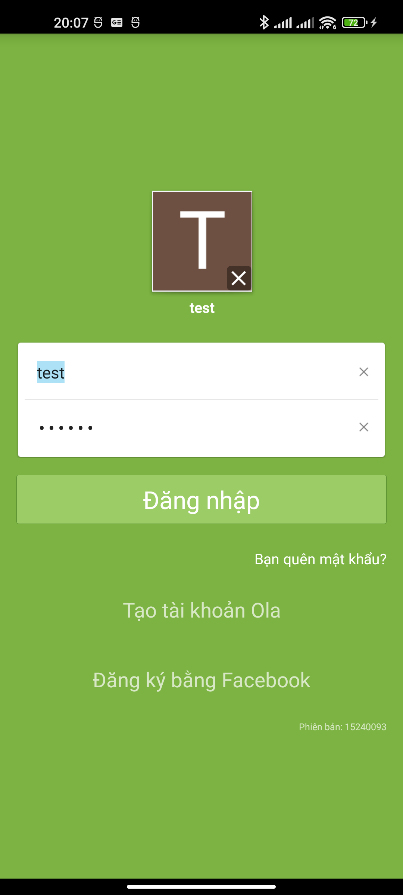
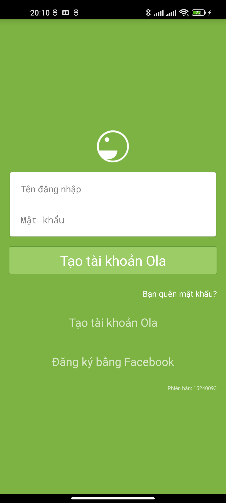

# Màn hình Đăng nhập

- **Activity:** `chat.ola.vn.activity.OlaLoginActivity`
- **Layout:** `apktool_out/res/layout/login_view_layout.xml`
- **Chức năng:** đăng nhập bằng nick/mật khẩu, hoặc chuyển sang đăng ký / đăng nhập Facebook / quên mật khẩu.

## Ảnh chụp (thiết bị thật + fake server)

| Đã có tài khoản lưu sẵn | Trạng thái trống (hint) |
|---|---|
|  |  |

> Khi **2 ô trống**, nút xanh hiển thị **"Tạo tài khoản Ola"**; khi đã nhập, nút đổi thành **"Đăng nhập"**. Nếu từng đăng nhập, app hiện **avatar account đã lưu** (vùng `OlaGalleryView`) phía trên ô nhập, kèm nút `×` để xoá account khỏi danh sách.

### Assets dùng trong màn (ảnh gốc trích từ APK)

| Asset | Ảnh | Dùng cho |
|-------|-----|----------|
| `ola_logo_trans` |  (mặt cười trắng, nền trong suốt — hiện rõ trên nền xanh) | Logo trên đầu màn |
| `ic_input_clear` |  | Nút `×` xoá nội dung ô nhập |

> Ảnh asset dùng chung đặt ở [../images/](../images/); ảnh chụp màn hình riêng của màn này ở [images/](images/).

---

## 1. Bố cục (top → bottom)

```
ScrollView (nền xanh #7CB342, fillViewport)
└─ LinearLayout vertical, gravity=center, padding ngang 16dp
   ├─ Logo Ola            ImageView 56×56dp, margin trên/dưới 16dp (ola_logo_trans)
   ├─ [Account gallery]   OlaGalleryView (ẩn nếu chưa lưu account; hiện avatar tròn + nick)
   ├─ Thẻ nhập (card)     LinearLayout nền trắng bo góc + đổ bóng (bg_shadow_4_edges)
   │   ├─ Ô "Tên đăng nhập"  EditText + nút × (ic_input_clear)
   │   ├─ divider 1px        (#1F000000, margin ngang 4dp)
   │   ├─ Ô "Mật khẩu"       EditText (ẩn ký tự) + nút ×
   │   └─ [Captcha]          ẩn mặc định — chỉ hiện khi server yêu cầu
   ├─ Nút "Đăng nhập"     Button cao 48dp, nền xanh #9CCC65, chữ trắng 24sp
   ├─ "Bạn quên mật khẩu?"  TextView 14sp, chữ trắng, canh phải
   ├─ "Tạo tài khoản Ola"   TextView 20sp, chữ trắng 70%, canh giữa, cao 48dp
   ├─ "Đăng ký bằng Facebook" TextView 20sp, chữ trắng 70%, canh giữa, cao 48dp
   └─ "Phiên bản: …"        TextView 9sp, chữ trắng 70%, canh phải-dưới
+ Overlay loading (ProgressBar giữa màn, nền đen 38%) — ẩn mặc định
```

## 2. Bảng style chi tiết từng phần

| Thành phần | id | Màu chữ / nền | Cỡ chữ | Kích thước / khoảng cách | Ghi chú |
|------------|----|----|--------|--------------------------|---------|
| Nền màn hình | (ScrollView) | nền `#7CB342` (`colorOlaPrimary`) | — | full màn | cuộn được khi bàn phím mở |
| Logo | `olaLogoImageView` | — | — | 56×56dp, margin T/B 16dp | `ola_logo_trans` (mặt cười trắng) |
| Avatar account đã lưu | `accountGallery` | — | nick: trắng | cao tối thiểu 96dp, spacing 16dp | ẩn nếu chưa có account |
| Thẻ nhập (card) | `inputSpan` | nền trắng | — | bo góc + bóng (9-patch `bg_shadow_4_edges`), margin dưới 8dp | bọc 2 ô nhập |
| Ô tên đăng nhập | `txtUserName` | chữ `rgba(0,0,0,.87)`, nền trong suốt | 14sp | 1 dòng | hint "Tên đăng nhập", `inputType=textEmailAddress`, Enter→ô kế |
| Nút xoá tên | `btnClearUserName` | icon xám | — | 36×36dp, padding 6dp | `ic_input_clear` (dấu ×) |
| Divider | — | `rgba(0,0,0,.12)` | — | cao 1px, margin ngang 4dp | kẻ giữa 2 ô |
| Ô mật khẩu | `txtPassword` | chữ `rgba(0,0,0,.87)`, nền trong suốt | 16sp | 1 dòng | hint "Mật khẩu", `inputType=textPassword`, Enter→đăng nhập |
| Nút xoá mật khẩu | `btnClearPassword` | icon xám | — | 36×36dp, padding 6dp | `ic_input_clear` |
| **Nút Đăng nhập** | `btnLogin` | chữ `#FFFFFF`, nền `#9CCC65` (`buttonGreen`) | **24sp** | cao 48dp, margin T 8dp / B 12dp | viền 1px `#558B2F`, bo góc 2dp |
| Quên mật khẩu | `forgotPasswordTextView` | chữ `#FFFFFF` | 14sp | padding T/B 12dp, canh phải | mở màn khôi phục |
| Tạo tài khoản Ola | `btnRegisterWhite` | chữ `rgba(255,255,255,.70)` | 20sp | cao 48dp, margin T 4dp, canh giữa | → [màn đăng ký](../dang-ky/README.md) |
| Đăng ký bằng Facebook | `btnLoginFacebook` | chữ `rgba(255,255,255,.70)` | 20sp | cao 48dp, margin T 20dp, canh giữa | qua Facebook SDK |
| Phiên bản | `versionCodeTextView` | chữ `rgba(255,255,255,.70)` | 9sp | margin T 16dp, canh phải-dưới | "Phiên bản: <build>" |
| Captcha (ẩn) | `validationCodeLayout` | thông báo `#E34545` in nghiêng | 12sp | ẩn mặc định | hiện khi server bắt nhập mã |
| Overlay loading | `loadingProgressBar` | nền `rgba(0,0,0,.38)` | — | full màn | spinner 48dp ở giữa |

## 3. CSS tương đương (dựng lại trên web)

```css
/* ===== Nền màn hình ===== */
.ola-login {
  min-height: 100vh;
  background: #7CB342;            /* colorOlaPrimary */
  display: flex;
  flex-direction: column;
  align-items: center;
  padding: 0 16px;
  box-sizing: border-box;
  font-family: Roboto, "Helvetica Neue", Arial, sans-serif;
}

/* Logo */
.ola-login__logo {
  width: 56px; height: 56px;
  margin: 16px 0;
  object-fit: contain;
}

/* ===== Thẻ nhập (card trắng đổ bóng) ===== */
.ola-login__card {
  width: 100%;
  background: #FFFFFF;
  border-radius: 2px;
  box-shadow: 0 1px 4px rgba(0,0,0,.24), 0 0 2px rgba(0,0,0,.12); /* mô phỏng bg_shadow_4_edges */
  margin-bottom: 8px;
  overflow: hidden;
}
.ola-login__field {
  position: relative;
  display: flex;
  align-items: center;
}
.ola-login__field input {
  flex: 1;
  border: none;
  outline: none;
  background: transparent;
  color: rgba(0,0,0,.87);        /* colorTextBlackPrimary */
  padding: 16px;
}
.ola-login__field input::placeholder { color: rgba(0,0,0,.38); }
.ola-login__field--user input { font-size: 14px; }   /* body1 */
.ola-login__field--pass input { font-size: 16px; }   /* subhead */
.ola-login__divider {
  height: 1px;
  margin: 0 4px;
  background: rgba(0,0,0,.12);   /* colorTextBlackDivider */
}
.ola-login__clear {                /* nút × xoá nội dung */
  width: 36px; height: 36px; padding: 6px;
  opacity: .54; cursor: pointer;
  box-sizing: border-box;
}

/* ===== Nút Đăng nhập ===== */
.ola-login__btn {
  width: 100%;
  height: 48px;
  margin: 8px 0 12px;
  background: #9CCC65;           /* buttonGreen */
  border: 1px solid #558B2F;     /* colorOlaPrimaryDark */
  border-radius: 2px;
  color: #FFFFFF;
  font-size: 24px;               /* text.size.headline */
  cursor: pointer;
}
.ola-login__btn:active { border-width: 2px; }

/* ===== Link phụ ===== */
.ola-login__forgot {
  align-self: flex-end;
  color: #FFFFFF;
  font-size: 14px;
  padding: 12px 0;
}
.ola-login__register,
.ola-login__fb {
  width: 100%;
  height: 48px;
  line-height: 48px;
  text-align: center;
  color: rgba(255,255,255,.70);  /* colorTextWhiteSecondary */
  font-size: 20px;               /* text.size.title */
}
.ola-login__register { margin-top: 4px; }
.ola-login__fb { margin-top: 20px; }
.ola-login__version {
  width: 100%;
  text-align: right;
  margin-top: 16px;
  color: rgba(255,255,255,.70);
  font-size: 9px;
}

/* ===== Overlay loading ===== */
.ola-login__overlay {
  position: fixed; inset: 0;
  background: rgba(0,0,0,.38);    /* translucent_black_38_percent */
  display: none;                  /* bật khi đang đăng nhập */
  align-items: center; justify-content: center;
}
```

```html
<div class="ola-login">
  

  <div class="ola-login__card">
    <div class="ola-login__field ola-login__field--user">
      <input type="text" placeholder="Tên đăng nhập">
      
    </div>
    <div class="ola-login__divider"></div>
    <div class="ola-login__field ola-login__field--pass">
      <input type="password" placeholder="Mật khẩu">
      
    </div>
  </div>

  <button class="ola-login__btn">Đăng nhập</button>
  <a class="ola-login__forgot">Bạn quên mật khẩu?</a>
  <a class="ola-login__register">Tạo tài khoản Ola</a>
  <a class="ola-login__fb">Đăng ký bằng Facebook</a>
  <div class="ola-login__version">Phiên bản: 15240093</div>
</div>
```

## 4. Hành vi & luồng

- **Nhấn "Đăng nhập"** → mở overlay loading → app **không gọi REST** mà mở **socket** (xem [../../api/socket-protocol.md](../../api/socket-protocol.md)): handshake svc `96` → login svc `206` → online svc `97`. Với fake server: nick/mật khẩu **bất kỳ** đều vào được.
- **Enter** ở ô tên → nhảy xuống ô mật khẩu (`imeOptions=actionNext`); Enter ở ô mật khẩu → đăng nhập luôn (`actionGo`).
- **Nút × (`ic_input_clear`)** xoá nhanh nội dung từng ô.
- **Captcha** chỉ hiện khi server trả yêu cầu mã xác thực (mặc định ẩn).
- **"Tạo tài khoản Ola"** → [màn đăng ký](../dang-ky/README.md).
- **"Đăng ký bằng Facebook"** → Facebook SDK (`OlaFacebookActivity`).
- **Avatar account đã lưu**: nhấn để điền sẵn nick + mật khẩu đã lưu rồi đăng nhập; nút `×` để gỡ account khỏi máy.

## 5. Strings (đa ngôn ngữ)

| Resource | EN (`values/strings.xml`) | VI (hiển thị thực tế) |
|----------|--------------------------|----------------------|
| `string_username` | Nick name | Tên đăng nhập |
| `string_password` | Password | Mật khẩu |
| `string_login` | Log In | Đăng nhập |
| `string_forgot_pass_tip` | Forgot password? | Bạn quên mật khẩu? |
| `string_register_account` | Sign up Ola | Tạo tài khoản Ola |
| `string_login_facebook_account` | Signup by Facebook | Đăng ký bằng Facebook |
