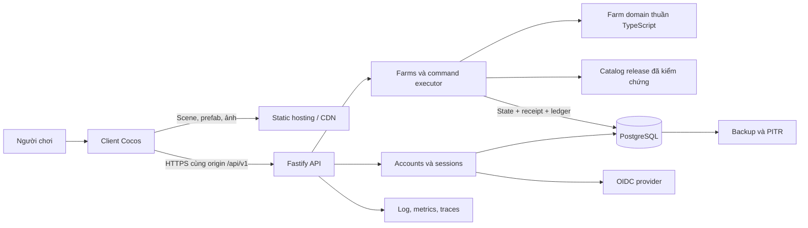
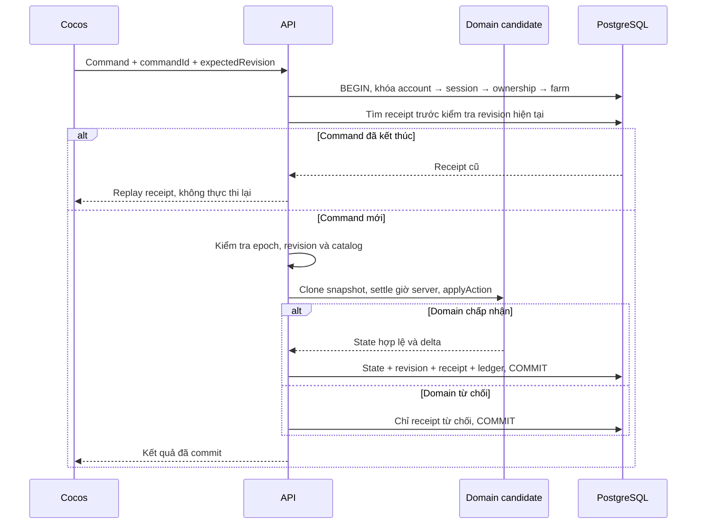

# 02 · Kiến trúc và cách chia code

[Mục lục backend](README.md) · [Dữ liệu](03-data-and-transactions.md) · [API](04-api-contract.md)

Tài liệu thiết kế đề xuất ngày 20/09/2026; các thư mục `backend/` và `packages/` bên dưới chưa tồn tại trong runtime hiện hành.

PostgreSQL đã được chọn cho kế hoạch database; kiểu cột, quan hệ, grants và thứ tự migration được cụ thể hóa trong [08 · Kế hoạch database PostgreSQL](08-postgresql-database-plan.md). Hạ tầng/provider chưa được provision.

## 1. Kiến trúc tổng thể

Một backend chia module đủ cho farm cá nhân với giao dịch theo thao tác. Mỗi request thay đổi game khóa một farm trong PostgreSQL, chạy domain trên snapshot đã đọc, rồi commit state và bằng chứng giao dịch cùng lúc. Thêm API replica khi cần; database điều phối cạnh tranh, không phụ thuộc khóa trong bộ nhớ của một process.



Các box module trong API chạy cùng ứng dụng. CDN chỉ phục vụ nội dung public; browser không có DB credential hoặc quyền cập nhật trực tiếp bảng farm. Với web, reverse proxy đưa `/api/v1` tới API và phần còn lại tới bản build Cocos. Native dùng cùng contract HTTPS với cách lưu phiên phù hợp thiết bị.

Không cần một process luôn tick mọi nông trại. Server tính khoảng thời gian đã trôi qua khi nhận command hoặc yêu cầu sync; dữ liệu công việc giữ thời điểm bắt đầu, thời gian hoàn thành và phần thưởng đã chốt. Chỉ có công việc người chơi đã thực sự bắt đầu mới tiến triển.

## 2. Stack đề xuất

| Thành phần | Chọn ban đầu | Cách kiểm chứng / giới hạn |
| --- | --- | --- |
| Runtime | Node.js 24 LTS, image khóa theo phiên bản/digest đã vá. | Tại ngày khảo sát 24 là LTS, 26 còn Current. Production chọn nhánh được hỗ trợ và có lịch nâng cấp. [Node releases](https://nodejs.org/en/about/previous-releases). |
| Ngôn ngữ | TypeScript strict; backend pin compiler trong lockfile riêng. | Không buộc project Creator nâng toolchain ngay; domain build phải chạy được với target mà Cocos đang hỗ trợ. |
| HTTP | Fastify 5, REST JSON. | Theo chính sách LTS và kiểm tra tương thích từng plugin với Node 24 trong CI; không suy ra mọi plugin đều tương thích. [Fastify LTS](https://fastify.dev/docs/latest/Reference/LTS/). |
| Database | PostgreSQL 18 managed; PostgreSQL 17 nếu provider chưa đáp ứng 18. | Cả hai đang được hỗ trợ tại ngày khảo sát. Chọn một major cho dev/staging/prod; cấu hình PITR và kiểm chứng restore. [PostgreSQL versioning](https://www.postgresql.org/support/versioning/). |
| Truy cập DB | Driver `pg`, SQL có tham số, SQL migration có thứ tự. | Giao dịch và `SELECT … FOR UPDATE` cần rõ ràng. Chọn công cụ migration sau spike, không tự viết migration runner cho production. |
| Contract | JSON Schema chuẩn cho request/response, sinh OpenAPI và client types từ cùng schema. | Schema validate hình dạng; domain validate luật. Không dùng type assertion TypeScript làm kiểm tra JSON từ mạng. |
| Deploy | Container cho API, static hosting/CDN cho client, DB managed. | Local dùng PostgreSQL container cùng major; production không chạy DB chung container vòng đời ngắn của API. |
| Quan sát | Structured logs, metrics và trace theo request/command. | Thiết kế nhãn có số lượng hữu hạn; không gắn farmId vào nhãn metrics. |

Đây là lựa chọn cho repo dùng TypeScript và domain đã tách khỏi engine, không phải kết luận rằng stack khác không phù hợp. Nếu có hạ tầng bắt buộc, giữ nguyên các invariant giao dịch và contract trước khi thay framework.

Fastify hỗ trợ JSON Schema cho validation và serialization; schema là code do dự án kiểm soát, không nhận schema tùy ý từ người dùng. Các kiểm tra DB/authorization đặt sau validation cấu trúc và trong luồng transaction phù hợp. [Fastify validation](https://fastify.dev/docs/latest/Reference/Validation-and-Serialization/).

## 3. Cấu trúc repository dự kiến

```text
farm-game/
  cocos/                           # Project Creator hiện có, giữ UUID và prefab
  backend/
    package.json                   # Scripts API, test, migration; lockfile backend
    src/
      app.ts                       # Khởi tạo app để integration test không mở port
      main.ts                      # Listen, shutdown, process lifecycle
      config/
        environment.schema.ts      # Parse env một lần, fail startup khi thiếu/sai
        environment.ts
      platform/
        database/                  # Pool, transaction boundary, migration adapter
        http/                      # Common response/error, requestId, limits
        observability/             # Log/metrics/traces và redact
      modules/
        accounts/                  # Account, identity, guest, link ownership
        sessions/                  # Cookie/native session, revoke, CSRF
        farms/                     # Read snapshot, commands, sync, lifecycle
        catalogs/                  # Load/verify/pin immutable content releases
        audit/                     # Append receipt/ledger trong transaction chung
        support/                   # Read tools; quyền đặc biệt tách rõ khỏi player
      health/                      # Liveness/readiness theo chính sách vận hành
    migrations/                    # SQL có review, checksum và thứ tự
    tests/
      integration/                 # PostgreSQL thật, auth và concurrency
      contracts/                   # Request/response schema, client compatibility
      faults/                      # Commit timeout, crash, restore/replay
    deploy/                        # Container và cấu hình triển khai được review
  packages/
    farm-domain/                   # Entry/build thuần, dùng nguồn core Cocos
    farm-contracts/                # JSON Schema, OpenAPI và generated DTO types
  docs/backend/                    # Quyết định, contract và runbook
```

Tên file là đề xuất đầu vào triển khai. Không tạo sẵn hàng loạt thư mục rỗng, base class hoặc generic repository trước khi có use case. Bản đầu giữ package/lockfile độc lập giống root và `cocos/` hiện tại; chưa chuyển toàn repo thành npm workspace. Build CI cài các dependency theo lockfile, build domain/contracts trước backend. Cách đóng gói local artifact phải được thử bằng cài đặt sạch, không phụ thuộc symlink chỉ chạy trên máy tác giả.

Ví dụ một module có thể gồm:

```text
modules/farms/
  farm.routes.ts                   # HTTP, schema registration, gọi use case
  farm.service.ts                  # Read/sync use cases và ownership boundary
  command-executor.ts              # Lock, receipt, time, domain, commit
  farm.repository.ts               # SQL đọc/ghi; nhận transaction client từ caller
  farm.types.ts                    # Kiểu nội bộ riêng module
  farm.constants.ts                # Giới hạn kỹ thuật riêng module
```

Repository không tự mở transaction con, không tự commit giữa một command. Executor truyền cùng DB connection tới ghi farm, receipt và ledger. Điều này tránh một lệnh lưu state thành công nhưng thiếu chứng từ, hoặc ghi ledger dù gameplay đã rollback. Driver `pg` yêu cầu dùng cùng client cho toàn bộ transaction, không trộn các lệnh qua `pool.query`. [node-postgres transactions](https://node-postgres.com/features/transactions).

## 4. Quy tắc tách logic, constants, enum, type và dữ liệu

| Loại | Đặt ở đâu | Ví dụ / điều cần tránh |
| --- | --- | --- |
| Luật game | Domain hiện hành, package export có kiểm soát. | Điều kiện mua máy, trừ nguyên liệu, trả sản phẩm, hình học đặt nhà. Không sao chép switch giá vào route. |
| Kiểu domain | `core/types/` hiện tại, export qua package domain. | `FarmState`, `FarmAction`; backend không tạo bản gần giống rồi tự đồng bộ tay. |
| Kiểu giao tiếp mạng | Schema trong `farm-contracts`, type sinh từ schema. | Envelope có revision/receipt không phải `FarmPack`; type network không chứa Cocos `Node`. |
| Kiểu nội bộ module | File `*.types.ts` cạnh module sử dụng. | Row đọc từ DB, port transaction; không dồn toàn dự án vào một `types.ts`. |
| Enum / tập mã hữu hạn | Theo chủ sở hữu: domain enum ở core, wire error/command status ở contracts. | Giá trị lưu DB/wire phải ổn định; tránh numeric enum tăng tự động khi thêm phần tử. |
| Hằng số kỹ thuật | File `*.constants.ts` cạnh module. | Giới hạn payload, tên header, giá trị giới hạn retry; cấu hình deploy ghi đè qua env đã validate nếu cần. |
| Giá và nội dung game | Catalog release được version, có kiểm thử. | Giá xu/kim cương, level, thời lượng, công thức không thành env rải rác hay `ServerConstants`. |
| Secret và cấu hình môi trường | `backend/src/config/`, secret manager lúc deploy. | DB URL, session keys, OIDC secret không nằm trong package dùng chung hoặc asset Cocos. |
| Dữ liệu sinh tự động | `generated/` theo pipeline nguồn. | Layout/footprint giữ một nguồn chuẩn; chỉnh nguồn rồi generate và check. |
| Prefab, ảnh, bố cục UI | `cocos/assets/` hiện tại. | Server chỉ cần collision manifest dùng bởi domain; không load prefab, texture, atlas hay kích thước màn hình. |

Chỉ tách file khi có chủ sở hữu và mục đích rõ. Hàm thuần, helper hoặc cache gắn với thuật toán vẫn ở module logic. Một literal dùng duy nhất một lần không tự động cần constants file. Quy tắc Cocos hiện tại xem [code structure](../cocos/code-structure.md).

## 5. Dùng lại domain Cocos

Nguồn có thể tái sử dụng gồm [FarmGame](../../assets/farm/scripts/core/FarmGame.ts), [FarmActions](../../assets/farm/scripts/core/FarmActions.ts), [FarmValidation](../../assets/farm/scripts/core/FarmValidation.ts), [BuildingPlacement](../../assets/farm/scripts/core/BuildingPlacement.ts), các types/catalog reader và geometry mà chúng phụ thuộc. `FarmGame` nhận catalog thay vì tự tải asset qua Creator.

[GameSession](../../assets/farm/scripts/core/GameSession.ts) là bộ điều phối local: storage đồng bộ, clock client, pause và retry save. Server **không** tạo `GameSession` để chạy farm online. Domain dùng được không có nghĩa mọi API import/save legacy đều an toàn với dữ liệu client gửi.

Đóng gói theo hai bước:

1. Trong `packages/farm-domain`, tạo entry cho các export cần thiết, trỏ tới nguồn core hiện có; build bundle JS và declarations tự chứa. Backend chỉ import package build, không import đường dẫn Cocos sâu ở từng route. Đây là build từ cùng nguồn, không copy một nhánh domain rồi sửa độc lập.
2. Chỉ cân nhắc chuyển nguồn chuẩn sang package chung khi đã chứng minh Cocos Creator xử lý được package/import và vẫn giữ metadata/UUID. Việc này là migration riêng; không kéo theo di chuyển prefab hay script component chỉ để làm backend.

Spike phải kiểm chứng artifact bằng môi trường Node sạch: cài package build vào thư mục tạm không có source Cocos, load catalog, mua máy, sản xuất, tick, thu sản phẩm và validate layout. Declarations không được trỏ ngược về file ngoài package; bundle không kéo vào `cc`, DOM, localStorage, audio, UI hay filesystem loader lúc import. CI kiểm dependency graph để giữ ranh giới này.

Domain runtime còn có các điểm cần làm rõ trước reuse:

- Constructor `FarmGame` gọi migration/validation và `advanceMachines`. Chỉ chạy trong candidate của transaction; endpoint đọc snapshot không khởi tạo domain rồi vô tình trả state chưa commit.
- `ActionResult.error` hiện là thông báo tiếng Việt. Bổ sung mã lỗi ổn định ở nơi tạo lỗi, giữ message cho UI; không phân loại lỗi bằng cách tìm chuỗi tiếng Việt.
- Network input là dữ liệu không tin cậy: chỉ allowlist command hỗ trợ profile online, cấm unknown properties, validate số hữu hạn/phạm vi, sau đó mới gọi domain.
- Khẳng định invariant trước commit, đặc biệt số dư, số lượng, ID, giới hạn hàng đợi/khay và footprint; kiểu `number` của TypeScript không tự ngăn overflow.
- Không chạy lịch sử migration mỗi lệnh một cách ngầm định. Farm online pin domain/schema/catalog đã hỗ trợ; nâng dữ liệu qua use case migration có backup và transaction rõ ràng.

## 6. Ranh giới transaction và thời gian



PostgreSQL row lock chặn cập nhật cạnh tranh cho cùng row đến khi transaction kết thúc; mọi đường ghi farm phải theo cùng protocol. Khóa này không thay thế kiểm tra ownership hay input. [PostgreSQL explicit locking](https://www.postgresql.org/docs/18/explicit-locking.html).

`GET state` và bootstrap chỉ đọc snapshot bền vững. `POST sync` là yêu cầu có receipt để ghi tiến trình thời gian, tách khỏi union 24 `FarmAction` hiện tại. Với command mới, kiểm `expectedRevision` trên state đang lưu **trước** khi settle; không tự làm revision cũ đi rồi từ chối chính request vừa nhận.

Domain dùng `FarmState.time` tính bằng giây; DB giữ `last_settled_at` là mốc giờ server (ký hiệu `lastSettledAt` trong công thức). Sau khi có khóa, lấy giờ DB, tính khoảng thời gian không âm từ mốc đã lưu, rồi tick candidate. Commit cập nhật cả hai và không cho watermark lùi: mốc mới là `max(lastSettledAt, serverNow)`. Domain từ chối thì bỏ candidate và giữ mốc cũ để sync sau không làm mất thời gian. Revision tăng khi commit làm đổi snapshot, kể cả thời gian; client không gửi sync theo từng frame.

Đồng hồ hiển thị client lấy snapshot cộng khoảng thời gian kể từ mốc server tương ứng. `serverTime` lúc trả response có thể muộn hơn `lastSettledAt`; công thức phải dùng đúng mốc, tránh cộng thời gian hai lần. Không dùng thời gian client để cấp sản phẩm hoặc giảm giá tăng tốc. Quy tắc chính xác, rollback, lock timeout và replay xem tài liệu 03/04.

Không gửi email, gọi provider thanh toán hoặc HTTP khác trong transaction farm. Khi cần side effect bất đồng bộ ở giai đoạn sau, ghi outbox cùng transaction rồi worker gửi với cơ chế deduplication của phía nhận. Chỉ thêm worker khi có use case thực tế như thông báo hoặc thanh toán.

## 7. Catalog, geometry và tương thích phiên bản

Nguồn nội dung hiện tại nằm trong [farm-town](../../assets/farm/bundles/farm-town/): `catalog.json`, `economy.json`, `timing.json`, `gameplay.json`, `runtime.json`. Release builder dùng parser/validation chung để tạo snapshot bất biến. Chỉ phần runtime ảnh hưởng luật được server sử dụng; âm thanh, camera, animation và kích thước UI không thành cấu hình kinh tế server.

Một release cần manifest gồm ID bất biến, hash các tệp đầu vào, phiên bản domain, state schema, layout và client tối thiểu được hỗ trợ. Server chỉ tải release trong danh sách được triển khai, kiểm hash lúc startup và fail readiness nếu thiếu dependency. Client gửi `catalogVersion` để kiểm tương thích, không gửi catalog tự chọn giá.

Quy trình cập nhật:

1. Sửa nguồn, generate nếu cần, chạy validation và mô phỏng kinh tế bằng bộ công cụ hiện hành.
2. Build content release có hash, domain package và client tương thích; lưu lại artifact cũ để rollback có điều kiện.
3. Staging kiểm job đang chạy, nhà đã mua, layout cũ, người chưa đủ level theo luật mới và đường quay lại khi migration thất bại.
4. Chỉ chuyển farm sang release mới bằng transaction/migration có audit; settle theo release cũ đến mốc chuyển trước khi dùng luật mới.
5. Công việc đã trả nguyên liệu giữ duration/output/XP snapshot đã chốt. Luật mới áp cho lệnh mới, trừ khi có chính sách chuyển đổi công khai và được kiểm thử riêng.

Phân biệt các version: API major cho wire contract; `catalogVersion` cho nội dung bất biến; domain build cho logic; `FarmState.version` cho schema; `buildingLayout.version` cho layout; `revision` cho lần commit; `farmEpoch` cho vòng đời farm. Không dùng `rulesVersion` sẵn có thay tất cả các khái niệm này.

Footprint server phải cùng release với manifest client; server kiểm tra `moveBuilding` bằng geometry domain. Không tin polygon hoặc khung đặt mà client gửi. Thay hình vẽ mà không đổi collision là asset release; thay khoảng cách hoặc diện tích chiếm đất cần kiểm migration layout và client compatibility.

## 8. Khả năng mở rộng và điểm đánh đổi

| Lựa chọn | Lợi ích hiện tại | Khi cần xem xét lại |
| --- | --- | --- |
| Snapshot JSONB cho mỗi farm | Một transaction dễ hiểu cho ví/kho/nhà/timer có quan hệ chặt. | Payload/lock time đo được quá lớn, hoặc cần truy vấn nhiều farm theo từng item liên tục. |
| Đọc snapshot đầy đủ | Client khôi phục và đổi thiết bị đơn giản. | Egress/latency có số đo vượt ngân sách; lúc đó thiết kế patch kèm base revision và full-resync. |
| HTTP request theo thao tác | Phù hợp gameplay hiện hành; retry và audit rõ. | Có thăm farm realtime/chat/co-op thực sự; thêm notification rồi vẫn fetch state chuẩn. |
| Lazy settlement | Chi phí theo người đang tương tác, không chạy hàng triệu timer job. | Cần push chính xác khi offline, xếp hạng tính liên tục hoặc event toàn server. |
| Một vùng ghi DB | Lock và thứ tự giao dịch rõ ràng. | Có nhu cầu nhiều vùng cụ thể và phương án ownership/shard, độ trễ đo được. |
| Receipt giữ bằng chứng lâu dài | Retry cũ không tạo lại tiền. | Dung lượng tăng cần partition/archive; phải giữ tombstone chống tái thực thi. |

Theo dõi lock wait, transaction duration, bytes/snapshot, receipt growth, pool saturation và lỗi theo nhóm action. Không thêm Redis để làm nguồn ví hoặc khóa farm trước khi đo bottleneck. Tối ưu đầu tiên là request cadence, index, query, pool có giới hạn và API scale phù hợp sức DB; xem [vận hành](06-security-and-operations.md).

## 9. ADR và điều kiện chốt kiến trúc

Giai đoạn triển khai cần ghi quyết định ngắn có bối cảnh, lựa chọn, phương án khác và hậu quả. Danh sách ban đầu:

| ADR dự kiến | Câu hỏi phải trả lời |
| --- | --- |
| ADR-001 · Quyền sở hữu state | Server authoritative hay chỉ cloud save; chế độ offline được phép làm gì? |
| ADR-002 · Reuse domain | Package build có chạy độc lập và cho cùng kết quả Cocos không? |
| ADR-003 · Aggregate và idempotency | Các đường ghi có cùng lock/receipt/ledger protocol không; giữ tombstone thế nào? |
| ADR-004 · Thời gian | Pause, offline cap, clock rollback và catalog transition xử lý ra sao? |
| ADR-005 · Auth và save cũ | Provider, link guest, xung đột hai farm, recover tài khoản và chính sách nhập save. |
| ADR-006 · Hạ tầng | Region, DB major, backup/PITR, SLO, budget và người chịu trách nhiệm vận hành. |

Kiến trúc chỉ sẵn sàng mở rộng triển khai khi lát cắt guest → mua máy → retry → thiết bị thứ hai đã chứng minh không nhân đôi giao dịch, giữ đúng geometry và không phụ thuộc engine trên server. Phần kế hoạch hiện tại xác định cách làm và điểm cần kiểm chứng; không thay thế kết quả spike/load test thực tế.
