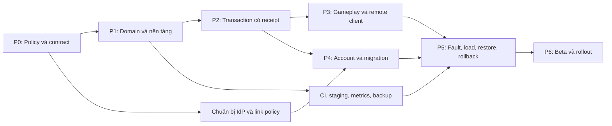

# 07 — Lộ trình triển khai và kiểm thử

Trạng thái: **kế hoạch công việc, chưa có backend chạy production**. Tài liệu này biến [kiến trúc](02-architecture.md), [giao dịch](03-data-and-transactions.md), [API](04-api-contract.md), [client/migration](05-client-sync-and-migration.md) và [vận hành](06-security-and-operations.md) thành các mốc có dependency, đầu ra và điều kiện nghiệm thu. Nguồn kỹ thuật kiểm tra ngày 20-09-2026; mọi ước lượng và tải mẫu đều là giả định lập kế hoạch.

## 1. Điểm xuất phát và nguyên tắc chia việc

Repo hiện có domain TypeScript tách khỏi engine, catalog/config, save migration và nhiều test gameplay. Chưa có DB transaction, auth server, API command/receipt, pipeline backend hoặc bằng chứng chịu tải nhiều người dùng. Không coi một bản build Cocos chạy được là hoàn tất phần backend.

Phần database được chia cụ thể thành [DB-00–DB-05 và DB-T01–DB-T16](08-postgresql-database-plan.md). Đây là các task con trong P0–P5 bên dưới; estimate DB 13–24 ngày công nằm trong estimate tổng, không cộng thêm lần nữa. DDL, roles và recovery gate phải được triển khai/kiểm thử trước khi đánh dấu phase tương ứng đạt.

| Nền tảng hiện có | Tận dụng thế nào | Phần cần chứng minh thêm |
| --- | --- | --- |
| [FarmActions](../../assets/farm/scripts/core/FarmActions.ts), [FarmAction](../../assets/farm/scripts/core/types/ActionTypes.ts) | Lập coverage matrix từng intent UI → policy/handler/API/test | Runtime schema, ownership, concurrent spend, giới hạn số và transaction |
| [GameSession](../../assets/farm/scripts/core/GameSession.ts), [game-session tests](../../tests/game-session.test.ts) | Giữ nguyên nguyên tắc candidate → persist → publish và test lỗi lưu | PostgreSQL commit/receipt thay cho localStorage; client chỉ công bố kết quả có bằng chứng server |
| [Construction tests](../../tests/construction-reset.test.ts) | Dùng làm acceptance kinh tế cho farm mới/mua từng công trình | Mua trên hai thiết bị, mất response, không auto-build khi bootstrap/sync/lên cấp |
| [Real-time tests](../../tests/real-time-economy.test.ts), [animal boost tests](../../tests/animal-boost.test.ts) | Giữ quy tắc công việc đã trả phí, queue đầy, thu một lần, boost tính đúng | Server clock, settlement transactional, policy config của job cũ, menu local không dừng thời gian cloud |
| [Save migration tests](../../tests/save-branding-migration.test.ts), [fixtures](../../tests/fixtures) | Dùng dữ liệu lịch sử để kiểm tra đường chuyển đổi | Không coi save hợp lệ là bằng chứng kinh tế; không nhập/chuyển farm lặp |
| [Browser harness](../../tests/browser-support.cjs), [construction browser test](../../tests/construction-reset.browser.cjs) | Giữ kiểm thử click/touch và quan sát UI trên bản build | Thêm API/DB thật, proxy/TLS/cookie, reconnect, hai browser context và lỗi mạng có kiểm soát |

Không sao chép domain thành hai bản độc lập lâu dài. Pha đầu xác định ranh giới dùng chung thuần TypeScript; giữ adapter local cho chơi local và thêm adapter remote cho mode online. Không đưa `cc`, localStorage, service locator UI hay timer mỗi frame vào backend. Việc thay semantics đồng hồ/menu được ghi rõ là thay đổi có chủ đích, có test riêng cho mỗi mode.

Không tạo Redis, WebSocket hoặc một background job cho mỗi cây/con vật/job sản xuất trong các pha MVP. Timer được settlement lười theo thời gian server trong command hoặc sync; tác vụ vận hành như xóa tài khoản, export lớn, retention và reconciliation có thể dùng job định kỳ có giới hạn khi thực sự cần.

## 2. Giả định ước lượng và đường phụ thuộc

Giả định có một kỹ sư backend, một kỹ sư client quen Cocos/domain và khoảng nửa thời gian QA/vận hành; managed PostgreSQL và OIDC có thể mua/provision, phạm vi đầu là browser, một vùng, một farm active/tài khoản. Không tính PvP, trade giữa người chơi, social, chat, event live, IAP, native store release hoặc nhập không kiểm soát mọi save local.

Đơn vị là **ngày công**, không phải ngày lịch; mỗi cột tính phần việc của vai trò đó. Khoảng dưới bao gồm implementation, review và test của pha; chưa bao gồm 20–30% dự phòng cho thay đổi quyết định, sự cố tích hợp và lịch cung cấp hạ tầng.

| Pha | Backend | Client | QA/vận hành | Dependency chính |
| --- | ---: | ---: | ---: | --- |
| P0 — Chốt quyết định và hợp đồng | 3–5 | 2–3 | 1–2 | Không |
| P1 — Skeleton, domain dùng chung, clock | 5–8 | 2–4 | 1–2 | Quyết định nền P0 |
| P2 — Giao dịch đầu tiên có guest/auth và receipt | 6–10 | 3–5 | 2–3 | P1 + API/data contract P0 |
| P3 — Toàn bộ gameplay v1 và client remote | 6–9 | 5–8 | 3–5 | P2 đạt fault/concurrency gate |
| P4 — OIDC, liên kết, nhiều thiết bị, chuyển local | 4–7 | 4–7 | 2–4 | P0 policy account; P2; tích hợp sau P3 |
| P5 — Vận hành, bảo mật, tải và diễn tập | 5–8 | 2–4 | 4–6 | CI/infra bắt đầu từ P1; rehearsal cần P3/P4 |
| P6 — Beta giới hạn và mở rộng | 2–4 | 2–3 | 3–5 | P3/P4/P5 đạt release gate |
| Tổng trước dự phòng | **31–51** | **20–34** | **16–27** | **67–112 ngày công tổng** |

Lịch sơ bộ với nhân sự trên là khoảng 10–16 tuần nếu các quyết định được giải quyết đúng hạn; cần lập lại sau P0/P2 bằng tốc độ thực tế. Không lấy tổng ngày công chia đều để cam kết ngày phát hành: auth/provider, build Cocos, QA và restore rehearsal có dependency. Native hoặc IAP cần estimate riêng và có thể thay đường găng.



## 3. Backlog theo pha và điều kiện nghiệm thu

### P0 — Quyết định đủ để implement

1. Backend + product xác nhận farm là server-authoritative; online yêu cầu kết nối cho command; không nhận arbitrary save, reset/pause/speed từ client. Chốt UX pending, reject, maintenance và mất mạng.
2. Backend + client review schema envelope `/api/v1`: `protocolVersion`, UUID `commandId`, UUID `farmEpoch`, `expectedRevision` dạng chuỗi thập phân, `catalogVersion` bất biến và `action`. GET bootstrap/state không ghi settlement; POST sync/commands dùng receipt. OpenAPI và ví dụ lỗi phải có owner.
3. Product chốt guest recovery, chọn IdP, phạm vi browser/native, xung đột hai farm, chính sách chuyển local, retention/xóa/export và quyền admin. Backend/client bổ sung OpenAPI cho workflow export/delete trước khi implement P4; các URL lifecycle đó chưa được chốt trong [04](04-api-contract.md). Không để kỹ sư tự giả định merge coin hoặc ghi đè save.
4. Vận hành chọn vùng/provider, PostgreSQL 18 managed hoặc 17 đã hỗ trợ, mức HA, budget, mục tiêu SLO/RPO/RTO và người trực. Lấy giá thật sau khi chốt cấu hình.
5. Lập inventory từng `FarmAction` và nguồn/sink kinh tế; đánh dấu thao tác local-only và hợp đồng cần đổi. Chốt đơn vị thời gian/số nguyên/giới hạn domain và strategy phiên bản job/config.

**Nghiệm thu:** ADR/decision log có owner và hạn cho mục còn mở; API/data/client docs không mâu thuẫn; ví dụ hai thiết bị cùng mua và timeout sau commit có kết quả DB/UX xác định. Những quyết định chưa chốt chỉ cho phép làm việc độc lập, chặn phần implementation phụ thuộc.

### P1 — Nền tảng chạy và domain có thể kiểm thử

1. Tạo service theo [02](02-architecture.md): TypeScript, Node 24 LTS/Fastify 5, PostgreSQL, cấu hình theo môi trường, health/readiness, logging có redaction; khóa dependency và runtime trong CI.
2. Tạo migration runner một người thực thi, schema tối thiểu và seed catalog bất biến; khởi động local/CI từ DB trắng bằng một quy trình được ghi lại. App role không có quyền migration.
3. Tách/import domain dùng chung theo module rõ ràng; tái sử dụng validator/fixtures. Inject server clock; không dùng thời gian hoặc tốc độ client làm bằng chứng. Nếu constructor hiện tại tự advance dữ liệu, tách đường đọc để GET không có side effect.
4. Định nghĩa settlement bounded trên job đã trả phí và chính sách job cũ qua catalog mới. Cố định `now` cho một lần xử lý dưới transaction; không đọc giờ khác nhau cho từng bước tính giá/boost.
5. Client tạo remote transport interface và mock contract test, chưa bật online công khai. Bảo toàn chế độ local và các asset/prefab path hiện có.

**Nghiệm thu:** fresh DB → migrate → start → health; CI chạy domain tests không cần engine; cùng fixture + clock + catalog cho cùng kết quả; GET không ghi DB; kiểm tra timer không tạo thưởng/công trình mới. Review bản đồ module và dependency, không có hai bản domain trôi riêng.

### P2 — Một vòng chơi hoàn chỉnh với commit thật

1. Tạo guest principal/farm/session server và ownership bằng `enrollmentKey` đã lưu trước request; nhận cookie cùng-origin trong môi trường test. Mất response rồi retry cùng key chỉ phát lại credential pending, sau `/auth/guest/confirm` mới mở command; chỉ có một account/farm/starter ledger. Test key đã confirm, hết hạn, fingerprint khác và confirm lặp. Không dùng farm ID hoặc device ID làm secret.
2. Cài transaction khóa account/session/ownership/farm theo thứ tự thống nhất, receipt unique `(farm_id, command_id)` không phụ thuộc actor/epoch, fingerprint, revision check, state/ledger và terminal rejection theo [03](03-data-and-transactions.md). Retry/replay diễn ra sau quyền hiện tại, trước policy dành cho command mới; logout/revoke cạnh command phải có kiểm thử tuyến tính hóa.
3. Cài state/bootstrap chỉ đọc, sync settlement bền vững và luồng command hẹp nhưng đủ chơi: farm mới → mua công trình cấp đầu → mua/cho ăn vật nuôi hoặc sản xuất thức ăn → chờ/đồng bộ → thu/sell. Danh sách chính xác theo catalog hiện hành; không seed công trình vào farm người chơi để làm demo.
4. UI online biểu diễn pending/committed/rejected/unknown; lưu outbox có ID trước gửi, khôi phục request chưa rõ kết quả sau reload. Không vừa chạy local action vừa cộng lại response server.
5. Viết integration dùng PostgreSQL thật cho đồng thời, rollback candidate, duplicate receipt và crash quanh commit. Gate này phải qua trước khi mở rộng tất cả action.

**Nghiệm thu:** refresh và reconnect giữ farm; mua xây đúng giá một lần; hai request cạnh tranh không chi quá số dư; không auto-build khi lên cấp/mở shop/sync; mất response sau commit rồi retry cho một ledger effect. Terminal rejection có receipt nhưng farm/time/revision không nhận settlement ứng viên; sync riêng có thể ghi timer hợp lệ. Bản demo đầu tiên có browser → API → DB, không chỉ mock.

### P3 — Phủ toàn bộ gameplay v1 và client online

1. Hoàn tất coverage matrix runtime schema/handler/ledger/test cho mọi action được duyệt: trồng/thu/hủy/boost/improve, production queue/collect, mua machine, pen/animal/feed/boost/collect, sell/coin exchange, placement và các tiến trình hỗ trợ được giữ trong v1. Action UI không được duyệt phải có UI policy rõ ràng, không để nút gọi API chưa có handler.
2. Validate level, nguyên liệu, số lượng, slot, capacity, collision/footprint, building identity và integer bounds ở server; không chỉ dựa nút disabled. Giữ giá và yêu cầu xây công trình theo catalog, kể cả nhiều công trình cùng loại.
3. Tích hợp state hydration, revision/epoch/catalog handling và timer interpolation dùng server-time anchor. UI countdown có thể chạy local, hoàn thành/thu thưởng vẫn cần server quyết định.
4. Mỗi farm/client chỉ gửi một mutation đang chờ theo outbox policy; gộp sync dư thừa. Conflict cần đọc trạng thái và người chơi xem lại intent chi tiêu; không tự rebase/spam command ID mới.
5. Chạy desktop/mobile dọc/ngang cho shop, livestock, production, boost, moving buildings và reload; xác nhận panel refresh theo state mới và không lộ controls debug thành API quản trị.

**Nghiệm thu:** mọi intent online có test hành vi thành công/reject và liên kết trong coverage matrix. Farm mới vẫn chưa có các công trình phải mua. Số dư, inventory, job đã trả phí, vị trí xây và tiến trình khớp DB sau reload trên thiết bị khác. Local-only import/reset không gửi cloud mutation.

### P4 — Tài khoản, xung đột farm và chuyển người chơi hiện tại

1. Tích hợp OIDC Code + PKCE, callback checks, session rotation/revocation và CSRF theo [06](06-security-and-operations.md). Test IdP giả lập trước, xác minh tenant staging thật trước beta.
2. Link guest giữ farm/receipt; danh tính thuộc farm khác sinh conflict challenge một lần có thời hạn, reauth và chọn active/archive theo [05](05-client-sync-and-migration.md). Không merge wallet/inventory. Thử link đồng thời và replay challenge.
3. Thêm phục hồi qua IdP, logout một/mọi thiết bị theo policy, export và workflow delete có audit theo contract lifecycle đã duyệt ở P0. Thử mất credential guest chưa link và lời giải thích đúng với khả năng phục hồi thật.
4. Thực hiện migration local qua luồng có scope/consent/giới hạn được duyệt. Lưu nguồn local để người chơi có thể tiếp tục chế độ local theo [05](05-client-sync-and-migration.md); không phát quyền kinh tế chỉ vì JSON qua validator.
5. Pending command thuộc farm/epoch nào giữ nguyên namespace; khi đổi farm/tài khoản không phát lại vào farm khác. Chủ mới hợp lệ có thể tra receipt farm cũ sau chuyển quyền; chủ cũ không còn quyền.

**Nghiệm thu:** ma trận khách/tài khoản/farm trống/farm có tiến trình/hai thiết bị và local save lịch sử qua đủ. Một lần migration/link không nhân đôi tài nguyên; cancel/conflict không âm thầm xóa nguồn. Xóa/thu hồi vẫn có hiệu lực sau restore rehearsal. Native nếu được chọn phải có test riêng trên thiết bị cho callback và secure credential, không chỉ giả lập browser.

### P5 — Chuẩn bị vận hành thực tế

1. Hoàn tất CI/CD artifact promotion, secrets, proxy/TLS/cookie, readiness/drain, limits, metrics/traces/redaction và dashboard có runbook. Cấu hình môi trường được kiểm tra khi start, không fallback production sang DB/catalog dev.
2. Thực hiện ma trận fault/security thuộc MVP bên dưới; kiểm thử ledger, quyền vận hành/support, retention receipt/tombstone, backfill và dữ liệu lịch sử có lỗi. Admin grant/debit là pha sau; các bài grant trở thành gate khi đưa tính năng đó vào scope.
3. Chạy load/soak trên cấu hình staging đại diện, đo state/index/WAL/egress và forecast chi phí. Chỉnh pool/index/query/caps bằng bằng chứng trước khi cân nhắc Redis hay tách service.
4. Restore từ base backup/WAL vào DB khác, xác nhận RPO/RTO, áp lại deletion/revocation và kiểm tra receipt/ledger. Diễn tập deploy N rồi rollback code N−1 sau khi đã nhận action mới.
5. Review bảo mật tập trung BOLA, phiên/CSRF, command abuse và quyền vận hành; đóng lỗi ảnh hưởng ownership/kinh tế/durability trước beta. Ghi rõ phần chưa test do phụ thuộc IdP/provider.

**Nghiệm thu:** có báo cáo, dữ liệu đầu vào và artifact cho mỗi gate; không chỉ checklist tự đánh dấu. Rollback giữ accepted actions; backup có bằng chứng restore; SLO/chi phí có baseline đo, owner xử lý incident có quyền cần thiết và đã thử runbook.

### P6 — Beta giới hạn và phát hành

1. Bật theo cohort cấu hình server, bắt đầu tài khoản nội bộ rồi nhóm beta đã xác định; giữ đường truy kết quả command cũ khi chặn command mới.
2. Quan sát ít nhất một chu kỳ chơi/offline và cửa sổ đủ để đánh giá lỗi thực tế đã chốt ở P0; không suy ra SLO tháng từ một giờ smoke. Đo support load, lost session, revision conflict, retry và tỷ lệ từ bỏ thao tác pending.
3. Chỉ mở rộng khi không có lỗi ownership/duplicate spend/mất state chưa giải thích; load/cost/SLO trong ngân sách và on-call sẵn sàng. Nếu không đạt, giữ cohort và sửa, không tự lùi dữ liệu toàn server.
4. Chốt tài liệu release, migration, support/recovery, runbook và danh sách phần còn ngoài phạm vi. IAP/social/leaderboard là backlog sau, mỗi phần có threat model/estimate mới.

**Nghiệm thu GA:** product, backend, client, QA và vận hành cùng xác nhận các gate ở mục 7; không còn quyết định bắt buộc chưa có chủ trì. Báo cáo rõ kết quả đo và giới hạn, không tuyên bố đã đạt những SLO chưa quan sát đủ.

## 4. Các tầng kiểm thử và cách dùng repo hiện tại

| Tầng | Nội dung | Phải bắt được |
| --- | --- | --- |
| Domain thuần | Fixtures, clock inject, economy/property tests | Giá/level/capacity sai, số dư âm, overflow/NaN, duplicate collect, job cũ đổi giá sau config update |
| Route/schema | Fastify injection, auth middleware, response validation | Payload ngoài allowlist, lỗi envelope, response lộ dữ liệu, status/error không đúng contract |
| DB integration | PostgreSQL cùng major production, nhiều connection, constraint và crash injection | Races, lock ordering, transaction một phần, receipt/ledger lệch, migration không thể chạy tiếp |
| Contract client/API | Request/response thực, version skew, outbox và unknown result | Retry đổi ID, hydrate state cũ đè state mới, pending gửi nhầm farm, ID số lớn mất chính xác |
| Browser E2E | Build Cocos thật + API/DB/proxy test, desktop và mobile | UI pending/reject, cookie/CSRF, reload giữa action, hai phiên cạnh tranh, menu/timer/placement |
| Staging/security/ops | IdP thật, TLS, limits, deployment, failover, backup | Những lỗi proxy/provider/credential và khôi phục không thể chứng minh bằng unit test |

Fastify `inject` phù hợp kiểm thử route trong process; nó không thay thế thử HTTP/TLS/cookie qua proxy hay PostgreSQL thật. [Fastify Testing Guide](https://fastify.dev/docs/latest/Guides/Testing/)

Các lệnh hiện có, dùng từ root repo sau khi cài dependency đúng lockfile:

```sh
npm ci
npm ci --prefix cocos
npm test
npm run verify --prefix cocos
```

`cocos` verify đã gồm asset/prefab/layer/structure checks, format, core typecheck và unit tests. Không viết lại những check này vào backend dưới dạng snapshot đếm file. Full Cocos build/typecheck và browser E2E cần Creator 3.8.8 cùng môi trường build phù hợp; CI runner đó là việc cần provision, không giả định đã có.

Harness browser hiện dùng `COCOS_TEST_BUILD` để chỉ thư mục build và một số test hỗ trợ `COCOS_TEST_URL`. Ví dụ kiểm tra hiện có sau khi tạo build:

```sh
COCOS_TEST_BUILD=cocos/build/farm-web-mobile node cocos/tests/construction-reset.browser.cjs
```

Đây là regression cho game local hiện tại. Bài online mới phải có API URL/auth bootstrap được cấu hình riêng, DB fixtures cô lập và assert ledger; không sửa fixture cho trực tiếp coin/XP vào live state rồi gọi đó là E2E server-authoritative. Test admin setup được phép seed DB tổng hợp trước bài test qua công cụ chỉ có trong test.

Các script backend như lint, typecheck, unit, integration, migrate và contract sẽ được đặt tên khi tạo service P1 theo [02](02-architecture.md); chúng **chưa tồn tại** và không phải lệnh có thể chạy ngay hôm nay. CI kế hoạch: cài khóa dependency → check source/domain → DB migration/integration → contract/security → build Cocos → browser → staging rehearsal theo gate. Lưu failure seed, request IDs và log đã redact để tái hiện.

## 5. Ma trận lỗi, cạnh tranh và bảo mật bắt buộc

Oracle của mỗi bài không chỉ là HTTP status: kiểm tra farm revision/state, receipt/fingerprint, ledger effects, ownership, response replay và UI sau reload. Dùng latch/fault hook test-only tại ranh giới transaction để gây lỗi xác định; không dùng sleep may rủi để giả lập concurrency.

| Tình huống | Cách tạo | Kết quả bắt buộc |
| --- | --- | --- |
| Request mất trước DB commit | Ngắt trước commit/rollback transaction | Không có effect một phần; retry cùng ID có thể thực thi đúng một lần |
| DB commit xong nhưng mất response | Kill API/ngắt socket sau commit | State + ledger + receipt cùng tồn tại; status/retry cùng ID trả kết quả cũ, không chi/cấp lại |
| Hai request cùng ID/cùng body | Hai connection đến cùng lúc | Một effect; request còn lại replay hoặc chờ theo contract, không trả hai kết quả mâu thuẫn |
| Cùng ID khác body/epoch | Sửa quantity/action/epoch rồi gửi lại | ID reuse bị từ chối; không sinh namespace mới, không sửa receipt |
| Hai ID cùng expected revision | Hai thiết bị cùng dùng số dư cuối | Tối đa một action áp dụng trên revision đó; action kia conflict và cần review intent mới |
| Replay sau đổi policy | Commit → maintenance/min-client/catalog mới → retry ID cũ | Người còn quyền lấy receipt trước policy chặn command mới; không bị buộc tạo ID mới |
| Đổi chủ sau guest link | Commit dưới guest → chuyển quyền hợp lệ → tra/replay | Chủ hiện tại được tra; actor cũ không còn quyền; không mất receipt vì đổi account |
| State GET có timer đến hạn | Gọi bootstrap/state lặp khi job vừa ready | DB state/revision/receipt không đổi; sync mới lưu chuyển trạng thái timer |
| Provision và guest lost response | GET bootstrap khi `currentFarm:null`; mất response `/auth/guest` hoặc `/me/farms`, retry cùng key/operation; confirm bị mất response | GET không ghi; một farm/opening ledger duy nhất; pending retry phát lại cùng credential; confirm lặp an toàn; key/fingerprint/operation đổi trả lỗi reuse; starter không cấp lặp |
| Auth revoke cạnh command | Logout/refresh/revoke-all tranh chấp cùng session với command; response refresh native bị mất | Lock order account → session → ownership → farm; request lấy lock trước được tuyến tính hóa, request thấy revoke không mutate; token cũ sau rotation bị phát hiện reuse và revoke cả family |
| Canonical numeric validation | Save/command có fractional hoặc unsafe `coins/xp/earned/harvested/sold`, finite fractional `time` hợp lệ | Backend validator từ chối số đếm/ví không safe integer; cho phép `time` hữu hạn theo domain; không dùng save validator hiện tại làm authority |
| Command reject sau candidate settlement | Timer đến hạn rồi gửi action thiếu tiền hoặc sai target | Receipt terminal rejection giữ; candidate time/state/ledger không commit; sync riêng settle được |
| Receipt rút gọn/cleanup | Rút full payload, giữ lifetime tombstone; replay rất muộn | Trả kết quả rút gọn theo contract, không thực thi lại; cleanup không xóa dấu đã xử lý |
| Xây công trình/chuồng | Fresh farm, lên cấp, mở shop, sync/reload, mua hai lần | Không auto-build; đúng level và đủ tổng chi phí; một công trình/slot không mua trùng |
| Boost và collect | Biên thời gian ready, thiếu diamond, boost/collect lặp | Chỉ job đích thay đổi, giá server đúng; collect thưởng một lần; reject không mất tiền |
| Queue/output đầy | Offline dài khi khay đầy rồi thu một phần | Chỉ công việc đã trả phí tiến triển; không vượt capacity hoặc chạy vô hạn |
| Clock và offline | Client ± nhiều năm; server clock lùi trong fixture; offline 7/30 ngày | Client clock không cấp lợi ích; không settle lại khoảng cũ; runtime bounded; job cũ giữ điều khoản |
| Catalog/schema khác phiên bản | Client cũ + config mới + job mua từ config cũ | Lỗi rõ ràng cho command không tương thích; job/replay cũ vẫn diễn giải đúng; không reset farm |
| BOLA trên mọi đường đọc/ghi | Tài khoản B gửi farm/job/receipt/export của A | Không đọc hoặc mutate; không lộ payload qua cache/replay; auth/status đúng contract |
| CSRF/session/rotation | Cross-site POST, thiếu token, credential cũ, logout/reuse refresh | Chặn theo adapter; session thu hồi không tiếp tục đọc/ghi; log không chứa credential |
| Guest/ID/body abuse | Tạo nhiều guest, ID ngẫu nhiên, body quá lớn, flood replay | Trần tài nguyên hoạt động; lỗi có retry policy; không làm pool/receipt table tăng không kiểm soát |
| Link conflict/recovery | Hai farm có tiến trình, hai link đồng thời, cùng email khác subject | Không merge ví hoặc chiếm farm; challenge không dùng lại; recovery cần chứng cứ đúng |
| Local migration/import | JSON hợp lệ nhưng sửa coin, source cũ/corrupt, migration lặp | Theo policy chuyển đổi; không tự công nhận giá trị local, không nhân đôi và giữ nguồn đúng UX |
| DB deadlock/timeout/failover | Cắt connection trước/quanh commit, tạo lock tranh chấp | Không biến unknown thành reject chắc chắn; retries bounded; reconcile bằng receipt |
| Rollout/rollback | N−1 → N → accepted actions → N−1 | Code tương thích đọc/replay/tiếp tục từ state mới; không PITR về trước action |
| Migration bị ngắt | Dừng giữa backfill rồi chạy tiếp; mixed app versions | Không mất dữ liệu, không cấp thưởng lại, progress chạy tiếp; contract chỉ sau compatible window |
| Restore DB | Restore một mốc có command đã biết và một command bị mất khỏi PITR | Farm/ledger/receipt/config nhất quán; tạo recovery epoch trước mở ghi, command epoch cũ bị chặn, không reuse ID; RPO/RTO và khoảng mất dữ liệu được ghi thật |
| Delete rồi restore | Xóa/thu hồi sau snapshot được restore | Áp lại tombstone trước traffic; dữ liệu/quyền đã xóa không âm thầm sống lại |
| Admin grant/debit, pha sau | Retry grant, thiếu quyền/duyệt, điều chỉnh sai | Gate khi triển khai công cụ: audit + ledger atomic; không nhân đôi; sửa sai bằng entry bù có tham chiếu |
| IAP, chỉ khi triển khai sau | Receipt giả/trùng, sai app, pending/refund/out-of-order | Server xác minh, một lần cấp, đối soát được; gate riêng trước bật tiền thật |

Bổ sung property/fuzz test có miền hữu hạn cho quantity/index/slot/coordinate/timestamp và chuỗi action ngẫu nhiên: invariants luôn giữ, encode/decode không mất số lớn, lặp receipt không đổi state. Không so tất cả HTTP 4xx thành một loại pass; tách business reject, revision conflict, auth failure, throttle và protocol error theo [04](04-api-contract.md).

## 6. Mô hình tải và tiêu chí đánh giá

### Tính từ hành vi người chơi

`commands/ngày = DAU × số phiên/ngày × số command/phiên`.

`peak command RPS = commands/ngày ÷ 86.400 × hệ số đỉnh`.

Thêm sync/read/auth/retry riêng; không coi một người online là một request mỗi frame. Ví dụ giả định 1.000 DAU × 3 phiên × 40 command = 120.000 command/ngày, trung bình khoảng 1,39 RPS; hệ số đỉnh 10 cho khoảng 13,9 command RPS. Đây là ví dụ tính toán, không phải số người chơi hoặc telemetry hiện có. Sync đến hạn/reconnect và read có thể tăng đáng kể; client phải gộp sync và tránh polling dày.

### Kịch bản baseline đề xuất

| Bài tải | Input ban đầu | Đo và gate |
| --- | --- | --- |
| Baseline | Ramp 5 phút rồi 100 tổng RPS trong 30 phút: 50% commands, 30% sync, 20% read; 1.000 farm tổng hợp | Mục tiêu action p95 <300 ms/p99 <1 s; 5xx không chủ đích <0,1%; không invariant violation |
| Cùng farm | 2, 10, 50 client tranh một farm; hỗn hợp cùng/khác ID | Receipt chính xác, lock wait có trần, conflict là kết quả dự kiến; không đòi mọi request tranh cùng revision thành công |
| Spike/reconnect | 5× baseline trong 60 giây rồi trở về bình thường; nhiều client resume cùng lúc | Không mất accepted action; throttle hữu hạn/Retry-After đúng; pool/memory phục hồi, không retry storm |
| Soak | 30 RPS ít nhất 8 giờ với retry, sync, login refresh, data growth | Không rò memory/connection; đo tăng state/index/receipt/WAL và lệch ledger |
| Farm lớn/offline | Farm gần trần plot/pen/queue/inventory, job cũ, offline 30 ngày | Settlement bounded, không vượt timeout và không lặp từng giây |
| Graceful shutdown/failover | Baseline đang chạy khi rolling deploy/kill/failover staging | Phân loại known/unknown outcomes, retries tìm receipt; thời gian phục hồi trong mục tiêu diễn tập |

100 RPS là mốc benchmark ban đầu, không phải cam kết capacity production hay trần mở beta. Ghi rõ loại CPU/RAM, tier DB, region/RTT, replica, pool, catalog hash, fixture size, build SHA và cấu hình limits trong báo cáo. So sánh kết quả trên cùng input và topology.

Generator phải có state, dùng action hợp lệ dựa trên revision mới, tồn kho và timer; seed farm tổng hợp trước bài test bằng công cụ test-only. Hỗn hợp có thể dành khoảng 10% command cho domain reject và 10% cho replay có chủ đích, nhưng báo riêng throughput/latency accepted/rejected/replayed. Không dùng hàng loạt action hết tiền trả lỗi nhanh để báo đạt throughput gameplay.

Đo từ phía phát tải lẫn phía server, giữ arrival rate đủ để không che latency bằng việc client chờ rồi giảm tải. Hiển thị request drop/throttle/timeouts thay vì bỏ khỏi thống kê; auth/IdP dùng tenant test và giới hạn được phép, không flood nhà cung cấp bên ngoài. Test timer dùng catalog production cho báo cáo chính; catalog rút thời gian chỉ phục vụ bài test chức năng riêng.

Sau baseline, lấy byte/command cho ledger/receipt/index và WAL, byte/read, tỷ lệ cache và egress vào công thức chi phí [06](06-security-and-operations.md). Chỉ thêm index/pool/replica sau khi xem query plan/lock/CPU; Redis, background queue hay chia service cần bottleneck đã đo cùng phương án bảo toàn transaction.

## 7. Release gate, rehearsal và bằng chứng bàn giao

| Gate | Điều kiện bắt buộc | Bằng chứng lưu cùng release |
| --- | --- | --- |
| G1 — Domain/contract | Tất cả action v1 có policy/schema/test; semantics timer và phiên bản thống nhất | Coverage matrix, OpenAPI, fixture hashes, kết quả CI |
| G2 — Giao dịch | Không duplicate/partial effect trong concurrency/fault matrix; rejection và sync đúng | SQL assertions, receipt/ledger đối soát, fault seed và log đã redact |
| G3 — Client/account | Reconnect/outbox/two-device/link/migration/delete không mất hoặc nhân đôi farm | Browser videos/screenshots cần thiết, account matrix, dữ liệu test và outcome |
| G4 — Bảo mật | Không còn lỗi ownership/session/CSRF/secret/quyền vận hành có thể chiếm farm hoặc sửa kinh tế; kiểm admin grant nếu đã đưa vào scope | Review có owner, test regression và xác nhận xử lý findings |
| G5 — Vận hành | Alert/runbook/backup restore/migration/rollback/drain được diễn tập | Báo cáo RPO/RTO thật, rollback sau accepted action, biểu đồ load/cost và incident drill |
| G6 — Sản phẩm phát hành | Guest recovery, local migration, retention, SLO và người trực đã chốt | Decision log, cohort/feature config, thông báo UX, kế hoạch hỗ trợ |

Rehearsal tối thiểu trên staging: tạo farm mới và mua bằng action thật → ghi bộ command kiểm chứng → deploy schema mở rộng/code/config N → nhận thêm action → chủ động làm mất response → rollback code tương thích N−1 → replay và đọc trên thiết bị khác → đối soát ledger → diễn tập restore riêng trong DB cô lập. Restore DR không được dùng để đạt gate rollback release.

Khi release lỗi, dừng tăng cohort và chặn command mới bị ảnh hưởng, giữ quyền tra receipt; rollback code nếu tương thích hoặc forward fix. Không dùng snapshot trước deploy để xóa các action đã chấp nhận. Quyết định PITR chỉ theo sự cố dữ liệu/DR và runbook có nêu khả năng mất dữ liệu trong RPO, như [06](06-security-and-operations.md).

Đầu ra bàn giao gồm commit/artifact, config/catalog versions, migration range, các phiên bản client hỗ trợ, SLO đã đo/chưa đo, dashboard/runbook/owner, backup drill gần nhất và danh sách hạn chế còn lại. Hoàn thành bộ tài liệu kế hoạch hiện tại không đồng nghĩa các gate implementation đã đạt.

## 8. Những quyết định làm đổi phạm vi

| Câu hỏi | Nếu chọn khác baseline | Mốc cần chốt |
| --- | --- | --- |
| Browser trước hay native cùng đợt? | Thêm secure credential, deep-link, thiết bị và store review; estimate riêng | P0 trước auth/client adapter |
| Có cho chơi và chi tiêu offline online-mode? | Cần policy reconcile/cheat/conflict khác; không còn chỉ outbox cho command chưa rõ kết quả | P0 trước contract |
| Cloud có nhận giá trị từ save local? | Cần trust policy, giới hạn, một lần import, hỗ trợ tranh chấp; không thể kiểm chứng lịch sử bằng validator | P0 trước P4 |
| Khi liên kết hai farm giữ farm nào? | Nếu muốn merge phải thiết kế chống nhân đôi toàn bộ economy; baseline chỉ chọn active/archive | P0 trước P4 |
| Có yêu cầu RPO=0 khi mất vùng? | Thay HA/replication và chi phí; backup bất đồng bộ đơn thuần không đáp ứng | P0 trước chọn provider |
| Có tiền thật ngay? | Thêm receipt verification, refund, audit/retention và release gate payment | Trước chốt phạm vi, không ghép muộn vào P6 |
| DAU/vùng/latency thực tế lớn hơn giả định? | Lập lại load model, DB budget, topology và hỗ trợ trực | P0 rồi cập nhật sau P2/P5 |

Owner P0 phải ghi quyết định hoặc issue chặn rõ ràng. Các phần độc lập vẫn làm song song; không triển khai mặc định có thể làm mất farm hoặc thay kinh tế khi sản phẩm chưa quyết định.
