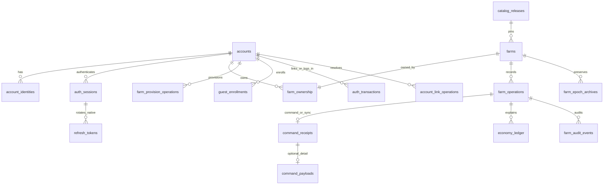

# 08 · Kế hoạch database PostgreSQL

Ngày lập: **23/09/2026**. Đối chiếu repo tại **`df98090`**. PostgreSQL là database được chọn cho kế hoạch này; **chưa tạo service, database, migration hay tài nguyên cloud**. SQL dưới đây là bản thiết kế để review, chưa phải migration production đã chạy thử.

[Mục lục backend](README.md) · [Quy tắc giao dịch](03-data-and-transactions.md) · [API](04-api-contract.md) · [Vận hành](06-security-and-operations.md) · [Lộ trình tổng](07-roadmap-and-testing.md)

Tài liệu 03 quy định kết quả giao dịch; 04 quy định wire contract. Tài liệu này cụ thể hóa **kiểu cột, khóa, index, quyền DB, thứ tự migration và bằng chứng nghiệm thu**. Các phase DB là phần việc trong P0–P5 của kế hoạch tổng, không phải một dự án cộng thêm vào estimate đó.

## 1. Thiết kế được chọn và phạm vi

Một farm là một aggregate: một thao tác thường đổi cùng lúc ví, kho, công việc, XP và mốc mở khóa. Lưu snapshot `FarmState` vào `jsonb`; dùng bảng quan hệ cho account, identity, session, ownership, catalog và bằng chứng giao dịch. Đây là lựa chọn thiết kế cho game hiện tại. PostgreSQL hỗ trợ JSONB và khóa cả hàng khi cập nhật; vì vậy cần giới hạn kích thước snapshot và thời gian transaction. [PostgreSQL JSON types](https://www.postgresql.org/docs/18/datatype-json.html).

| Quyết định | Phương án cho bản đầu |
| --- | --- |
| Engine | PostgreSQL **18**, minor đã vá và image/digest được pin; 17 chỉ khi provider không đáp ứng 18. Dev/CI/staging/prod cùng major. |
| Kết nối | API TypeScript dùng `pg`, SQL có tham số; Cocos chỉ gọi HTTPS API. |
| Topology | Một primary ghi, DB managed cùng vùng với API; HA/PITR theo budget đã chốt. Không đọc state/receipt từ replica có lag. |
| Database/schema | Database riêng mỗi môi trường, ví dụ `ola_farm_dev`, `ola_farm_test`, `ola_farm`; schema ứng dụng `game`. |
| State gameplay | `game.farms.state` là nguồn ví/kho/XP có quyền chi tiêu duy nhất. Không tạo bảng wallet có số dư sửa độc lập. |
| Timer | Lazy settlement khi command/sync; không tạo cron riêng cho từng cây, con vật hoặc job. |
| Đồng thời | `READ COMMITTED` + khóa theo protocol ở mục 7; `expectedRevision` phát hiện ý định dựa trên state cũ. |
| Chống lặp | `(farm_id, command_id)` bền vững, không phụ thuộc account hoặc epoch. |
| Nội dung | Catalog release bất biến; không sao chép giá/level vào SQL trigger. |
| Ngoài phạm vi | Payment, player trade, leaderboard, reset/import online, native auth nếu chưa chọn nền tảng đó. |

Đầu vào hiện có: [FarmState](../../assets/farm/scripts/core/types/StateTypes.ts), [FarmAction](../../assets/farm/scripts/core/types/ActionTypes.ts), [FarmGame](../../assets/farm/scripts/core/FarmGame.ts), [FarmValidation](../../assets/farm/scripts/core/FarmValidation.ts) và [farm-town JSON](../../assets/farm/bundles/farm-town/). Baseline có 25 action trong union; `setPenSpecies` bị từ chối ở online simple. Farm mới có 500 xu, 10 kim cương, 6/40 ruộng mở, 0 máy/chuồng đã mua, state v7/layout v6. Giá trị này dùng làm fixture; server đọc catalog, không ghi cứng vào `DEFAULT` của DB.

## 2. Sơ đồ dữ liệu và nguồn có thẩm quyền



Sơ đồ thể hiện quan hệ logic; một số proof/tombstone có FK nullable để xóa liên kết danh tính theo retention. `farm_ownership` bắt buộc có đúng một hàng cho mỗi farm đã hoàn tất provision; PK chỉ bảo đảm *tối đa một*, service và integration test bảo đảm *có một*.

`farm_operations` là bảng khóa chung bổ sung cho mô hình ở 03: registry nhỏ nối receipt, ledger và audit. Nó cho phép opening ledger/catalog migration/DR có FK hợp lệ dù không phải command của người chơi. Registry chỉ lưu ID/kind/thời điểm; không chứa ví hay sao chép kết quả receipt. Với gameplay, `operation_id` chính là `commandId`; với tác vụ hệ thống, server tạo UUID nội bộ và giữ nguyên qua retry. Ghi registry cùng transaction cuối cùng, không commit một hàng “đang xử lý” trước gameplay.

Không tách plots/machines/animals thành bảng trong MVP. Báo cáo theo item/level sau này là projection có thể dựng lại từ snapshot/ledger; mọi quyền chi tiêu vẫn qua farm aggregate.

## 3. Quy ước kiểu dữ liệu

| Dữ liệu | Kiểu PostgreSQL và ràng buộc | Quy tắc adapter |
| --- | --- | --- |
| Account/farm/session/operation/epoch | `uuid`, server tạo ID danh tính; client tạo command UUID v4 | Chuẩn hóa UUID trước fingerprint theo version; không dùng UUID làm quyền truy cập. |
| Revision | `bigint CHECK (revision >= 0)` | Wire là decimal string tối đa 19 chữ số, ≤ 9223372036854775807. Không cấu hình driver parse int8 thành Number. Chặn revision exhaustion trước increment. |
| Coins/diamonds/XP/quantity/stat | JSON number; ledger dùng `bigint` | Domain phải `Number.isSafeInteger`, trong 0..9007199254740991; signed delta được giới hạn tương ứng. Kiểm overflow cả phép nhân/trung gian. |
| Game time | JSON number hữu hạn, không âm; có thể phân số | Giây logic; không chuyển thành ngày UTC hoặc làm tròn mỗi tick. |
| Giờ quản trị/watermark | `timestamptz`, session timezone UTC | Đề xuất chuẩn hóa server clock xuống milliseconds bằng `date_trunc('milliseconds', clock_timestamp())`; dùng đúng một giá trị sau khóa. Không làm tròn lên hoặc mất phần lẻ ở mỗi lần lưu. |
| Hash SHA-256 | `bytea CHECK (octet_length(hash) = 32)` | Canonicalizer có version; không hash `jsonb::text` để so với JSON do JS serialize. |
| Token/secret | Hash 32 byte để lookup; ciphertext + key ID chỉ khi cần lấy lại secret | Credential không vào receipt/payload/log. Khóa giải mã ở secret manager, không cùng backup DB. |
| Status/kind | `text NOT NULL` + `CHECK IN (...)` | Tập mã versioned; bổ sung qua migration. Tránh enum số tự tăng. |
| Issuer/subject/catalog/item key | `text`, độ dài bounded, so sánh phân biệt hoa thường | Identity `(issuer, subject)` dùng collation `C`; không lowercase email rồi gộp account. |
| JSON document | `jsonb NOT NULL`, kiểm loại object và size | Validate schema/domain trước DB; parser phát hiện duplicate keys trước JSONB. |

`CHECK` có kết quả NULL không tự từ chối hàng; trường bắt buộc cần `NOT NULL`, còn check bên trong JSON phải dùng điều kiện thiếu/null rõ ràng. Constraint chỉ kiểm một hàng; invariant nhiều hàng phải dùng FK/unique hoặc transaction, không dùng CHECK đọc bảng khác. [PostgreSQL constraints](https://www.postgresql.org/docs/18/ddl-constraints.html).

`created_at` mặc định `clock_timestamp()` phù hợp dấu ghi; `updated_at` được service đặt khi UPDATE, không tự đổi vì có DEFAULT. `committed_at` trong receipt là dấu ghi trước COMMIT, không tuyên bố là thời điểm WAL commit chính xác; success chỉ trả khi COMMIT được xác nhận.

## 4. Từ điển bảng

Các cột dưới đây bắt buộc trừ khi ghi `?`. FK mặc định `ON DELETE RESTRICT`; không cascade xóa farm/ledger/receipt khi logout hoặc xóa account. Timestamp audit/lịch sử dùng `timestamptz`; thao tác xóa danh tính thực hiện theo mục 10.

### 4.1. Account, identity và session

| Bảng | Cột chính | Constraint/index và vòng đời |
| --- | --- | --- |
| `accounts` | `id uuid PK`, `kind text`, `status text`, `merged_into_account_id uuid?`, `created_at`, `updated_at` | Kind guest/registered; status active/locked/merged/deleting/deleted. Self-FK merge khác chính mình. Account tombstone có thể tồn tại sau xóa PII. |
| `account_identities` | `id uuid PK`, `account_id uuid FK`, `provider text`, `issuer text`, `subject text`, `linked_at` | Unique `(issuer, subject)`, index `account_id`. Không lưu profile/token IdP dư thừa. Chuyển account cần proof và transaction link. |
| `auth_sessions` | `id uuid PK`, `account_id uuid FK`, `client_kind text`, `access_token_hash bytea`, `token_family_id uuid?`, `generation bigint`, `expires_at`, `absolute_expires_at`, `revoked_at?`, `last_seen_at`, `created_at` | Unique access hash và `(id, account_id)` để bảng con tham chiếu đúng account/session; thêm unique `(id, token_family_id)` khi có native refresh. Generation không âm; expiry không vượt absolute expiry. Index `(account_id, id)` và `expires_at`. |
| `refresh_tokens`, native | `token_hash bytea PK`, `session_id uuid FK`, `family_id uuid`, `generation bigint`, `parent_token_hash bytea?`, `issued_at`, `expires_at`, `consumed_at?`, `revoked_at?` | Unique `(family_id, generation)`; FK session/family bằng unique cặp ở session. Giữ hash đã consume đến hết khả năng dùng family; reuse revoke family trong transaction. Chưa tạo bảng này khi chỉ phát hành web. |
| `auth_transactions` | `id uuid PK`, `purpose text`, `provider/issuer text`, `state_hash/nonce_hash bytea`, `browser_binding_hash bytea?`, `pkce_challenge text`, `verifier_ciphertext bytea?`, `key_id text?`, `account_id/session_id uuid?`, `session_generation bigint?`, `verified_identity jsonb?`, `status text`, `expires_at`, `created_at`, `consumed_at?` | Unique state hash; index expiry. Purpose login/link; pending/exchanging/verified/failed/consumed. Link bắt buộc đủ tuple phiên nguồn; web bắt buộc browser binding. Proof chỉ server ghi, ngắn hạn, xóa ciphertext sau consume. |
| `guest_enrollments` | `enrollment_key_hash bytea PK`, `account_id/session_id uuid?`, `operation_id uuid`, `request_hash bytea`, `hash_version smallint`, `issued_credential_ciphertext bytea?`, `encryption_key_id text?`, `status text`, `created_at`, `expires_at`, `closed_at?`, `confirmed_at?` | Pending phải có account/session/ciphertext. Confirm/expire/revoke xóa ciphertext nhưng giữ hash tombstone; không kéo dài expiry theo retry. `confirmed_at` độc lập: phiên hợp lệ vẫn confirm sau khi cửa sổ phát lại key đã hết; không mở lại key. |

Web `/auth/refresh` chỉ gia hạn idle trong absolute expiry, giữ credential; native có rotation riêng. Nút confirm guest là call của adapter, không phải hộp thoại xin người chơi hiểu thuật ngữ DB. Retry enrollment phát lại đúng credential đã cấp trong cửa sổ pending; cùng key không tạo farm mới. Ciphertext là ngoại lệ ngắn hạn cho lost response, không phải cách lưu tất cả token có thể giải mã lâu dài.

### 4.2. Catalog và farm

| Bảng | Cột chính | Constraint/index và vòng đời |
| --- | --- | --- |
| `catalog_releases` | `id text PK`, `content_hash bytea`, `domain_version text`, `state_schema_version int`, `rules_version text`, `manifest jsonb`, `status text`, `created_at` | ID/content bất biến sau phát hành; status draft/active/retired chỉ publisher đổi. Farm cũ vẫn đọc được release retired. Không buộc content hash unique nếu hai release hợp lệ có cùng nội dung. |
| `farms` | `id uuid PK`, `farm_epoch uuid`, `revision bigint`, `catalog_version text FK`, `state_schema_version int`, `state jsonb`, `state_hash bytea`, `state_hash_version smallint`, `last_settled_at`, `status text`, `created_at`, `updated_at` | Status active/archived/locked. Index `(catalog_version, id)` phục vụ migration; không index revision/time đang đổi mỗi action. Không có `owner_account_id` song song với ownership. |
| `farm_ownership` | `farm_id uuid PK/FK`, `account_id uuid FK`, `selected boolean`, `granted_at` | Index `(account_id, farm_id)`; partial unique `account_id WHERE selected`. Một account có tối đa một farm được chọn. Farm archive không được selected; service bảo vệ liên bảng. |
| `farm_epoch_archives` | `farm_id uuid FK`, `farm_epoch uuid`, `final_revision bigint`, `catalog_version text FK`, `final_state_hash bytea`, `state_hash_version smallint`, `snapshot jsonb?`, `archive_ref text?`, `reason text`, `recovery_id uuid?`, `closed_at` | PK `(farm_id, farm_epoch)`. Ít nhất một snapshot/reference bền vững. Với DR, đây là điểm đã phục hồi, không khẳng định biết head bị mất. |
| `service_policy` | `id smallint PK`, `policy_version bigint`, `mode text`, `minimum_client_build int`, `supported_protocol_versions jsonb`, `feature_flags jsonb`, `updated_at` | Singleton `id=1`; mode normal/read-only/maintenance. API chỉ đọc. Dùng `mode/supported_protocol_versions` theo API04, không duy trì thêm bản policy khác tên có thể lệch. |

State giữ toàn bộ `FarmState`, không bọc `FarmPack.settings/clock` local vào server. `stateSchemaVersion`, `state.version`, catalog/schema hỗ trợ và layout phải tương thích. Đề xuất cap snapshot **256 KiB UTF-8 JSON** để bắt đầu đo, chưa coi là số đã chứng minh đủ; kiểm farm tối đa, fixtures lịch sử và ít nhất 2× headroom trước chốt. DB có thể thêm check độ dài `state::text` cùng trần sau khi đo representation PostgreSQL, không dùng kích thước nén TOAST làm giới hạn request.

### 4.3. Giao dịch và lịch sử

| Bảng | Cột chính | Constraint/index và vòng đời |
| --- | --- | --- |
| `farm_operations` | `farm_id uuid FK`, `operation_id uuid`, `kind text`, `recorded_at` | PK `(farm_id, operation_id)`; kind command/sync/provision/catalog_migration/recovery/ownership_change. Registry terminal bất biến; giữ cùng receipt hoặc bằng chứng lifecycle. |
| `command_receipts` | `farm_id`, `command_id uuid`, `operation text`, `actor_account_id uuid?`, `actor_session_id uuid?`, `protocol_version smallint`, `request_hash bytea`, `hash_version smallint`, `request_farm_epoch uuid`, `request_catalog_version text`, `observed_farm_epoch uuid`, `observed_catalog_version text FK`, `outcome text`, `business_code text`, `http_status smallint`, `revision_before/after bigint`, `evaluated_at`, `committed_at`, `result_summary jsonb` | PK `(farm_id, command_id)`; FK registry đúng kind command/sync. Request epoch/catalog **không FK** vì có thể nhận ID không tồn tại và phải ghi mismatch rejection. Rejected giữ revision; committed tăng 0 hoặc 1. Actor là chứng cứ, không phải owner hiện tại. |
| `command_payloads` | `farm_id`, `command_id`, `payload jsonb?`, `archive_ref text?`, `expires_at` | PK/FK receipt; payload đã lọc credential, bounded. Dọn phần này không xóa registry/receipt. Index `(expires_at, farm_id, command_id)`. |
| `economy_ledger` | `id bigint identity PK`, `farm_id`, `farm_epoch`, `command_id uuid`, `revision bigint`, `line_no int`, `resource_key text`, `delta bigint`, `balance_after bigint`, `reason text`, `created_at` | FK `(farm_id, command_id)` → registry, unique `(farm_id, command_id, line_no)`. Mỗi resource net delta khác 0 một dòng/operation. Index `(farm_id, farm_epoch, revision, id)`. |
| `farm_audit_events` | `id bigint identity PK`, `farm_id`, `farm_epoch`, `operation_id uuid`, `command_id uuid?`, `event_type text`, `actor_account_id uuid?`, `revision_before/after bigint`, `before_hash/after_hash bytea?`, `hash_version smallint`, `catalog_version text FK`, `domain_version text`, `details jsonb`, `created_at` | FK registry bằng operation_id. command_id chỉ hiện khi nguồn là command/sync. Index `(farm_id, created_at, id)`. Hash null chỉ khi không có state trước đó như provision. Details không chứa secret. |

Giữ tên `economy_ledger.command_id` tương thích mô hình 03; đó là ID registry, có thể là operation hệ thống. Không FK nó chỉ vào `command_receipts`, vì provision/migration/recovery không có player receipt. Rejection có registry/receipt/audit, **không có ledger**; no-op thật có receipt, không bắt buộc ledger hoặc tăng revision. Sync có thể đổi time và revision nhưng không đổi resource.

Không tạo unique `(farm_id, revision_after)` trên receipt: nhiều rejection/no-op có thể cùng revision. Counter identity có thể hở số sau rollback; không dùng `ledger.id + 1` làm bằng chứng không mất giao dịch.

### 4.4. Các workflow ngoài command

| Bảng | Dữ liệu và invariant | Pha |
| --- | --- | --- |
| `farm_provision_operations` | PK `(account_id uuid, operation_id uuid)`, FK account/farm, `farm_operation_id uuid?`, request hash/version, outcome/code, created_at. Hai ID khác nhau vẫn phải khóa account trước kiểm tra farm active. Request lặp trả farm cũ, không opening ledger lần hai. | DB-02 |
| `account_link_operations` | `id uuid PK` là linkId; `source_account_id uuid FK`, `start_operation_id uuid`, `target_account_id uuid FK?`, identity FK?, status, proof/challenge hash + expiry, expected farm IDs/epochs/revisions, resolution?, request hash?, result jsonb?, completed_at?. Không ghi token vào result. | DB-04 |
| `account_link_requests` | Bổ sung receipt lifecycle: PK `(link_id, operation_id uuid)`, `kind complete/resolve`, request hash/version, outcome/code/result. Unique `(source_account_id, start_operation_id)` trong link operation cho `/complete` chưa có linkId. Lookup receipt **trước** kiểm challenge đã dùng; conflict mới dùng operation ID mới. | DB-04 |
| `account_data_requests` | `id uuid PK`, account FK, `operation_id uuid`, kind export/delete, request hash, status, progress, created/expires/completed_at, artifact reference?. Unique `(account_id, kind, operation_id)`. Export file riêng có expiry, không lưu URL credential vào log. | DB-04, contract chốt P0 |
| `database_recoveries` | `id uuid PK`, source/target cluster identifiers không secret, restore point, status preparing/validating/ready/failed, started/completed_at. Khóa ngoài cluster bảo đảm chỉ một lần cutover đang chạy; lưu checkpoint từng farm/epoch cho chạy tiếp. | DB-05 |
| `outbox_events` | ID UUID, farm FK, operation FK, type, payload bounded, created/published_at, attempts, lease expiry. Consumer dedupe event ID. Không tạo nếu chưa có side effect ngoài DB. | Khi có use case |

Native refresh, outbox và workflow lifecycle tạo trong migration pha tương ứng, không dựng mọi bảng tùy chọn ngay DB-01. `account_link_requests` và `farm_operations` cụ thể hóa receipt lifecycle còn khái quát ở 03; không thay namespace chống lặp API gameplay. Với `/complete`, `start_operation_id` là operationId của lần complete đầu tiên, giữ nguyên qua lost response; source account lấy từ phiên đã xác thực hoặc mapping merge đã kiểm quyền.

## 5. DDL mẫu cho các khóa quan trọng

Đây là **trích đoạn**, giả định đã có `game.accounts`, `game.farms`, `game.catalog_releases` và enum/check cột theo mục 4. Khi triển khai, migration đầy đủ phải chạy từ database trắng; không copy trích đoạn rồi coi toàn schema đã sẵn sàng.

```sql
CREATE TABLE game.farm_ownership (
  farm_id uuid PRIMARY KEY REFERENCES game.farms(id) ON DELETE RESTRICT,
  account_id uuid NOT NULL REFERENCES game.accounts(id) ON DELETE RESTRICT,
  selected boolean NOT NULL DEFAULT false,
  granted_at timestamptz NOT NULL DEFAULT clock_timestamp()
);

CREATE INDEX farm_ownership_by_account
  ON game.farm_ownership (account_id, farm_id);
CREATE UNIQUE INDEX farm_ownership_one_selected
  ON game.farm_ownership (account_id) WHERE selected;

CREATE TABLE game.farm_operations (
  farm_id uuid NOT NULL REFERENCES game.farms(id) ON DELETE RESTRICT,
  operation_id uuid NOT NULL,
  kind text NOT NULL CHECK (kind IN
    ('command','sync','provision','catalog_migration','recovery','ownership_change')),
  recorded_at timestamptz NOT NULL DEFAULT clock_timestamp(),
  PRIMARY KEY (farm_id, operation_id),
  UNIQUE (farm_id, operation_id, kind)
);

CREATE TABLE game.command_receipts (
  farm_id uuid NOT NULL,
  command_id uuid NOT NULL,
  operation text NOT NULL CHECK (operation IN ('command','sync')),
  protocol_version smallint NOT NULL CHECK (protocol_version > 0),
  request_hash bytea NOT NULL CHECK (octet_length(request_hash) = 32),
  hash_version smallint NOT NULL CHECK (hash_version > 0),
  request_farm_epoch uuid NOT NULL,
  request_catalog_version text NOT NULL,
  observed_farm_epoch uuid NOT NULL,
  observed_catalog_version text NOT NULL REFERENCES game.catalog_releases(id),
  outcome text NOT NULL CHECK (outcome IN ('committed','rejected')),
  business_code text NOT NULL CHECK (length(business_code) BETWEEN 1 AND 80),
  http_status smallint NOT NULL,
  revision_before bigint NOT NULL CHECK (revision_before >= 0),
  revision_after bigint NOT NULL CHECK (revision_after >= 0),
  evaluated_at timestamptz NOT NULL,
  committed_at timestamptz NOT NULL DEFAULT clock_timestamp(),
  result_summary jsonb NOT NULL CHECK (jsonb_typeof(result_summary) = 'object'),
  PRIMARY KEY (farm_id, command_id),
  FOREIGN KEY (farm_id, command_id, operation)
    REFERENCES game.farm_operations (farm_id, operation_id, kind),
  CHECK (
    (outcome = 'rejected' AND http_status IN (400,409,422)
      AND revision_after = revision_before)
    OR
    (outcome = 'committed' AND http_status = 200
      AND revision_after >= revision_before
      AND revision_after - revision_before <= 1)
  )
);

CREATE TABLE game.economy_ledger (
  id bigint GENERATED ALWAYS AS IDENTITY PRIMARY KEY,
  farm_id uuid NOT NULL,
  farm_epoch uuid NOT NULL,
  command_id uuid NOT NULL,
  revision bigint NOT NULL CHECK (revision >= 0),
  line_no integer NOT NULL CHECK (line_no > 0),
  resource_key text NOT NULL CHECK (length(resource_key) BETWEEN 1 AND 160),
  delta bigint NOT NULL CHECK (delta <> 0
    AND delta BETWEEN -9007199254740991 AND 9007199254740991),
  balance_after bigint NOT NULL CHECK
    (balance_after BETWEEN 0 AND 9007199254740991),
  reason text NOT NULL,
  created_at timestamptz NOT NULL DEFAULT clock_timestamp(),
  UNIQUE (farm_id, command_id, line_no),
  UNIQUE (farm_id, command_id, resource_key),
  FOREIGN KEY (farm_id, command_id)
    REFERENCES game.farm_operations (farm_id, operation_id)
);
CREATE INDEX economy_ledger_by_revision
  ON game.economy_ledger (farm_id, farm_epoch, revision, id);
```

Migration thực bổ sung actor columns, size caps, audit, FK đã mô tả ở mục 4. FK đúng kind không chứng minh ledger khớp wallet: đó là hậu điều kiện transaction và reconciliation. Partial unique selected cũng không chứng minh farm status active; link/provision phải đổi status/selected nguyên tử.

Ví dụ check JSON bắt buộc trên `farms`, sau khi `state` đã `NOT NULL`:

```sql
CHECK (jsonb_typeof(state) = 'object'),
CHECK (COALESCE(
  jsonb_typeof(state -> 'version') = 'number'
  AND state ->> 'version' = state_schema_version::text,
  false
))
```

Không đặt trigger SQL thực thi `FarmGame`. Trigger nếu thêm chỉ bảo vệ kỹ thuật như cấm sửa payload catalog đã phát hành/receipt terminal; phải version và test cùng migration, không tạo bộ luật giá thứ hai.

## 6. Index, dung lượng và truy vấn

| Truy vấn | Index đầu tiên | Ghi chú |
| --- | --- | --- |
| Session theo credential | Unique `auth_sessions(access_token_hash)` | Lookup hash, không scan secret. |
| Revoke mọi phiên | `auth_sessions(account_id, id)` | Khóa account trước, session theo ID; batch cleanup tách khỏi revoke. |
| Login OIDC | Unique `account_identities(issuer, subject)` | Không truy bằng email. |
| Farm account/selected | Ownership account index + partial unique | PK farm lookup lấy toàn row state sau authorize. |
| Replay command | PK receipt và registry | Không cần index commandId riêng toàn hệ thống. |
| Reconciliation/lịch sử farm | Ledger `(farm_id, farm_epoch, revision, id)` | Pagination theo key, không OFFSET hàng triệu dòng. |
| Audit support | `(farm_id, created_at, id)` | Support chỉ đọc view đã bỏ dữ liệu nhạy cảm. |
| Migration catalog | Farms `(catalog_version, id)` | Keyset checkpoint; không dùng OFFSET khi batch đổi catalog. |
| Cleanup payload/phiên/proof | Index expiry và PK ổn định | Batch nhỏ; không giữ transaction dài. |

Không tạo GIN toàn bộ `state` hoặc partition ngay bản đầu. Trước mỗi index bổ sung, lưu query plan trên staging với `EXPLAIN (ANALYZE, BUFFERS)` và workload thật; ANALYZE thực thi statement nên không chạy trên mutation production tùy tiện. Index online cho bảng lớn dùng migration riêng với `CREATE INDEX CONCURRENTLY`, không nằm trong transaction block; thất bại có thể để lại index invalid cần kiểm tra rồi xử lý. [PostgreSQL CREATE INDEX](https://www.postgresql.org/docs/18/sql-createindex.html).

Ví dụ kế hoạch tải cũ: 1.000 DAU × 3 phiên × 40 command = 120.000 command/ngày. Nếu giả định thêm 60.000 sync/ngày thì tối đa 180.000 receipt mới/ngày, khoảng 5,4 triệu/30 ngày; retry cùng ID không thêm row, rejection ID mới có thêm. Đây là giả định sizing, không phải telemetry hiện có.

`Storage ≈ số farm × bytes snapshot + số receipt/registry × bytes trung bình + số ledger/audit/payload × bytes trung bình + indexes + bloat/headroom + WAL/backup`.

Đo `pg_total_relation_size`, kích thước TOAST/index, bytes mỗi operation và WAL sau load test; không suy chi phí chỉ từ dung lượng JSON. Dọn payload 90 ngày không làm receipt ngừng tăng. Nếu cần partition receipt, không partition theo ngày rồi đổi PK thành `(farm_id, command_id, date)`: nó làm mất uniqueness xuyên ngày. PostgreSQL yêu cầu unique của bảng partitioned bao gồm partition key; cân nhắc hash theo farm_id hoặc registry không partition trước khi đổi thiết kế. Ledger/audit có thể partition riêng sau benchmark và kế hoạch FK/retention. [PostgreSQL partitioning](https://www.postgresql.org/docs/18/ddl-partitioning.html).

## 7. Protocol giao dịch

### 7.1. Thứ tự khóa

Mọi writer, kể cả support/migration/recovery, theo thứ tự: **accounts → sessions → auth/provision/link rows nếu cần → ownership → farms → operation/receipt/ledger/audit**. Khi có nhiều hàng cùng nhóm, sort ID. Link phải tìm đủ account liên quan trước khóa; nếu discovery thay đổi, rollback và làm lại toàn bộ theo thứ tự, không giữ account A rồi quay lại khóa account nhỏ hơn A.

Gameplay writer dùng `FOR UPDATE`; bootstrap/state/receipt reader dùng `FOR SHARE` như 03. Các đọc có khóa không chạy trong transaction `READ ONLY` hoặc hot standby. Không nâng SHARE lên UPDATE giữa use case; POST riêng cho gia hạn phiên. FK/unique có thể tạo chờ khóa bổ sung: vẫn cần deadlock test. `READ COMMITTED` không tự bảo vệ invariant nhiều hàng nếu bỏ protocol này. [PostgreSQL isolation](https://www.postgresql.org/docs/18/transaction-iso.html), [row locks](https://www.postgresql.org/docs/18/explicit-locking.html).

### 7.2. Command hoặc sync

1. Parse JSON/envelope/size, authenticate sơ bộ, throttle. Lấy **một connection** từ pool, BEGIN, đặt timeout transaction-local; không gọi `pool.query` xen vào transaction. [node-postgres transactions](https://node-postgres.com/features/transactions).
2. Khóa account/session, xác minh lại hash/generation/revocation/expiry; khóa ownership/farm và xác minh lại owner. Quyền không hợp lệ không được đọc receipt.
3. Lookup receipt trước epoch/revision/catalog/policy dành cho lệnh mới. Dùng hash_version của receipt để so fingerprint. Receipt trùng trả nguyên outcome/status/result; currentFarm lấy head hiện tại.
4. Kiểm registry nếu chưa có receipt: ID đã thuộc operation hệ thống → `COMMAND_ID_REUSED`; kind command/sync đã có registry nhưng thiếu receipt là lỗi toàn vẹn cần chặn/điều tra, không thực thi lại.
5. Command mới kiểm policy, guest confirmation, trạng thái farm, epoch, revision, catalog và action schema. Lỗi nghiệp vụ ghi rejected receipt; lỗi auth/admission/hạ tầng không ghi rejection giả. Lấy một serverNow dưới khóa cho cả evaluation và dấu thời gian rejection.
6. Clone state → settle với `max(last_settled_at, serverNow)` → applyAction, hoặc chỉ settle với sync. Rejection bỏ toàn bộ candidate/watermark; sync sau vẫn nhận đủ delta.
7. Success validate safe integers, full state, paid snapshots và geometry; diff resource trước/sau tạo net ledger. Ghi registry, state/revision, receipt, ledger, audit trong cùng transaction. UPDATE state có predicate id+epoch+revision và assert rowCount=1 dù đã khóa.
8. COMMIT được xác nhận rồi mới publish success. Lỗi transport quanh COMMIT là unknown; lookup primary/retry cùng ID. Response serialization lỗi sau commit cũng không chứng minh rollback.

SQL minh họa UPDATE, chỉ gọi sau validation trong transaction trên:

```sql
UPDATE game.farms
SET state = $1::jsonb, state_hash = $2::bytea,
    state_hash_version = $3::smallint,
    revision = revision + 1,
    last_settled_at = $4::timestamptz, updated_at = $5::timestamptz
WHERE id = $6::uuid AND farm_epoch = $7::uuid
  AND revision = $8::bigint AND revision < 9223372036854775807
RETURNING revision::text;
```

### 7.3. Provision và liên kết

| Use case | Atomic writes | Race phải chặn |
| --- | --- | --- |
| Guest mới | Account + session + enrollment + farm + ownership + provision registry + opening ledger/audit | Unique key cạnh tranh: transaction thua rollback tất cả account/farm tạm, rồi đọc enrollment thắng. |
| Guest confirm | Enrollment confirmed_at/closed_at + xóa ciphertext; session giữ nguyên | Confirm/logout/link cùng khóa; expired key không được phát credential lại. |
| Account OIDC tạo farm | Khóa account, tra operation/farm selected, provision hoặc trả farm cũ; ghi operation receipt | Hai operationId khác nhau không tạo hai starter farm. |
| Link hai account | Lock cả hai account/phiên/proof/ownership/farm, consume challenge, đổi ownership/selected/status, revoke session, ghi lifecycle receipt/audit | Guest account đã merged không tạo farm mới; stale lựa chọn giữ nguyên cả hai farm. |
| Catalog migration | Khóa farm, settle release cũ tới mốc chuyển, migrate/validate, đổi catalog/schema/revision, ghi registry/audit/ledger nếu resource đổi | Không instantiate domain mới trước settlement cũ; giữ duration/output/XP/refund đã trả. |

Khởi tạo ledger so với baseline 0: +500 coins, +10 diamonds theo release hiện tại. Chuyển ownership không tạo opening wallet lần nữa. OAuth HTTP exchange thực hiện ngoài farm transaction; proof đã xác minh mới được consume dưới khóa.

### 7.4. Lỗi SQL và retry

| SQLSTATE/tình huống | Xử lý |
| --- | --- |
| `40P01` deadlock, `40001` serialization | Rollback, retry toàn transaction cùng body/ID, tối đa 2 lần bổ sung với jitter trong request budget. |
| `55P03` lock timeout, `57014` statement timeout | Rollback được xác nhận, trả retryable `COMMAND_BUSY`/service error; client giữ ID. |
| `23505` unique conflict | Chỉ xử lý theo constraint đã biết: enrollment/operation dedupe. Unique khác là lỗi invariant, không biến mọi duplicate thành success. |
| `23503` FK, `23514` CHECK | Rollback; input hợp lệ mà đến lỗi này là thiếu validation hoặc bug, cần metric/audit phù hợp. Không trả SQL cho client. |
| Connection lỗi lúc COMMIT | Không biết outcome; loại connection hỏng, tra receipt qua connection mới. Không INSERT lại bằng UUID mới. |

ROLLBACK/cleanup luôn ở finally; connection trạng thái không rõ bị hủy, không trả về pool như connection khỏe. Retry không gọi lại email/IdP/payment; side effect ngoài DB phải dùng workflow riêng.

## 8. Phân quyền DB và cấu hình kết nối

| Role đề xuất | Quyền |
| --- | --- |
| `farm_owner` NOLOGIN | Sở hữu schema/tables, chỉ migration role được SET ROLE. |
| `farm_migrator` | DDL/constraint/index qua job migration; không cấp cho API container. |
| `farm_api` | SELECT và DML cần thiết trên bảng operational; registry/receipt/ledger/audit chỉ SELECT+INSERT. Không DELETE/TRUNCATE lịch sử, không CREATE/DROP. |
| `farm_catalog_publisher` | Phát hành catalog/policy qua pipeline đã review; không sửa ví farm. |
| `farm_maintenance` | Cleanup payload/proof, pseudonymize theo workflow; quyền cột/bảng tối thiểu, không sửa result/hash của receipt. |
| `farm_support_read` | SELECT view đã redact; không đọc token hashes/ciphertext và không UPDATE farm. |

REVOKE quyền tạo object tùy ý trên schema public theo cấu hình cluster; set search_path tin cậy và schema-qualify SQL ứng dụng. Grant sequence USAGE đúng các identity cần insert; role app không là owner/superuser và không có quyền tự nâng role. Test bằng từng role thật. `FOR SHARE/UPDATE` cần quyền tương ứng trên bảng được khóa; support dùng view chỉ đọc, không dùng API transaction role để lách hạn quyền. [PostgreSQL privileges](https://www.postgresql.org/docs/18/ddl-priv.html).

MVP kiểm ownership trong API/SQL protocol; không tuyên bố đã có RLS. Nếu thêm RLS sau, thiết kế SET LOCAL account context, role không bypass và test pool reuse; policy không tự làm cho client có quyền ghi state. [PostgreSQL row security](https://www.postgresql.org/docs/18/ddl-rowsecurity.html).

| Cấu hình | Điểm bắt đầu cần benchmark |
| --- | --- |
| `DATABASE_URL` | Secret theo môi trường; không log. TLS verify CA/hostname theo provider, không `rejectUnauthorized:false`. |
| Pool API | `max=10`/replica; acquire 1 s; không pool mới mỗi request. |
| Transaction | lock_timeout 500 ms, statement_timeout 2 s, idle_in_transaction_session_timeout 5 s; request budget 5 s. |
| Durability | Không tắt fsync/synchronous_commit cho benchmark; HA/failover loss phải được provider xác nhận. |
| Telemetry | application_name theo service/build, slow query theo query template; redact bind values có secret/state. |

Ví dụ budget 100 connection, reserve vận hành 20, 4 API × 10, worker 10, migration 2 → 72 connections, còn 28 headroom. Đếm cả replica cũ+mới lúc rolling deploy, job CI nếu chung instance và connection dành riêng của provider. Con số không phải khuyến nghị tier cloud hay cam kết capacity.

## 9. Migration và thứ tự triển khai

Chọn migration runner duy trì sẵn sau spike, dùng SQL migration có version/checksum; **không tự viết runner production**. Một job migration lấy khóa điều phối trước DDL, API chỉ kiểm schema version hỗ trợ khi startup. Migrations đã áp dụng không sửa nội dung; viết migration mới để sửa.

| Mốc | Migration dự kiến | Đầu ra và phụ thuộc | Ngày công DB/backend ước lượng |
| --- | --- | --- | ---: |
| DB-00 / P0 | ADR database/provider/roles/retention | Chốt PG major, cap số/JSON, source hashes, lock order, IdP, RPO/RTO; prototype package domain | 1–2 |
| DB-01 / P1 | 001 schema/roles; 002 accounts/catalog/farms/ownership; 003 registry/receipt/ledger/audit | DB trắng migrate được; grants và FK/unique/CHECK bị thử bằng negative cases | 2–4 |
| DB-02 / P2 | 004 sessions/enrollment/provision | Guest → confirm → mua máy → duplicate/reload, opening ledger đúng; fault/concurrency gate | 3–5 |
| DB-03 / P3 | Index/constraints theo workload, không tạo bảng mỗi action | Tất cả 25 action có policy, validation, ledger oracle; 24 action khả dụng theo điều kiện simple | 2–4 |
| DB-04 / P4 | 005 identities/auth transactions/link receipts; 006 export/delete jobs | Link/reauth/delete giữ receipt/local save; native refresh chỉ nếu native được chọn | 2–4 |
| DB-05 / P5 | 007 recovery/archive/checkpoints; maintenance indexes | Load/soak, catalog backfill, restore drill, rollout/rollback và báo cáo chi phí | 3–5 |
| Tổng phần DB trong kế hoạch tổng | Không cộng lại vào estimate P0–P5 | Chưa gồm dự phòng 20–30%, UI, tích hợp IdP thật và chờ provider | **13–24** |

Mỗi migration cần: mô tả invariant, SQL up, thời gian/lock dự kiến, cách xác minh, cách chạy tiếp sau lỗi và phương án rollback/forward fix. Không dùng down migration xóa accepted actions. Với bảng có dữ liệu: expand → backfill theo keyset → validate constraints → switch reader/writer → contract sau cửa sổ N/N−1. `CREATE INDEX CONCURRENTLY` tách khỏi migration transaction.

Tạo bảng cha trước FK: 003 có thể tạo actor session UUID nullable, nhưng chỉ thêm FK đó trong 004 sau `auth_sessions`; bảng recovery và FK recoveryId tạo cùng 007. Schema phục vụ traffic phải có đầy đủ constraint của pha đang bật, không để FK lịch sử bị bỏ quên sau spike.

Catalog seed đi từ parser chung: ghép catalog/economy/timing/gameplay và geometry, manifest gồm hash từng input + domain build. Seed cùng releaseId/hash là no-op; cùng releaseId khác hash phải fail. Không chạy `UPSERT` thay nội dung release đã phát hành. Farm mới được tạo bởi use case, không seed sẵn tiền cho mọi account lúc deploy.

Dev/test cần script tương lai `db:migrate`, `db:seed:catalog`, `test:db`, `test:faults`; tên cuối chốt khi tạo backend. Chúng **chưa có trong package.json hiện tại**. CI dùng PostgreSQL tạm cùng major, DB riêng mỗi job và credential không có quyền vào production. DDL mẫu phải được chạy và kiểm constraint trên PostgreSQL thật trong DB-01; kiểm tra Markdown không thay thế bước này.

## 10. Retention, reconciliation và phục hồi

### 10.1. Retention và xóa dữ liệu

| Dữ liệu | Mặc định thiết kế | Điều kiện trước cleanup |
| --- | --- | --- |
| Receipt/registry tối thiểu | Giữ trong suốt vòng đời farm có thể nhận replay | Không dọn ID chỉ vì payload quá 90 ngày. Kết thúc farm cần tombstone chống tái sử dụng và policy xóa được duyệt. |
| Payload command | Đề xuất 90 ngày | Receipt vẫn có hash/version/status/result đủ replay sau xóa payload. |
| Ledger/audit | Chốt theo sản phẩm/thị trường ở P0 | Không xóa phần cần reconcile mà chưa tạo checkpoint được kiểm chứng và archive có checksum. |
| Enrollment ciphertext | Tới confirm hoặc hết cửa sổ 15 phút | Xóa ciphertext/key reference, giữ hash đã dùng; không mở lại enrollment. |
| Auth proof/session/refresh history | Hết khả năng dùng + cửa sổ điều tra đã chốt | Hash token cũ phải đủ để phát hiện reuse khi family còn hiệu lực; xóa identity linkage theo policy. |
| Backup | PITR 14 ngày đề xuất | Danh sách xóa/revoke ngoài snapshot phải được áp lại khi restore. |

Account delete: khóa account, đánh dấu deleting, revoke session và đóng enrollment trước khi xóa/pseudonymize. Không cascade receipt/ledger; actor FK có thể bỏ liên kết bằng maintenance role theo policy. Guest tombstone hash còn lại không được cấp credential. Không coi hash hay UUID tự động là dữ liệu vô danh; thời hạn/khả năng giữ phải được product/pháp lý chốt.

### 10.2. Reconciliation

Trong transaction, so `after(resource) - before(resource)` với tổng delta vừa insert cho mọi coins/diamonds/XP/item. Mỗi resource net đổi đúng một dòng và `balance_after` khớp snapshot mới. Không lấy `ActionResult.coins` làm toàn bộ sổ tiền vì action có thể đổi nhiều resource.

Job định kỳ đọc một snapshot nhất quán (ví dụ transaction `REPEATABLE READ READ ONLY` ngắn trên primary cho batch giới hạn), lấy farm head và tổng ledger tới cùng epoch/revision. Không so ledger mới với farm state cũ ở hai statement không cùng snapshot. Bất kỳ chênh lệch nào tạo alert và khóa điều tra farm, không tự UPDATE ví để khớp tổng.

Opening ledger của epoch mới sau DR lấy **số dư đã phục hồi**, không cấp thêm starter wallet. Epoch cũ giữ lịch sử đã restore; epoch mới bắt đầu từ các dòng chuyển số dư có reason recovery_carry_forward, gắn recoveryId. Catalog migration không đổi epoch; nếu đổi resource có ledger delta riêng. Nếu archive ledger, giữ checkpoint resource/revision/hash để cộng từ đó, tránh scan lịch sử vô hạn.

### 10.3. PITR và cutover

PITR cần base backup và chuỗi WAL; logical dump hữu ích cho export/migration nhưng không thay thế PITR. [PostgreSQL continuous archiving](https://www.postgresql.org/docs/18/continuous-archiving.html).

1. Đóng ghi ở control plane và fence primary cũ (credential/network/endpoint), dừng worker. Không cho hai cluster cùng nhận mutation trong cutover.
2. Restore cả DB đến cùng điểm trong môi trường cô lập; kiểm schema, catalog artifacts, state/hash, registry/receipt/ledger, ownership và keys cấu hình.
3. Áp lại deletion/revocation và quyết định ownership/link sau restore từ bằng chứng ngoài snapshot. Không coi ownership cũ tự động là quyền hợp lệ sau khi đã chuyển chủ; nếu không chứng minh được, giữ account/farm bị ảnh hưởng locked và xử lý recovery.
4. Khi lịch sử có thể lùi, tạo recoveryId mới, đóng epoch cũ và tạo epoch mới cho farm bị ảnh hưởng trước mở ghi; ghi archive/carry-forward/audit atomically từng farm với checkpoint retry. Giữ state đã restore, không reset farm hoặc tự thưởng thời gian/quà.
5. Receipt còn trong restore vẫn replay kết quả cũ; request mất receipt nhưng nhắm epoch cũ bị mismatch, không áp lại. Client có thể thấy revision nhỏ hơn cache **chỉ sau bootstrap xác nhận epoch recovery mới**; không merge hoặc đổi epoch trong outbox cũ.
6. Vô hiệu auth transaction/enrollment phát lại cũ có rủi ro; reauth identity liên kết hoặc recovery đã được xác minh. Nếu farm/account hoàn toàn nằm trong cửa sổ RPO bị mất, không có row để đổi epoch: không giả vờ khôi phục bằng cache/local save, cần xử lý người dùng theo policy DR.
7. Đối soát, đo RPO ≤5 phút/RTO ≤60 phút đề xuất, mở cohort nhỏ rồi traffic; lưu báo cáo mất accepted actions nếu có. Không dùng restore DB như rollback release thường ngày.

## 11. Bảo trì PostgreSQL và quan sát

Snapshot thay đổi cả khi sync chỉ tiến thời gian: theo dõi WAL/TOAST/dead tuples, độ trễ autovacuum, transaction dài, lock wait, connection wait và disk growth. Giữ autovacuum bật; tune bảng farms/session theo số đo, không chạy VACUUM FULL định kỳ trong giờ phục vụ. PostgreSQL cần vacuum để tái sử dụng không gian và chống transaction ID wraparound. [Routine vacuuming](https://www.postgresql.org/docs/18/routine-vacuuming.html).

Dashboard tách accepted/rejected/replayed; receipt growth, duplicate-ID mismatch, SQLSTATE, pool utilization, p95/p99 transaction, max snapshot bytes, reconciliation mismatch, backup age/WAL lag, disk/headroom. Farm/account ID nằm trong log hạn quyền, không là metrics label. Alert có owner/runbook; raw SQL bind values và credential không vào log.

Trước scale: đo query plan, sync cadence, số ledger/receipt trên mỗi phiên, lock account và farm. Lock account bảo vệ link/provision nhưng cũng serialize các mutation của cùng account; không bỏ khóa chỉ để tăng benchmark. Tăng pool/replica cần kiểm DB connection budget; không dùng Redis lock thay PostgreSQL transaction.

## 12. Ma trận nghiệm thu database

Đây là **test cần triển khai**, không phải kết quả đã chạy. Mỗi bài kiểm DB rows, quyền, receipt, ledger và state; HTTP 200 một mình không phải oracle.

| ID | Kịch bản | Bằng chứng đạt |
| --- | --- | --- |
| DB-T01 | DB trắng → migrate → seed → chạy lại | Schema/checksum ổn định; release cùng ID khác hash fail; không có seed ví lặp. |
| DB-T02 | Sai FK/selected trùng/null JSON version/số unsafe | DB hoặc canonical validator từ chối trước commit; không row lịch sử mồ côi. |
| DB-T03 | 50 request cùng ID; cùng ID khác action/kind | Một receipt terminal/effect; mismatch không ghi đè; system-operation ID không thành command mới. |
| DB-T04 | Hai ID mua bằng số dư cuối, sync cạnh command | Tối đa một effect trên revision cũ; rejected không đổi watermark/state/ledger. |
| DB-T05 | Kill trước COMMIT, sau COMMIT, lỗi serialize response | Atomic rows; unknown được resolve bằng cùng ID; không success trước commit. |
| DB-T06 | Account A đọc/ghi receipt/farm B; revoke/link cạnh GET | Không lộ state; reader/writer tuân lock order; không torn snapshot/revision. |
| DB-T07 | Guest retry đảo response, confirm/expire/logout | Một farm/opening ledger; key đóng không phát phiên; lost confirm idempotent. |
| DB-T08 | Provision hai operationId, link hai account, challenge replay | Một selected farm; quyền cũ bị thu hồi; không merge hoặc cấp tiền lại. |
| DB-T09 | Đổi hash version/catalog/domain, cleanup payload rồi retry | Outcome/status/result cũ còn đúng; job đã trả giữ snapshot; canonicalizer cũ còn dùng được. |
| DB-T10 | Safe integer/BigInt/time biên, clock lùi/offline dài | Không precision loss/overflow; watermark không lùi; bounded settlement. |
| DB-T11 | Tất cả action online + no-op/rejection/provision | Net ledger đúng before/after từng resource; registry/FK/audit khớp, không cần ledger delta 0. |
| DB-T12 | API/support/maintenance/migrator roles | API không sửa/xóa receipt/ledger hoặc DDL; support không thấy credential; migration không dùng API secret. |
| DB-T13 | Migration/backfill ngắt giữa chừng, deploy N/N−1 | Chạy tiếp được, giữ accepted actions và historical catalog; rollback code không PITR. |
| DB-T14 | Restore có receipt còn/mất, ownership đã chuyển, client cache mới hơn | Fence primary cũ; epoch recovery và quyền được đối soát; lệnh cũ không thực thi lại; đo RPO/RTO thật. |
| DB-T15 | Baseline 100 RPS, spike, soak 8h theo 07 | p95/p99, locks/pool/WAL/disk đo được; không invariant violation; không tính rejection nhanh thành capacity gameplay. |
| DB-T16 | Xóa account rồi restore; dọn proof/payload/ledger archive | Tombstone/revocation được áp lại, không resurrect quyền; reconciliation dùng checkpoint đúng. |

Dùng PostgreSQL thật cùng major, nhiều connection và latch/fault hook có kiểm soát. Không thay bằng SQLite, mock repository hoặc sleep ngẫu nhiên cho test khóa. Native refresh test chỉ trở thành gate khi bật native; payment giữ phase riêng.

## 13. Checklist bàn giao và bước triển khai đầu tiên

| Đầu ra | Người phụ trách đề xuất | Gate |
| --- | --- | --- |
| Provider/region/PG major/HA, budget và retention | Product + vận hành + backend | DB-00 |
| SQL migrations + schema dictionary + role grants | Backend | DB-T01/T02/T12 |
| Catalog builder bất biến và domain artifact | Backend + client | DB-T09/T10 |
| Transaction executor + enrollment/provision | Backend + client | DB-T03–T08/T11 |
| Link/export/delete và proof cleanup | Backend + QA | DB-T08/T16 |
| Metrics, capacity report và restore runbook | Vận hành + QA | DB-T13–T16 |

Bắt đầu bằng DB-00/DB-01: chọn provider và PG major, chạy PostgreSQL local/CI cô lập, tạo migrations core và test constraints. Sau đó làm lát cắt guest → confirm → mua máy thức ăn → mất response → retry → đọc farm trên thiết bị khác; chỉ mở rộng gameplay sau khi transaction/ledger/quyền đã có bằng chứng.

Hoàn thành bản kế hoạch nghĩa là đã có thiết kế và tiêu chí để chia việc. Backend chỉ được gọi là triển khai xong khi các migration, service và test gate trên tồn tại và đã chạy trong môi trường phù hợp.
