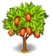

# Cây Ca Cao — `cacao_tree`

[Danh mục](../../README.md) · [Bản xem ảnh](../../index.html) · [Hồ sơ JSON](crop.json)

**Thư mục nguồn không được runtime nạp trực tiếp.** Nhãn khảo sát gốc: C5 — mở rộng vườn quả.

| Thuộc tính | Dữ liệu nguồn |
| --- | --- |
| Nhóm | Cây / bụi ăn quả |
| Sản phẩm | Hạt Ca Cao (`cacao`, source ID 22) |
| Thu mỗi đợt nguồn | 5 |
| Thời gian nguồn | 6000 giây |
| Cấp công thức / item nguồn | 19 / 19 |
| Chi phí mỗi lượt nguồn | Không có nguyên liệu mỗi lượt; mua cây qua cửa hàng là giao dịch riêng |
| `BasicPrice` / `ExpOnUse` nguồn | 13 / 7 — chưa khẳng định là giá bán/XP thu hoạch Farm |
| Tệp PNG riêng trong thư mục | 5 |
| Số lượt bắt đầu mọc nguồn | 3 |
| Dụng cụ dọn cây | 1 Cưa |
| Drop bảo đảm khi dọn | 1 Ván Gỗ |

Thời gian ở đây là **giây nguồn APK**, không phải giờ mô phỏng Farm. Cấp mở còn phụ thuộc công trình/shop/điều kiện. Với cây lâu năm, nhận hết đợt cuối mới chuyển sang cây cạn lượt; không mất quả khi số lượt bắt đầu mọc đã về 0.

**Ảnh theo role / giai đoạn nguồn**

Ảnh nằm trong `images/`, được dùng chung giữa các role khi nguồn trỏ cùng sprite. Một dòng có nhiều PNG là nhiều mảnh tham chiếu, không phải nhiều cây hoàn chỉnh. Chưa có thông tin ghép transform/hierarchy đầy đủ trong bộ ảnh này.

| Role nguồn | Clip | Các mảnh PNG |
| --- | --- | --- |
| Gán sẵn trong prefab | — | [ảnh 1](images/cocoa_bg--653a638504.png), [ảnh 2](images/cocoa_top--f6f7f77c8f.png), [ảnh 3](images/cocoa_ready--19c5c5237c.png) |
| `Idle (default)` | `Idle (default)` | Không có Sprite PPtr trong clip; xem ghi chú JSON |
| `Dead` | `Dead` | Không có Sprite PPtr trong clip; xem ghi chú JSON |
| `Harvest (default)` | `Harvest (default)` | Không có Sprite PPtr trong clip; xem ghi chú JSON |
| `Ready (default)` | `Ready (default)` | Không có Sprite PPtr trong clip; xem ghi chú JSON |

**Công thức nguồn dùng sản phẩm này**

| Cơ sở | Sản phẩm làm ra | Cần mỗi mẻ | Điều kiện bundle nguồn |
| --- | --- | ---: | --- |
| Mũ (`hats_prod`) | Mũ Mùa Hè | 2 | Không có nhãn bundle |
| Máy Pha Cà Phê (`coffee_machine`) | Sôcôla Nóng | 2 | Không có nhãn bundle |
| Lò Ngô (`popcorn_factory`) | Mảnh Sôcôla | 2 | Không có nhãn bundle |
| Nhà Máy Kẹo (`candy_factory`) | Sôcôla | 3 | Không có nhãn bundle |
| Nhà Sản Xuất Sữa (`milk_factory`) | Kem Sôcôla | 2 | Không có nhãn bundle |

**Trước khi đưa vào game**

Dựng prefab đúng pivot/tỉ lệ và thứ tự vẽ, kiểm tra các pose trên map; chốt giá/thời lượng/sản lượng Farm; nối catalog, kho, save và UI; thử gieo/thu/reload hoặc chu kỳ cây lâu năm. Không dùng source ID số làm ID Farm tự động.

Nguồn APK/hash, object ID, pivot, pixels-per-unit, clip và công thức được ghi trong `crop.json`. README và hồ sơ được tạo bởi `cocos/tools/prepare-crop-sources.py`.
