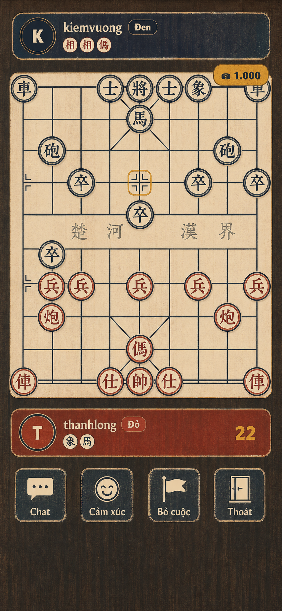
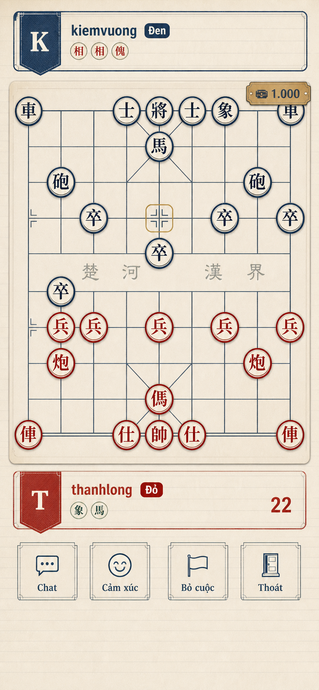
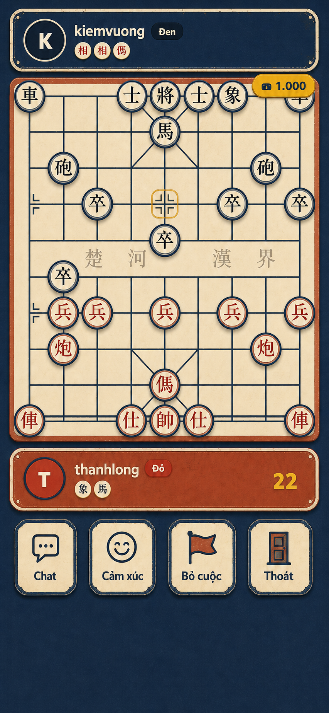

# Hướng mỹ thuật cho bàn Cờ Tướng

Ba ảnh trong thư mục này là **mockup định hướng**, được phát triển từ `../board.png`. Chúng không phải tài nguyên đưa thẳng vào game: khi chốt một hướng, hãy dựng lại giao diện bằng CSS/SVG và text thật để bảo đảm độ sắc nét, khả năng co giãn và tính nhất quán.

**Đã chọn:** Mộc bản thủ công. Đặc tả production chi tiết nằm tại [`docs/style/`](../../style/README.md).

## Các concept

### 1. Mộc bản thủ công

- Màu chủ đạo: nâu óc chó, giấy kem, xanh navy, đỏ son, vàng mù tạt.
- Cá tính thương hiệu rõ nhất; hợp với trải nghiệm cờ truyền thống nhưng vẫn hiện đại.
- Chỉ dùng vân gỗ và thớ giấy rất nhẹ, không thêm rồng, phượng, chùa hoặc họa tiết giả cổ.

### 2. Sổ cờ biên tập

- Màu chủ đạo: giấy ngà, mực chàm, đỏ nâu, xanh ngọc trầm, điểm đồng cũ.
- Dễ triển khai thành UI thật nhất nhờ lưới rõ, mảng phẳng và hệ thống component gọn.
- Đây là hướng đề xuất nếu ưu tiên cảm giác “designer-made”, dễ đọc và dễ mở rộng.

### 3. Sân đình hiện đại

- Màu chủ đạo: xanh chàm đậm, đất nung, kem, vàng mù tạt, xanh lá trầm.
- Thân thiện, trẻ hơn và phù hợp nếu muốn hòa vào một hệ game casual của Ola.
- Bản cuối đã bỏ cây, gạch và cảnh nền; chỉ giữ nền phẳng có speckle rất nhẹ.

## Quy tắc để UI không có cảm giác AI-generated

1. Khóa một lưới 8 px và giữ nguyên hình học bàn cờ 9 cột × 10 hàng giao điểm.
2. Mỗi theme chỉ dùng 5–6 màu, hai mức bo góc và một độ dày nét chính.
3. Dùng một họ icon SVG tự vẽ; không dùng emoji hệ điều hành hoặc trộn nhiều phong cách icon.
4. Texture chỉ xuất hiện ở mảng lớn với cường độ thấp; chữ, quân cờ và nút luôn sạch, sắc.
5. Không dùng ornament “Á Đông” ngẫu nhiên, glow, glassmorphism, gradient bóng hoặc vật thể trang trí không có chức năng.
6. Dựng lại toàn bộ chữ bằng font thật; kiểm tra thủ công dấu tiếng Việt và glyph Hán trên quân cờ.
7. Mockup chỉ quyết định art direction. Trạng thái hover, disabled, selected, check và urgent phải được thiết kế thành token/component có quy luật.

## Gợi ý triển khai

- Bắt đầu với **Sổ cờ biên tập** nếu cần một bản production nhanh và bền.
- Chọn **Mộc bản thủ công** nếu cần nhận diện riêng mạnh hơn.
- Dùng **Sân đình hiện đại** nếu ưu tiên chất casual, gần gũi và đồng bộ với hệ sinh thái Ola.
