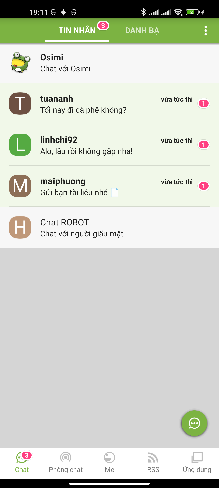
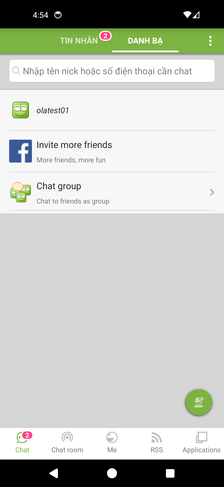
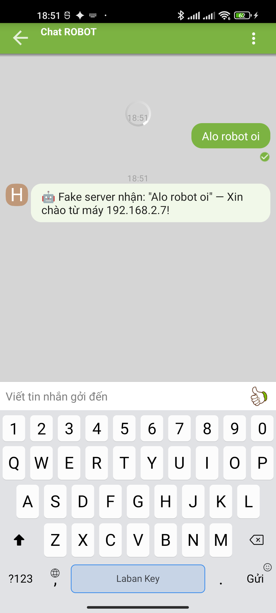
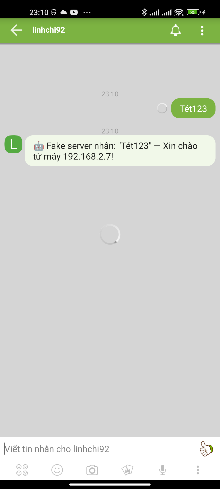

# Màn hình Chat (TIN NHẮN + DANH BẠ)

- **Activity:** `chat.ola.vn.activity.OlaBottomTabActivity` — tab **Chat** (index 0), fragment `chat.ola.vn.e`
- **Khung 2 tab con:** `apktool_out/res/layout/contact_view_layout.xml` (action bar + ViewPager)
  - Trang **TIN NHẮN**: `conversation_tab_layout.xml` → item `conversation_item_layout.xml`
  - Trang **DANH BẠ**: contacts fragment → item `contact_item_layout.xml`
- **Khung hội thoại (mở 1 cuộc chat):** `OlaChatViewActivity` → `ola_chat_view_resizable_layout.xml`
- **Chức năng:** tab đầu tiên sau đăng nhập — gồm **2 tab con**: danh sách hội thoại (TIN NHẮN) và danh bạ bạn bè (DANH BẠ). Bấm 1 dòng để mở khung chat.

## Ảnh chụp (thiết bị thật + fake server)

| TIN NHẮN (list hội thoại) | DANH BẠ (contacts) | Khung chat (bong bóng) | Auto-reply |
|---|---|---|---|
|  |  |  |  |

> Avatar hiển thị chữ cái đầu của nick (màu nền ngẫu nhiên) khi chưa có ảnh. Thời gian "vừa tức thì" do fake server đẩy timestamp hiện tại.

---

## 1. Bố cục tổng — `contact_view_layout.xml`

```
FrameLayout
├─ OlaViewPager  contactFragmentHolder   paddingTop 42dp   ← 2 trang: [TIN NHẮN] | [DANH BẠ]
├─ Action bar (LinearLayout, style actionBar.background — nền xanh #7CB342)
│   ├─ conversationTabLeftButton   (ẩn)
│   ├─ btnTabConversation   "TIN NHẮN"   ← chữ TRẮNG, in đậm; gạch chân khi chọn
│   │   └─ txtTabConversationInfo  badge số chưa đọc (góc phải-trên, ẩn mặc định)
│   ├─ btnTabContactList    "DANH BẠ"    ← chữ trắng mờ rgba(255,255,255,.70) khi không chọn
│   └─ conversationTabRightButton  ⋮  (ic_more_white — menu)
└─ ProgressBar  loadingProgressBar   (giữa màn, khi tải)
```

- 2 tab con dùng style `actionBar.tab.button` (in **đậm**, cỡ **14sp** button, nền `btn_action_tab_selector` → **gạch chân trắng** khi đang chọn).
- Tab đang chọn: chữ `#FFFFFF`. Tab không chọn: `rgba(255,255,255,.70)` (`colorTextWhiteSecondary`).
- Mỗi tab có **badge số chưa đọc** riêng (kiểu `bg_uread_notify` — hồng `#FF4081`).

---

## 2. Trang TIN NHẮN — danh sách hội thoại

Layout `conversation_tab_layout.xml`:

```
RelativeLayout
├─ EnhancedListView  conversationListView   (style list.noDivider)   ← VUỐT để xoá hội thoại
├─ conversationTipLayout (nền trắng, padding 16dp)   ← hiện khi DANH SÁCH TRỐNG
│   ├─ TextView  message_free_chat   (subhead 16sp)
│   └─ TextView  message_make_friend_by_chat   (body1 14sp)
└─ addConversationImageButton  FAB  56dp  ↘ góc phải-dưới (ic_action_compose_message)
```

### Cấu tạo 1 dòng hội thoại (`conversation_item_layout.xml`)

| Thành phần | id | Style / màu | Cỡ | Ghi chú |
|------------|----|-----|-----|---------|
| Dòng | `conversationViewLayout` | nền `#CCFFFFFF` (trắng mờ 80%) | min-height **72dp**, padding **16dp** | bấm cả dòng |
| Avatar | `imgItemIcon` | `ic_contact_photo`, `centerCrop` | **40×40dp** | `OlaCachedImageView`, bo tròn |
| Icon thiết bị | `imgDeviceType` | `ic_device_type_android/ios` | 12dp, góc phải-dưới avatar | ẩn mặc định |
| Tên/nick | `txtItemTitle` | `subhead` **16sp**, `rgba(0,0,0,.87)` | 1 dòng, weight 1 | |
| Thời gian | `timeAgoTextView` | `caption` **12sp**, `rgba(0,0,0,.54)` | 1 dòng | "vừa tức thì" |
| Tin cuối | `txtItemSubTitle` | `body1` **14sp**, `rgba(0,0,0,.87)` | 1 dòng | preview tin nhắn cuối |
| Trạng thái gửi | `messageStateImageView` | icon 12dp | ẩn mặc định | đã gửi/đã nhận |
| Badge chưa đọc | `txtUnreadMessgage` | `bg_uread_notify` (hồng `#FF4081`), chữ trắng **đậm 12sp** | marginLeft 8dp | số tin chưa đọc |
| Divider | `bottomDividerView` | `#1F000000` (đen 12%) | 1dp, margin ngang 16dp | |

### Tính năng TIN NHẮN
- **Vuốt sang để xoá** hội thoại (`EnhancedListView` của sephiroth) → dialog xác nhận (`delete_conversation_confirm_dialog_layout`).
- **FAB ✎** mở màn soạn tin mới (`conversation_create_new_layout`): ô "Nhập tên nick hoặc số điện thoại cần chat", **Invite more friends**, **Chat group**.
- **Badge số chưa đọc** trên từng dòng + trên tab.
- **Empty state**: khi chưa có hội thoại → hiện hướng dẫn "Để bắt đầu chat, chạm vào biểu tượng ✎ góc dưới phải".
- Icon **loại thiết bị** (Android/iOS) ở góc avatar.

### Trạng thái CHƯA ĐỌC vs ĐÃ ĐỌC (code `message/n.java`)

Khi hội thoại có tin **chưa đọc** (`unread > 0`), dòng đổi style:

| Thành phần | Đã đọc | **Chưa đọc** | Nguồn |
|------------|--------|--------------|-------|
| Nick (`txtItemTitle`) | thường | **in đậm** | `Typeface.create(.., BOLD)` |
| Thời gian (`timeAgoTextView`) | thường, `rgba(0,0,0,.54)` (`f.z`) | **in đậm**, `rgba(0,0,0,.87)` (`f.y`) | đậm + đổi màu |
| Nền dòng (`conversationViewLayout`) | `rgba(255,255,255,.8)` (`f.d`) | **`#F1F8E9`** xanh lá nhạt (`f.I` = `colorOlaPrimaryLight`) | highlight |
| Badge (`txtUnreadMessgage`) | ẩn | **hiện số** (nền hồng `#FF4081`) | — |

> Tóm lại tin chưa đọc = **nền xanh nhạt `#F1F8E9` + nick & giờ in đậm + badge số hồng**. Bấm vào đọc xong → trở lại nền trắng mờ, chữ thường, badge biến mất.

---

## 3. Trang DANH BẠ — danh bạ bạn bè

Item `contact_item_layout.xml` (gần giống dòng hội thoại, thêm giới tính + VIP):

| Thành phần | id | Style | Ghi chú |
|------------|----|-------|---------|
| Icon giới tính | `imgGenderIcon` | `ic_indicate_male` / `ic_indicate_female` | bên trái, marginRight 8dp |
| Avatar | `imgItemIcon` | 40×40dp, `centerCrop` | |
| Icon VIP | `vipImageHolder` | 24dp | ẩn nếu không phải VIP |
| Nick | `txtItemTitle` | `subhead` 16sp, `ellipsize=end` | |
| Trạng thái | `txtItemSubTitle` | `caption` 12sp | status message của bạn |
| Online | `timeOfflineTextView` | `caption` 12sp | "online" / thời gian offline (ẩn mặc định) |
| Divider | `listViewBottomDividerView` | `#1F000000` 1dp | |

### Header DANH BẠ (3 dòng cố định trên đầu list — thấy rõ trong ảnh `02-danh-ba.png`)

| Dòng | Icon | Tiêu đề (EN→VI) | Phụ đề | Hành động |
|------|------|------------------|--------|-----------|
| **Ô tìm kiếm** | 🔍 (search) | placeholder `Nhập tên nick hoặc số điện thoại cần chat` | — | gõ → mở `contact_finder_fragment_layout` |
| **Invite more friends** | logo Facebook (xanh) | `Invite more friends` → "Mời thêm bạn" | `More friends, more fun` | mời bạn FB (`contact_invite_fb_friend_layout`) |
| **Chat group** | icon nhóm Ola | `Chat group` → "Chat nhóm" | `Chat to friends as group` | tạo nhóm chat (`contact_chatgroup_layout`) + mũi tên ❯ |

> Ô tìm kiếm: nền trắng bo nhẹ, margin 8dp, cao ~40dp, icon 🔍 trái, chữ gợi ý `rgba(0,0,0,.38)`. Dòng Invite/Chat group dùng đúng khung item 72dp như contact (icon 40dp + tiêu đề subhead + phụ đề caption); "Chat group" có thêm mũi tên ❯ phải.

### Tính năng DANH BẠ
- Header: **ô tìm kiếm** "Nhập tên nick hoặc số điện thoại", **Invite more friends** ("More friends, more fun"), **Chat group** ("Chat to friends as group").
- Hiển thị **giới tính** (icon nam/nữ), **huy hiệu VIP**, **trạng thái online**.
- Bấm 1 contact → mở khung chat 1-1 với người đó.

### CSS riêng — dòng danh bạ (`contact_item_layout.xml`)

```css
.ola-contact-item {
  display: flex; align-items: center;
  min-height: 72px; padding: 16px;
  background: rgba(255,255,255,.80);              /* translucent_white_80_percent */
  border-bottom: 1px solid rgba(0,0,0,.12);
  font-family: Roboto, "Helvetica Neue", Arial, sans-serif;
}
.ola-contact-item__gender {                        /* imgGenderIcon — nam/nữ */
  width: 16px; height: 16px; margin-right: 8px;
  align-self: flex-start;                          /* gravity left|top */
}
.ola-contact-item__avatar {                        /* imgItemIcon 40dp */
  position: relative; width: 40px; height: 40px;
  border-radius: 50%; object-fit: cover; flex-shrink: 0;
}
.ola-contact-item__device {                        /* imgDeviceType — góc phải-dưới avatar */
  position: absolute; right: 0; bottom: 0;
  width: 12px; height: 12px; border-radius: 50%;
  background: #fff;
}
.ola-contact-item__body { flex: 1; margin-left: 16px; min-width: 0; }
.ola-contact-item__title-row { display: flex; align-items: center; }
.ola-contact-item__vip {                           /* vipImageHolder — ẩn nếu không VIP */
  width: 24px; height: 24px; margin-right: 4px;
}
.ola-contact-item__name {
  font-size: 16px; color: rgba(0,0,0,.87);
  white-space: nowrap; overflow: hidden; text-overflow: ellipsis;
}
.ola-contact-item__status {                        /* txtItemSubTitle — caption 12sp */
  margin-top: 2px; font-size: 12px; color: rgba(0,0,0,.54);
  white-space: nowrap; overflow: hidden; text-overflow: ellipsis;
}
.ola-contact-item__online {                        /* timeOfflineTextView — ẩn mặc định */
  margin-left: 8px; font-size: 12px; color: rgba(0,0,0,.54);
}
```

```html
<li class="ola-contact-item">
  
  <div class="ola-contact-item__avatar">
    
    
  </div>
  <div class="ola-contact-item__body">
    <div class="ola-contact-item__title-row">
      
      <span class="ola-contact-item__name">linhchi92</span>
    </div>
    <div class="ola-contact-item__status">Hôm nay vui ghê 🌸</div>
  </div>
  <span class="ola-contact-item__online">online</span>
</li>
```

> Khác dòng hội thoại: thêm **icon giới tính** đầu dòng (canh trên-trái), **huy hiệu VIP** trước nick, **trạng thái online** cuối dòng; phụ đề là **status message** (caption 12sp) thay vì tin nhắn cuối.

---

## 4. Khung chat (mở 1 hội thoại) — `OlaChatViewActivity`

- **Bong bóng tin nhắn** dùng 9-patch:
  - **Đến** (incoming): `chat_incoming.9.png` — canh **trái**, nền sáng.
  - **Đi** (outgoing): `chat_outgoing.9.png` — canh **phải**, nền xanh.
  - Nội dung text: `messageTextContentTextview` (`subhead` 16sp, `maxWidth` 400dp).
- **Thanh nhập dưới**: ô "Viết tin nhắn cho \<nick>" + icon **emoji / camera / ảnh / ghi âm** + nút **👍** (thumbs-up gửi nhanh).
- **Nhiều loại tin nhắn** (mỗi loại 1 layout riêng):

| Loại | Layout |
|------|--------|
| Text | `chat_balloon_text_message_item` |
| Sticker | `chat_sticker_layout` |
| Ghi âm (voice) | `chat_voice_message_item` |
| Vị trí (location) | `chat_message_location_item` |
| YouTube | `chat_youtube_attachment_layout` |
| Snap pic (ảnh tự huỷ) | `chat_snap_pic_item` |
| Chuyển KEN | `chat_ken_transferred_layout` |
| Trao đổi VIP | `chat_sent_tradding_vip_layout` / `chat_received_tradding_vip_layout` |
| Trạng thái | `chat_status_bubble_layout` |
| RSS | `chat_rss_layout` |

> Trong fake server: gửi tin → ACK "đã gửi ✓" → **auto-reply** từ bot (xem ảnh 04).

---

## 5. CSS tương đương (dựng lại trên web)

```css
/* ===== Action bar 2 tab con ===== */
.ola-chat-tabs {
  display: flex; align-items: center;
  height: 48px; background: #7CB342; padding: 0 8px;
  font-family: Roboto, "Helvetica Neue", Arial, sans-serif;
}
.ola-chat-tabs__btn {
  flex: 1; height: 100%;
  display: flex; align-items: center; justify-content: center;
  font-size: 14px; font-weight: bold;
  color: rgba(255,255,255,.70);              /* tab không chọn */
  background: none; border: none; position: relative;
}
.ola-chat-tabs__btn.is-active {
  color: #FFFFFF;
  box-shadow: inset 0 -2px 0 #FFFFFF;        /* gạch chân trắng */
}
.ola-chat-tabs__more { width: 24px; color: #fff; }   /* ⋮ */

/* ===== 1 dòng hội thoại ===== */
.ola-convo-item {
  display: flex; align-items: center; gap: 16px;
  min-height: 72px; padding: 16px;
  background: rgba(255,255,255,.8);          /* translucent_white_80_percent */
  border-bottom: 1px solid rgba(0,0,0,.12);
}
.ola-convo-item__avatar {
  width: 40px; height: 40px; border-radius: 50%;
  object-fit: cover; flex-shrink: 0;
}
.ola-convo-item__body { flex: 1; min-width: 0; }
.ola-convo-item__line1 { display: flex; justify-content: space-between; gap: 8px; }
.ola-convo-item__name {
  font-size: 16px; color: rgba(0,0,0,.87);
  white-space: nowrap; overflow: hidden; text-overflow: ellipsis;
}
.ola-convo-item__time { font-size: 12px; color: rgba(0,0,0,.54); white-space: nowrap; }
.ola-convo-item__last {
  font-size: 14px; color: rgba(0,0,0,.87);
  white-space: nowrap; overflow: hidden; text-overflow: ellipsis;
}
.ola-convo-item__badge {        /* số chưa đọc */
  min-width: 16px; height: 16px; padding: 0 5px;
  border-radius: 999px; background: #FF4081;
  color: #fff; font-size: 12px; font-weight: bold;
  display: flex; align-items: center; justify-content: center;
}

/* ===== Dòng CHƯA ĐỌC (highlight) ===== */
.ola-convo-item.is-unread { background: #F1F8E9; }            /* colorOlaPrimaryLight */
.ola-convo-item.is-unread .ola-convo-item__name { font-weight: bold; }
.ola-convo-item.is-unread .ola-convo-item__time {
  font-weight: bold; color: rgba(0,0,0,.87);                 /* f.y, đậm hơn .54 */
}
/* Đã đọc: ẩn badge, nền trắng mờ, chữ thường (mặc định) */
.ola-convo-item:not(.is-unread) .ola-convo-item__badge { display: none; }

/* ===== FAB soạn tin ===== */
.ola-chat-fab {
  position: absolute; right: 16px; bottom: 16px;
  width: 56px; height: 56px; border-radius: 50%;
  background: #7CB342; color: #fff;
  display: flex; align-items: center; justify-content: center;
  box-shadow: 0 3px 6px rgba(0,0,0,.3);
}

/* ===== Bong bóng chat ===== */
.ola-bubble { max-width: 400px; padding: 8px 12px; border-radius: 8px; font-size: 16px; }
.ola-bubble--in  { align-self: flex-start; background: #FFFFFF; color: rgba(0,0,0,.87); }
.ola-bubble--out { align-self: flex-end;   background: #DCEDC8; color: rgba(0,0,0,.87); }
```

```html
<li class="ola-convo-item">
  
  <div class="ola-convo-item__body">
    <div class="ola-convo-item__line1">
      <span class="ola-convo-item__name">linhchi92</span>
      <span class="ola-convo-item__time">vừa tức thì</span>
    </div>
    <div class="ola-convo-item__last">Hôm nay trời đẹp ☀️</div>
  </div>
  <span class="ola-convo-item__badge">3</span>
</li>
```

---

## 6. Strings (đa ngôn ngữ)

| Resource | EN | VI (hiển thị) |
|----------|----|----|
| `string_messages` | MESSAGES | TIN NHẮN |
| `string_contacts` | CONTACTS | DANH BẠ |
| `message_free_chat` | To begin a new chat, simply tap on the \<MESSAGE> icon at the bottom right corner | Để bắt đầu chat, bạn chỉ cần chạm vào biểu tượng \<MESSAGE> ở góc phía dưới bên phải. |
| `message_make_friend_by_chat` | You can start chatting by join public room… | Bạn có thể bắt đầu trò chuyện bằng cách tham gia phòng chat công cộng… |

---

## 7. Tóm tắt token UI

| Thành phần | Giá trị |
|------------|---------|
| Action bar | nền `#7CB342`, cao 48dp |
| Tab chọn / không chọn | chữ `#FFFFFF` (đậm 14sp) gạch chân trắng / `rgba(255,255,255,.70)` |
| Nền dòng (hội thoại & contact) | `rgba(255,255,255,.8)` (`#CCFFFFFF`) |
| Dòng | min-height 72dp, padding 16dp |
| Avatar | 40×40dp, bo tròn, `centerCrop` |
| Nick | subhead 16sp, `rgba(0,0,0,.87)` |
| Tin cuối / trạng thái | body1 14sp / caption 12sp |
| Thời gian | caption 12sp, `rgba(0,0,0,.54)` |
| Badge chưa đọc | nền `#FF4081`, chữ trắng đậm 12sp |
| Divider | `#1F000000`, 1dp, margin ngang 16dp |
| FAB | 56dp, nền `#7CB342`, icon ✎ trắng, góc phải-dưới |
| Bong bóng | maxWidth 400dp, text 16sp; đến=trái sáng, đi=phải xanh |

---

## 8. Modal & Menu

### 8.1. Menu ⋮ trong khung chat (list popup `m`)
Bấm nút ⋮ (hoặc avatar đối phương) trong `OlaChatViewActivity` → popup danh sách (code dòng 2210–2243):

| Mục | String | Hành động |
|-----|--------|-----------|
| Kết bạn | `string_make_friend` | gửi lời mời kết bạn (ẩn nếu đã là bạn) |
| Chat | `string_chat` | mở/đi tới khung chat |
| Xem Me | `string_view_me` | mở trang cá nhân (`me.c.a(...)`) |
| Chặn | `string_block` | → **dialog xác nhận chặn** (ẩn nếu đã là bạn) |
| Chat nhóm | `string_chat_group` | tạo/mời vào nhóm chat |

### 8.2. Dialog xác nhận **Chặn** (`i.i.d(...)`)
- Tiêu đề: `message_block_chat_title` = **"Chặn tin nhắn"**
- Nội dung: `message_block_chat_confirm_format` = **"Bạn có muốn chặn tin nhắn từ @\<nick> không?"**
- Nút: **Chặn** (`string_block`) / **Huỷ** (`string_cancel`). Khung dialog dùng kiểu chung — xem [modal-dialog/](../modal-dialog/README.md).

### 8.3. Dialog **Xoá hội thoại** (`delete_conversation_confirm_dialog_layout.xml`)
Vuốt 1 dòng hội thoại (hoặc giữ) → dialog:
```
┌─────────────────────────────────────┐
│ [ⓘ ic_dialog_indicate_info]  Tiêu đề │  ← dialog.header
├─────────────────────────────────────┤
│ <nội dung cảnh báo xoá>              │  ← dialog.content.text, minHeight 50dp
│ ☐ Xóa nội dung chat                  │  ← CheckBox ckbDeleteConversationContentHistory
├─────────────────────────────────────┤
│   [ Xoá (nền ĐỎ) ]   [ Huỷ ]         │  ← btnButton1 (btn_red_button_selector) / btnButton2
└─────────────────────────────────────┘
```
- Checkbox `message_clear_conversation_content_history` = **"Xóa nội dung chat"** (xoá cả lịch sử đã lưu).
- Nút **Xoá**: chữ trắng, nền **đỏ** `btn_red_button_selector` (≈ `#E34545`). Nút **Huỷ**: kiểu `commont.button`.

---

## 9. Bảng đính kèm (khung chat) — `ola_attachment_*_tab_layout`

Thanh nhập có nút mở **bảng đính kèm** trượt lên, gồm 6 tab:

| Tab | Layout | String (VI) | Nội dung |
|-----|--------|-------------|----------|
| Biểu cảm | `ola_attachment_smiley_tab_layout` | `string_smiley` = "Biểu cảm" | lưới emoji/mặt cười |
| Sticker | `ola_attachment_sticker_tab_layout` | `string_sticker` = "Sticker" | album sticker (`sticker_album_item`, `sticker_object_item`) |
| Ảnh | `ola_attachment_photo_tab_layout` | — | lưới ảnh trong máy (`photo_item`, `photo_selection_item`) |
| Máy ảnh | `ola_attachment_camera_tab_layout` | `string_camera` = "Máy ảnh" | chụp ảnh / quay phim (`string_camera_capture_image`, `string_camera_record`) |
| Ghi âm | `ola_attachment_voice_tab_layout` | `string_voice_recorder` = "Ghi âm" | thu âm gửi voice |
| Khác | `ola_attachment_more_tab_layout` | `string_more` = "Khác" | vị trí, YouTube, snap pic, chuyển KEN, trao đổi VIP… |

> Các loại tin nhắn tạo ra tương ứng với layout bong bóng ở **mục 4** (sticker, voice, location, youtube, snap pic, KEN, VIP…).

---

## 10. Tính năng nâng cao

| Tính năng | Entry point | Layout |
|-----------|-------------|--------|
| **Soạn tin mới** | FAB ✎ ở TIN NHẮN | `conversation_create_new_layout` — ô "Nhập nick / SĐT cần chat" + Invite more friends + Chat group |
| **Chat nhóm** | "Chat group" (menu / màn soạn) | `contact_chatgroup_layout`, `chat_invitation_to_chatgroup_layout`, `invite_chat_group_footer_button` |
| **Mời bạn** | "Invite more friends" (DANH BẠ) | `contact_invite_fb_friend_layout` |
| **Chặn / Bỏ chặn** | menu ⋮ → Chặn | `blocked_contact_layout`, `ola_blocked_list_layout` (`OlaChatBlockedListActivity`) |
| **Đổi nhóm danh bạ** | DANH BẠ | `change_contact_group_layout` |
| **Tìm bạn** | ô tìm kiếm DANH BẠ | `contact_finder_fragment_layout`, `contact_search_layout` |
| **Vuốt xoá hội thoại** | TIN NHẮN (EnhancedListView) | `delete_conversation_confirm_dialog_layout` (mục 8.3) |

---

## 11. Checklist độ phủ tài liệu

| Hạng mục | Trạng thái |
|----------|-----------|
| Bố cục 2 tab con + action bar | ✅ mục 1 |
| List hội thoại (item + style) | ✅ mục 2 |
| Danh bạ (item + style + header) | ✅ mục 3 |
| Khung chat + 11 loại bong bóng | ✅ mục 4 |
| CSS (tab, dòng, FAB, bong bóng) | ✅ mục 5 |
| CSS chi tiết dòng danh bạ riêng | ✅ mục 3 (gender + VIP + online + device) |
| Header DANH BẠ (tìm kiếm / Invite / Chat group) | ✅ mục 3 |
| Strings (vi/en) | ✅ mục 6 |
| Token UI tóm tắt | ✅ mục 7 |
| Menu ⋮ khung chat | ✅ mục 8.1 |
| Dialog Chặn | ✅ mục 8.2 |
| Dialog Xoá hội thoại | ✅ mục 8.3 |
| Bảng đính kèm 6 tab | ✅ mục 9 |
| Soạn tin / chat nhóm / chặn / tìm bạn | ✅ mục 10 |
| Bảng icon UI (drawable thật) | ✅ mục 12 |
| CSS thanh nhập + bảng đính kèm | ✅ mục 13 |
| Ảnh chụp màn soạn tin mới | ✅ `images/05-soan-tin.png` |
| Ảnh chụp panel đính kèm mở (sticker/voice) | ❌ fake server chưa hỗ trợ luồng này |

---

## 12. Icon & drawable thật (trích từ APK)

> Đã copy sẵn vào [images/icons/](images/icons/) (mật độ xxhdpi). Tên = đúng tên resource trong `apktool_out/res/drawable-*/`.

### Khung Chat (TIN NHẮN / DANH BẠ)
| UI | Icon | Drawable |
|----|------|----------|
| FAB soạn tin |  | `ic_action_compose_message` (tint trắng) |
| Menu ⋮ |  | `ic_more_white` |
| Avatar mặc định |  | `ic_contact_photo` |
| Thiết bị Android |  | `ic_device_type_android` |
| Thiết bị iOS |  | `ic_device_type_apple` (+ `_pc`, `_phone`, `_winphone`) |
| Giới tính nam |  | `ic_indicate_male` |
| Giới tính nữ |  | `ic_indicate_female` |
| Badge chưa đọc | — | `bg_uread_notify` (nền hồng `#FF4081`) |

### Khung hội thoại (OlaChatViewActivity)
| UI | Icon | Drawable |
|----|------|----------|
| Nút 👍 / gửi nhanh |  | `smiley_35` (`likeButton`) |
| Nút Gửi (khi gõ) | — | text "Gửi" màu `#7CB342` (`sendTextView`) |
| Thêm thành viên (chat nhóm) |  | `ic_add_friend` |
| Bong bóng đến |  | `chat_incoming.9.png` (9-patch, trái) |
| Bong bóng đi |  | `chat_outgoing.9.png` (9-patch, phải) |
| Bong bóng gửi lỗi | — | `chat_outgoing_fail.9.png` |

### Tab bảng đính kèm (mỗi tab có bản thường + `_selected`)
| Tab | Bình thường | Đang chọn | Drawable |
|-----|-------------|-----------|----------|
| Văn bản (bàn phím) |  |  | `ic_chat_text` / `ic_chat_text_selected` |
| Biểu cảm / Sticker |  |  | `ic_smiley` / `ic_smiley_selected` |
| Máy ảnh |  |  | `ic_camera` / `ic_camera_selected` |
| Ghi âm |  |  | `ic_voice` / `ic_voice_selected` (+ `ic_voice_volumn_0..3` mức âm) |
| Khác (ảnh, vị trí, YouTube…) |  |  | `ic_more` / `ic_more_selected` |

### Dialog
| UI | Icon | Drawable |
|----|------|----------|
| Icon thông tin (header dialog) |  | `ic_dialog_indicate_info` |
| Nút Xoá (đỏ) | — | `btn_red_button_selector` (≈ `#E34545`) |

---

## 13. CSS — Thanh nhập & Bảng đính kèm (khung chat)

Trích từ `ola_chat_message_input_layout.xml` (thanh nhập) + `chatAttachmentFrameLayout` (panel) + tab strip.

```css
/* ===== Thanh nhập (chatTextInputLayout) ===== */
.ola-chat-input {
  display: flex; align-items: flex-end;       /* gravity bottom */
  min-height: 36px; padding: 2px 8px;          /* T/B 2dp, L/R 8dp */
  background: #FFFFFF;
  border-top: 1px solid rgba(0,0,0,.12);
}
.ola-chat-input__field {
  flex: 1;                                     /* layout_weight 1 */
  border: none; background: none;              /* edittext.nobackground */
  font-size: 16px; line-height: 36px;
  max-height: 36px; resize: none;
  color: rgba(0,0,0,.87);
}
.ola-chat-input__field::placeholder { color: rgba(0,0,0,.38); }  /* "Viết tin nhắn cho <nick>" */
.ola-chat-input__action {                      /* FrameLayout phải, 36×36 */
  width: 36px; height: 36px; margin-left: 4px;
  display: flex; align-items: center; justify-content: center;
  background: none; border: none;
}
.ola-chat-input__like { width: 28px; height: 28px; }            /* smiley_35 — khi ô TRỐNG */
.ola-chat-input__send {                                          /* "Gửi" — khi ĐANG GÕ */
  display: none; color: #7CB342; font-size: 16px; min-width: 32px;
}
.ola-chat-input.is-typing .ola-chat-input__like { display: none; }
.ola-chat-input.is-typing .ola-chat-input__send { display: inline-block; }

/* ===== Tab strip đính kèm ===== */
.ola-attach-tabs {
  display: flex; background: #FFFFFF;
  border-top: 1px solid rgba(0,0,0,.12);
}
.ola-attach-tabs__tab {
  flex: 1; height: 44px;
  display: flex; align-items: center; justify-content: center;
  background: none; border: none; opacity: .6;       /* icon thường */
}
.ola-attach-tabs__tab.is-active { opacity: 1; }       /* dùng icon _selected (xanh) */
.ola-attach-tabs__tab img { width: 24px; height: 24px; }

/* ===== Panel đính kèm (chatAttachmentFrameLayout) ===== */
.ola-attach-panel {
  background: #FFFFFF;
  height: 240px;                                /* trượt lên thay bàn phím */
  overflow-y: auto;
}
.ola-attach-panel__grid {                       /* emoji / sticker / "Khác" */
  display: grid;
  grid-template-columns: repeat(4, 1fr);
  gap: 8px; padding: 12px;
}
```

```html
<!-- Thanh nhập -->
<div class="ola-chat-input">
  <input class="ola-chat-input__field" placeholder="Viết tin nhắn cho thuhuong">
  <button class="ola-chat-input__action">
    
    <span class="ola-chat-input__send">Gửi</span>
  </button>
</div>

<!-- Tab strip đính kèm -->
<div class="ola-attach-tabs">
  <button class="ola-attach-tabs__tab"></button>
  <button class="ola-attach-tabs__tab is-active"></button>
  <button class="ola-attach-tabs__tab"></button>
  <button class="ola-attach-tabs__tab"></button>
  <button class="ola-attach-tabs__tab"></button>
</div>
```

> Quy tắc hiển thị: ô nhập **trống** → hiện nút **👍 `smiley_35`**; **đang gõ** → đổi thành nút **"Gửi"** (`#7CB342`). Bấm 1 tab đính kèm → panel trượt lên thay bàn phím, icon tab đổi sang bản `_selected` (xanh).
