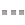

# Màn hình Bình luận Me (`OlaMeCommentActivity`)

- **Mở từ:** bài đăng trong feed Me — bấm nút **Bình luận** (`btnMeItemFooterReply`) hoặc **số bình luận** (`attachedMeCommentNumberOfComments`) → `OlaMeCommentActivity.a(context, meId)` ([entry/b/a/c.java:62](../../../../jadx_out/sources/chat/ola/vn/entry/b/a/c.java#L62)).
- **Activity:** `chat.ola.vn.me.OlaMeCommentActivity` — [me/OlaMeCommentActivity.java](../../../../jadx_out/sources/chat/ola/vn/me/OlaMeCommentActivity.java)
- **Layout màn:** `me_comment_page_layout.xml`
- **Adapter list:** `chat.ola.vn.b.v` (extends `b.h`) — nguồn dữ liệu `h.u.q()`
- **Item bài gốc (đầu list):** `me_entry_layout.xml` (y hệt 1 bài trong feed — xem [../README.md §4](../README.md#4-item-1-bài-đăng-me_entry_layoutxml))
- **Item 1 bình luận:** `media_comment_src_item_layout.xml`
- **Bình luận trích dẫn / lồng:** `attached_me_comment_holder_layout.xml`

> **Là gì:** màn full-screen riêng (trượt vào từ phải, `push_left_in`) liệt kê **bài gốc + toàn bộ bình luận** của bài đó. Hỗ trợ kéo-làm-mới, tự nạp thêm khi cuộn (phân trang), Thích/Trả lời/menu trên từng bình luận. Bài gốc luôn là **dòng đầu tiên** của list, các bình luận xếp dưới thành **1 khối thẻ trắng** (bo góc trên/giữa/dưới).

> Doc dựng từ **code + XML** (chưa chụp ảnh). Khi bật fake server có comment sẽ chụp bổ sung.

---

## 1. Flow tổng thể

```
   Feed Me (1 bài)                              OlaMeCommentActivity (full-screen)
   ┌────────────────────┐                       ┌──────────────────────────────────┐
   │ ...bài đăng...      │   bấm [Bình luận]     │ [←] Bình luận (12)                │ ← action bar
   │ 12 bình luận        │ ───────────────────►  ├──────────────────────────────────┤
   │ [Bình luận][Ghét]   │  push_left_in         │ ▒ BÀI GỐC (me_entry_layout) ▒     │ ← item[0], bg_shadow_2_edges
   │       [Thích]       │                       │   avatar+tên+giờ, nội dung, ảnh,  │
   └────────────────────┘                        │   thống kê, [Bình luận][Ghét][Thích]│
                                                  ├──────────────────────────────────┤
            ▲ back (push_right_in)                │ ┌── khối bình luận (thẻ trắng) ──┐ │
            │                                      │ │ ◯ nameA   2 phút trước          │ │ ← item[1] top  (media_comment_src_item)
            └──────────────────────────────────── │ │   nội dung bình luận @nick      │ │
                                                  │ │   [↩][⋯]        ◯◯◯  3 ❤        │ │
                                                  │ ├────────────────────────────────┤ │
                                                  │ │ ◯ nameB   1 phút trước          │ │ ← item[2..] middle
                                                  │ │   sticker / ảnh + nội dung      │ │
                                                  │ │   [↩][⋯]            5 ❤         │ │
                                                  │ └────────────────────────────────┘ │ ← item cuối: footer (bo góc dưới)
                                                  │            (cuộn xuống → nạp thêm)  │ ← load_more_watting_span_view
                                                  └──────────────────────────────────┘
```

**Vòng đời / mạng:**
1. `onCreate` → `setContentView(me_comment_page_layout)` → đọc `_me_id` từ Intent → `a(meId, 0)` nạp trang đầu.
2. Gửi gói `OlaApplication.b.a(meId, fromCommentId, (short)6)` — `fromCommentId=0` lần đầu, `=h.u.p()` (id nhỏ nhất đang có) để phân trang ([OlaMeCommentActivity.java:75](../../../../jadx_out/sources/chat/ola/vn/me/OlaMeCommentActivity.java#L75)).
3. Server trả về → `a(g post, List<g> list, 6)` → `h.u.a(post, list)` gộp vào store → `adapter.notifyDataSetChanged`.
4. **Tiêu đề** set động theo `post.g()` (số comment): `"Bình luận"` + ` (N)` nếu N>0.
5. List rỗng / hết trang → `j=false`, ngừng nạp; lỗi → toast `message_can_not_load_comment` = "Không thể tải nội dung bình luận".

---

## 2. Bố cục màn (`me_comment_page_layout.xml`)

```
FrameLayout  @id/wrapMeComment
├─ SwipeRefreshLayout  @id/swipeRefreshLayout  (paddingTop 42dp = chừa action bar, màu xoáy = colorOlaPrimary)
│   └─ ListView  @id/listView  (scrollbars none, rowSpacing, selector trong suốt)   ← LIST bài + bình luận
│        └─ (footerView) load_more_watting_span_view → @id/wattingProgressBar       ← spinner "nạp thêm"
├─ <include> ola_top_action_bar_layout                                              ← ACTION BAR
└─ ProgressBar  @id/progressBar  (giữa màn, ẩn lúc đầu)                              ← spinner tải trang đầu
```

> Màn **không có** thanh nhập cố định ở đáy. Viết bình luận đi qua nút **Trả lời** (`btnMeItemFooterReply`) / menu — xử lý bởi `chat.ola.vn.q.b` (context handler). Xem [§6](#6-viết-bình-luận--gợi-ý-cho-web).

### 2.1. Nền item theo vị trí (adapter `b.v`)

Background mỗi dòng đổi theo index để ghép thành khối thẻ ([b/v.java:14](../../../../jadx_out/sources/chat/ola/vn/b/v.java#L14)):

| Index | Vai trò | Background | Highlight (comment mới/của mình) |
|-------|---------|-----------|----------------------------------|
| `0` | **Bài gốc** | `bg_shadow_2_edges` (card có bóng) | — |
| `1` | Bình luận **đầu** | `bg_me_comment_top_item` (bo góc trên) | `bg_me_comment_top_hightlight_item` |
| `2…` | Bình luận **giữa** | `bg_me_comment_item` | `bg_me_comment_item_highlight` |
| cuối | Bình luận **cuối** | `bg_me_comment_item_footer` (bo góc dưới) | — |

> Cờ highlight = `entry.b.b.j()` (bình luận vừa thêm / liên quan tới mình) → nền nhấn nhẹ thay vì trắng trơn.

---

## 3. Action bar (`ola_top_action_bar_layout.xml`)

Nền xanh `defaultStyle.actionBar.background` (#7CB342), cao 48dp.

| View id | Loại | Nội dung |
|---------|------|----------|
| `olaActionBarBackViewLayout` → `olaActionBarBackImageView` | ImageView `ic_action_back` (trắng) | **← back** (bấm → `finish()`, trượt ra `push_right_in`) |
| `olaActionBarTitleTextView` | TextView button, chữ trắng | **"Bình luận"** / **"Bình luận (N)"** (set động) |
| `olaActionBarButtonTextView` / `...ImageView` / `...MoreButtonImageView` | (ẩn) | màn comment không dùng nút phải |

**Tiêu đề** ([OlaMeCommentActivity.java:230](../../../../jadx_out/sources/chat/ola/vn/me/OlaMeCommentActivity.java#L230)): `string_comment_title` = "Bình luận"; nếu `post.g()>0` thì append `" (" + số + ")"`.

---

## 4. Item 1 bình luận (`media_comment_src_item_layout.xml`)

LinearLayout dọc, padding L/T/R 16dp (không padding đáy — khoảng cách do nền `.9.png` lo).

```
LinearLayout (vertical, padding 16dp)
├─ RelativeLayout (hàng tác giả)
│   ├─ OlaCachedImageView  imgMeAvatarThumbnail  40×40dp (ic_contact_photo)         ← avatar
│   └─ LinearLayout  meOwnerInfoSpan (phải avatar, marginLeft 16dp)
│       ├─ LinearLayout  txtMeOwnerName (ngang)
│       │   ├─ OlaCachedImageView  vipImageMeOwner  24dp (ẩn nếu không VIP)
│       │   └─ TextView  txtMeItemTitle  (subhead 16sp, 1 dòng)                     ← TÊN
│       └─ TextView  txtMeItemTimeAgo  (caption 12sp, marginTop 2dp)                ← "x phút trước"
├─ LinearLayout (ngang, paddingTop 16dp)
│   ├─ OlaCachedImageView  stickerImageView  cao 84dp (ẩn)                          ← sticker
│   └─ CommpressTextView   txtMeItemContent  (body1 14sp, max 5 dòng, line ×1.3)    ← NỘI DUNG (@nick/#tag + smiley)
└─ LinearLayout  btnMeActionSpan  (ngang, gravity center, marginTop/Bottom 16dp)    ← HÀNG NÚT
    ├─ ImageView  btnMeItemFooterReply  (ic_action_reply_gray, cao 32dp)            ← Trả lời
    ├─ ImageView  btnMeItemFooterMore   (ic_button_small_more, cao 32dp)            ← menu ⋯ (sửa/xoá/report)
    ├─ LinearLayout  btnMeItemLikeSpan  (weight 1, gravity right)                   ← avatar người thích
    │   ├─ imgMeItemLikeBuddy1  32dp
    │   ├─ imgMeItemLikeBuddy2  32dp (marginLeft 2dp)
    │   └─ imgMeItemLikeBuddy3  32dp (marginLeft 2dp)
    └─ LinearLayout  txtMeItemLikeWrapper  (button_like_selector, minWidth 48dp)    ← nút Thích + số
        ├─ ImageView  txtMeItemLikeIcon  (ic_like_gray → ic_like_selected)
        └─ TextView   txtMeItemLikeNumber  (caption)
```

> Khác với item feed: comment dùng `ic_button_small_more` (không phải `ic_more`), **không có** nút Ghét, và **không có** divider — phân tách bằng nền `.9.png` xếp chồng.

### 4.1. Đổi trạng thái Thích trên bình luận

Giống bài đăng: chưa thích = `ic_like_gray` + chữ xám `#42000000`; đã thích = `ic_like_selected` + xanh `#7CB342`. Tối đa **3 avatar** người thích (`imgMeItemLikeBuddy1..3`, 32dp) hiển thị canh phải trước số like.

---

## 5. Bình luận trích dẫn / lồng (`attached_me_comment_holder_layout.xml`)

Khi 1 bình luận **trả lời** bình luận khác (hoặc trích dẫn bài), khối được trích hiển thị trong thẻ viền xám `bg_shadown_border`:

```
FrameLayout (bg_shadown_border, nền trắng)
├─ LinearLayout (padding 8dp)
│   ├─ LinearLayout  txtMeOwnerName (ngang)
│   │   ├─ OlaCachedImageView  attachedMeCommentOvatar  36dp centerCrop
│   │   └─ TextView  attachedMeCommentNick  (subhead, 1 dòng, weight 1)
│   └─ TextView  attachedMeCommentContent  (body1, max 4 dòng, marginTop 8dp)
├─ FrameLayout  attachedMeCommentMediaPan  (bg_stroke_border_gray)               ← ảnh/video (nếu có)
│   ├─ OlaRatioImageView  attachedMeCommentImageView  (giữ tỉ lệ, centerCrop)
│   └─ LinearLayout  attachedMeVideoInfo  (nền đen 60%, ẩn)                       ← lớp video
│       ├─ ImageView  ic_play_media
│       ├─ TextView   meYouTubeTitle  (caption trắng đậm)
│       └─ TextView   attachedMeVideoDuration  (caption trắng mờ)
└─ LinearLayout (padding 8dp)
    ├─ TextView  attachedMeCommentNumberOfComments  (caption, weight 1)          ← "X bình luận"
    └─ TextView  attachedMeCommentNumberOfLike      (caption)                    ← "X lượt thích"
+ ProgressBar  attachedMeCommentLoading  19dp (giữa, lúc đang tải khối trích)
```

> `attachedMeCommentNumberOfComments` cũng chính là điểm bấm để mở lại `OlaMeCommentActivity` của khối được trích.

---

## 6. Viết bình luận — gợi ý cho web

APK **không** có ô nhập cố định ở đáy màn comment Me; thao tác viết đi qua nút **Trả lời** → `chat.ola.vn.q.b`. Tuy nhiên các màn họ hàng (RSS/Mall) dùng **thanh nhập nhanh** `rss_comment_input_span.xml` / `mall_comment_input_span.xml`:

```
LinearLayout (bg_me_comment_top_item, padding 16dp, minHeight 72dp)
├─ OlaCachedImageView  imgRssItemAvatar  40dp                 ← avatar mình
└─ TextView  txtRssCommentInput  (gravity bottom, 1 dòng)     ← hint "Viết bình luận"
     text = @string/general_hint_comment_quick
     màu hint colorTextBlackHintOrDisable
```

**Khuyến nghị bản web:** đặt **thanh nhập cố định ở đáy** (avatar mình + ô text + nút Gửi), giống chuẩn newsfeed hiện đại — tốt hơn mô hình mở composer riêng của APK. Cho phép `@mention`, smiley `:olaN:`, sticker, 1 ảnh (khớp dữ liệu comment ở [§8](#8-dữ-liệu-1-bình-luận-entityg)).

---

## 7. Strings (EN → VI)

| Key | EN | VI |
|-----|----|----|
| `string_comment` | Comment | Bình luận |
| `string_comment_plural` | comments | bình luận |
| `string_comment_title` | Comment | Bình luận |
| `string_comment_plural_title` | Comments | Bình luận |
| `general_hint_comment_quick` | Type your comment | Viết bình luận |
| `message_can_not_load_comment` | Cannot load comment | Không thể tải nội dung bình luận |
| `message_can_not_load_more` | Cannot load more | (tải thêm thất bại) |

---

## 8. Dữ liệu 1 bình luận (`entity.g`)

| Method | Ý nghĩa |
|--------|---------|
| `e()` | comment id (long) — dùng cho phân trang |
| `n()` | id bài gốc / owner (long) |
| `j()` *(String)* | nick người viết |
| `b()` | nội dung text |
| `w()` / `d()` | thời gian (chuỗi "x phút trước" / timestamp) |
| `f()` | số lượt thích (int) |
| `E()` | mảng URL ảnh đính kèm (String[]) |
| `B()` | hồ sơ người viết (avatar/VIP…) |
| `x()` | bình luận cha (reply lồng) — kiểu `h` |
| `g()` | số bình luận con / tổng (int) — dùng cho tiêu đề |
| `i()` | type/status (short) |

> **Gói mạng:** message `(short)92`, field `V`=meId, `S`=fromCommentId, `aj`=status(6) ([OlaNetworkService.java:695](../../../../jadx_out/sources/chat/ola/vn/network/OlaNetworkService.java#L695), [w/ci.java:436](../../../../jadx_out/sources/chat/ola/vn/w/ci.java#L436)).

---

## 9. Bảng icon

| UI | Icon | Drawable |
|----|------|----------|
| Back action bar |  | `ic_action_back` (trắng) |
| Trả lời |  | `ic_action_reply_gray` |
| Menu ⋯ trên bình luận |  | `ic_button_small_more` |
| Thích |  →  | `ic_like_gray` → `ic_like_selected` |
| Avatar mặc định |  | `ic_contact_photo` |
| Play video (khối trích) |  | `ic_play_media` |

---

## 10. CSS tương đương — 1 bình luận

```css
/* Khối bình luận = thẻ trắng nhóm; top bo góc trên, footer bo góc dưới */
.ola-cmt {
  background: #fff;
  padding: 16px;
  border-bottom: 1px solid rgba(0,0,0,.06);
}
.ola-cmt--top    { border-radius: 2px 2px 0 0; }
.ola-cmt--footer { border-radius: 0 0 2px 2px; border-bottom: none; box-shadow: 0 1px 2px rgba(0,0,0,.18); }
.ola-cmt.is-highlight { background: #FFFDE7; }          /* comment mới/của mình */

.ola-cmt__head { display: flex; align-items: flex-start; }
.ola-cmt__avatar { width: 40px; height: 40px; border-radius: 50%; object-fit: cover; flex-shrink: 0; }
.ola-cmt__info { margin-left: 16px; }
.ola-cmt__name { font-size: 16px; color: rgba(0,0,0,.87); }
.ola-cmt__time { margin-top: 2px; font-size: 12px; color: rgba(0,0,0,.54); }

.ola-cmt__body { display: flex; padding-top: 16px; }
.ola-cmt__sticker { height: 84px; margin-right: 8px; }
.ola-cmt__text {
  flex: 1; font-size: 14px; line-height: 1.3; color: rgba(0,0,0,.87);
  display: -webkit-box; -webkit-line-clamp: 5; -webkit-box-orient: vertical; overflow: hidden;
}

.ola-cmt__actions { display: flex; align-items: center; gap: 4px; margin-top: 16px; }
.ola-cmt__btn { height: 32px; display: flex; align-items: center; }      /* reply / more */
.ola-cmt__likers { margin-left: auto; display: flex; }
.ola-cmt__likers img { width: 32px; height: 32px; border-radius: 50%; }
.ola-cmt__likers img + img { margin-left: 2px; }
.ola-cmt__like { min-width: 48px; display: flex; align-items: center; gap: 2px; }
.ola-cmt__like.is-liked { color: #7CB342; }
```

```html
<div class="ola-cmt ola-cmt--top">
  <div class="ola-cmt__head">
    
    <div class="ola-cmt__info">
      <div class="ola-cmt__name">linhchi92</div>
      <div class="ola-cmt__time">2 phút trước</div>
    </div>
  </div>
  <div class="ola-cmt__body"><p class="ola-cmt__text">Đẹp quá @huy ❤️</p></div>
  <div class="ola-cmt__actions">
    <button class="ola-cmt__btn"></button>
    <button class="ola-cmt__btn"></button>
    <span class="ola-cmt__likers"></span>
    <button class="ola-cmt__like is-liked">3</button>
  </div>
</div>
```

---

## 11. Tóm tắt token UI

| Thành phần | Giá trị |
|------------|---------|
| Action bar | nền `#7CB342`, cao 48dp, back trắng + tiêu đề "Bình luận (N)" |
| List | `SwipeRefreshLayout` (xoáy `colorOlaPrimary`) + `ListView`, footer spinner nạp thêm |
| Item[0] bài gốc | `me_entry_layout`, nền `bg_shadow_2_edges` (xem [../README.md §4](../README.md#4-item-1-bài-đăng-me_entry_layoutxml)) |
| Khối bình luận | thẻ trắng nhóm: top → giữa → footer; highlight = nền nhấn |
| Avatar bình luận | 40×40dp tròn |
| Tên / Giờ | subhead 16sp `.87` / caption 12sp `.54` |
| Nội dung | body1 14sp, line ×1.3, max 5 dòng, `@nick`/`#tag` xanh `#33691E` + smiley |
| Sticker | cao 84dp |
| Avatar người thích | 32dp ×3 (canh phải) |
| Nút Trả lời / Menu | cao 32dp; Thích minWidth 48dp, đã thích → xanh `#7CB342` |
| Phân trang | cuộn còn cách đáy 5 item → nạp `(meId, minCommentId, 6)` |
