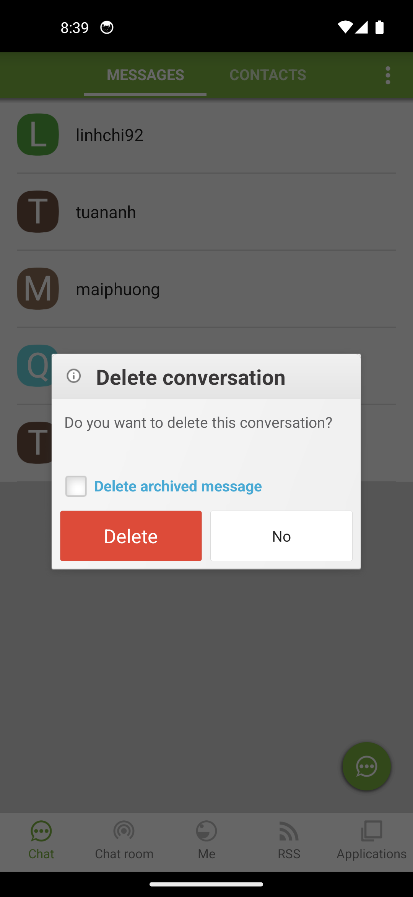
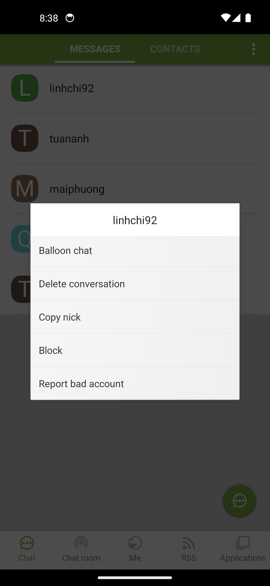

# Modal / Dialog — Ola 2.1.11

Hệ thống hộp thoại của Ola — **xác nhận, nhập liệu, progress, chọn danh sách, quảng bá**. Tất cả chia sẻ **khung 3 phần: Header → Content → Footer**, dùng theme `Theme.ola.default.dialog`.

> **Nguồn:** đọc trực tiếp từ `apktool_out/res/layout/*.xml`, `res/values/styles.xml`, `res/drawable/bg_dialog_header.xml`.

## Ảnh chụp (emulator)

| Confirm (xóa hội thoại) | List Option (menu hành động) |
|---|---|
|  |  |

---

## 1. Bố cục chung (3 phần)

```
┌─────────────────────────────┐  ← cửa sổ nổi, bo góc 5dp, nền trắng
│ [icon] Tiêu đề               │  Header  (gradient xám nhạt, cao ≥38dp)
├─────────────────────────────┤
│ Nội dung / Input / Progress   │  Content (tùy loại)
│ ☐ (checkbox tùy chọn, ẩn)    │
├─────────────────────────────┤
│ [  Nút 1  ] [  Nút 2  ]      │  Footer  (1–2 nút, weight 1:1)
└─────────────────────────────┘
```

## 2. Bảng style chi tiết

| Thành phần | Style / ID | Giá trị |
|---|---|---|
| **Cửa sổ** | `Theme.ola.default.dialog` | Nổi (`windowIsFloating`), bo góc, nền ngoài mờ (`backgroundDimEnabled`), anim `Animation.Dialog`, softInput `adjustPan` |
| **Header** | `?dialog.header` → `defaultStyle.dialog.header` | Nền gradient **#F1F1F1 → #E4E4E4** (dọc), viền 1px **#D1CECE**, góc trên 5dp. Padding **4dp**, min-height **38dp** |
| **Icon header** | `imgVipIcon` | **34×34dp**, `centerInside`, drawable: `ic_dialog_indicate_info` |
| **Tiêu đề (1 dòng)** | `txtItemTitle` → `?dialog.header.title.single` | **20sp bold**, màu **#3A3839**, padding 4dp, marquee |
| **Tiêu đề (nhỏ)** | `txtItemTitle` → `?dialog.header.title` | **12sp bold**, màu **#3A3839**, 1 dòng marquee |
| **Nội dung** | `txtMeItemContent` → `?dialog.content.text` | **14sp**, màu **#616163**, margin 8dp, min-height **50dp**, `autoLink=all` |
| **Checkbox** | `ckbCheckBox` → `?login.checkbox` | margin 8dp, **ẩn mặc định** (`visibility=gone`) |
| **Footer** | `linearFooter` | padding ngang 4dp, chứa 1–2 Button |
| **Nút thường** | `btnButton1/2` → `?commont.button` | Chữ **#DE000000**, nền trắng `btn_default_button_selector`, minW **56dp**, minH **28dp**, weight 1 |
| **Nút nguy hiểm** | (logout/xóa) | Chữ **#FFFFFF**, nền **#DD4B39** (đỏ), `btn_red_button_selector` |
| **Nút xanh** | `defaultStyle.button.green` | Chữ **#FFFFFF**, nền **#9CCC65**, viền **#558B2F**, minW **64dp** |

**Quy ước:** nút **đồng ý** đứng **trái** (`btnButton1`), nút **hủy** đứng **phải** (`btnButton2`). Hành động phá hủy → nút trái **đỏ**.

---

## 3. Danh mục tất cả Dialog (15 loại — từ XML)

### 3.1. Xác nhận (Confirm) — 3 layout

#### `confirm_dialog_layout.xml`
```
Header:  icon ic_dialog_indicate_info (34dp) + AutoScrollTextView (title.single 20sp bold)
Content: TextView #616163 (autoLink, min 50dp) + CheckBox (ẩn mặc định)
Footer:  [Accept ?commont.button] [Cancel ?commont.button]
```
**Dùng cho:** xác nhận chung, cảnh báo. Checkbox có thể bật để hỏi "Không hỏi lại".

#### `logout_confirm_dialog_layout.xml`
```
Header:  AutoScrollTextView "Log Out" (title, 12sp bold) — KHÔNG có icon
Content: TextView "Do you want to sign out Ola?"
Footer:  [Log Out (ĐỎ btn_red)] [No ?commont.button]
```

#### `delete_conversation_confirm_dialog_layout.xml`
```
Header:  icon ic_dialog_indicate_info + AutoScrollTextView (title.single)
Content: TextView + CheckBox "Delete archived message" (luôn hiện)
Footer:  [Delete (ĐỎ btn_red)] [Cancel ?commont.button]
```

---

### 3.2. Nhập liệu (Input) — 4 layout

#### `dialog_text_input_layout.xml`
```
Header:  logo ola_logo_trans (34dp) + AutoScrollTextView (title.single)
Content: EditText trong FrameLayout (hint "Group", 1 dòng, imeOptions=actionDone)
Footer:  [OK (XANH btn_green)] [Cancel ?commont.button]
```
**Dùng cho:** đặt tên nhóm, đổi tên hiển thị.

#### `dialog_text_suggest_input_layout.xml`
```
Header:  logo ola_logo_trans + AutoScrollTextView
Content: OlaSuggestEditText (autocomplete) + nút ▾ (ic_button_spinner)
Footer:  [OK (XANH)] [Cancel]
```
**Dùng cho:** tìm kiếm bạn bè với gợi ý.

#### `change_status_dialog_layout.xml`
```
Header:  AutoScrollTextView "Thay đổi trạng thái" (title, 12sp) — KHÔNG icon
Content: EditText trạng thái (nền #C5EA9C xanh nhạt, max 300 ký tự, 4 dòng)
         + OlaGalleryView (chọn ảnh/video đính kèm)
Footer:  [Update (XANH)] [Close ?commont.button]
```

#### `captcha_required_dialog_layout.xml`
```
Header:  icon ic_dialog_indicate_info + AutoScrollTextView
Content: TextView + ImageView captcha (min 120×52dp) + EditText nhập mã (inputType=number)
Footer:  [OK (XANH)] — chỉ 1 nút
```

---

### 3.3. Tiến trình (Progress) — 2 layout

#### `dialog_circle_progress_layout.xml`
```
Header:  (không có — chỉ nội dung)
Content: ProgressCircleView (vòng xoay) + TextView txtMessage
Footer:  [button1 (XANH)] [Stop (ĐỎ btn_red)]
```

#### `upload_progress_dialog.xml`
```
Header:  AutoScrollTextView "Upload media" (title, 12sp)
Content: ImageView thumbnail (96×96dp)
         + ProgressBar ngang (?commont.progress, 20dp)
         + TextView %  |  TextView dung lượng
Footer:  [Cancel ?commont.button] — 1 nút
```

---

### 3.4. Danh sách / Chọn (List) — 5 layout

#### `list_option_dialog_layout.xml`
```
Header:  LinearLayout nền trắng, cao 48dp + TextView tiêu đề (subhead, center)
         + divider 1px
Content: ListView (scrollbar ẩn, ?commont.list)
Footer:  [Accept (XANH)] [Cancel ?commont.button]
```
**Dùng cho:** menu hành động (Xóa / Copy nick / Block…)

#### `simple_multichoice_dialog.xml` + `select_dialog_*choice_material.xml`
> Dialog chọn 1 (radio) hoặc nhiều (checkbox) — dùng layout Material mặc định.

#### `friend_list_dialog.xml`
> ListView bạn bè + ProgressBar khi tải.

#### `date_picker_dialog.xml`
> `DateScrollPickerView` cuộn ngày/tháng/năm + OK/Cancel.

#### `full_attach_dialog_layout.xml`
> `ViewPager` + tab Smiley/Kul… (bảng emoji/sticker, kiểu bottom sheet).

---

### 3.5. Quảng bá / Khuyến nghị (Promo) — 2 layout

#### `like_ola_page_dialog_layout.xml`
```
Header:  logo ola_logo_trans + TextView "Thích trang Ola" (title.single)
Content: TextView lời mời like
Footer:  [Like (XANH)] [Close ?commont.button]
```

#### `released_app_dialog_layout.xml`
```
(Không dùng header chuẩn — thiết kế riêng)
Banner:  OlaRatioImageView full-width (ảnh quảng cáo app)
         + overlay #60000000 chứa: tên app (màu cam), mô tả (trắng), icon app
         + nút × đóng (ic_close_quick_dialog) góc phải trên
Footer:  [Play now (XANH, full-width)]
```

---

### 3.6. Popup (không phải dialog nổi)

| Layout | Mô tả |
|---|---|
| `buddy_item_detail_popup_layout` | Xem nhanh hồ sơ bạn — **stub rỗng** (`<x/>`) |
| `action_menu_popup_item` | Menu ⋮ — item Material mặc định |
| `elv_undo_popup` | Thanh undo xóa: text + nút Undo, nền tối bo góc |
| `music_player_dialog_layout` | Player nhạc — **stub rỗng** (`<x/>`) |

> Popup **không làm mờ nền** toàn màn, bám theo anchor.

---

## 4. CSS tương đương

```css
.ola-dialog-backdrop {
  position: fixed; inset: 0;
  background: rgba(0,0,0,.6);
  display: grid; place-items: center;
}
.ola-dialog {
  min-width: 280px; max-width: 90vw;
  background: #fff; border-radius: 5px;
  overflow: hidden; box-shadow: 0 6px 24px rgba(0,0,0,.35);
}
.ola-dialog__header {
  display: flex; align-items: center; gap: 5px;
  min-height: 38px; padding: 4px 8px;
  background: linear-gradient(#f1f1f1, #e4e4e4);
  border-bottom: 1px solid #d1cece;
}
.ola-dialog__header img { width: 34px; height: 34px; object-fit: contain; }
.ola-dialog__title {
  font-size: 20px; font-weight: 700; color: #3a3839;
  white-space: nowrap; overflow: hidden; text-overflow: ellipsis;
}
.ola-dialog__content {
  margin: 8px; min-height: 50px; font-size: 14px; color: #616163;
}
.ola-dialog__footer { display: flex; gap: 8px; padding: 0 4px 8px; }
.ola-dialog__footer button {
  flex: 1; min-width: 56px; min-height: 28px;
  padding: 5px; font-size: 14px; border-radius: 2px;
  border: 1px solid rgba(0,0,0,.12);
  background: #fff; color: rgba(0,0,0,.87);
}
.btn-danger { background: #dd4b39; color: #fff; border: 0; }
.btn-green  { background: #9ccc65; color: #fff; border: 1px solid #558b2f; min-width: 64px; }
```

## 5. Strings (đa ngôn ngữ)

| Resource | EN | VI |
|----------|----|----|
| `string_accept` | Accept | Đồng ý |
| `string_cancel` | Cancel | Hủy |
| `string_logout` | Log Out | Đăng xuất |
| `string_no` | No | Không |
| `string_delete` | Delete | Xóa |
| `string_ok` | OK | OK |
| `string_close` | Close | Đóng |
| `string_update` | Update | Cập nhật |
| `string_like` | Like | Thích |
| `string_stop` | Stop | Dừng |
| `string_play_now` | Play now | Chơi ngay |
| `string_upload_media` | Upload media | Tải lên |
| `string_change_status` | Change status | Thay đổi trạng thái |
| `message_logout_confirm` | Do you want to sign out Ola? | Bạn có muốn đăng xuất? |
| `message_like_app` | Love Ola | Thích Ola |
| `message_clear_conversation_content_history` | Delete archived message | Xóa tin nhắn đã lưu |
| `button_group` | Group name | Tên nhóm |
| `general_hint_capcha` | Enter captcha | Nhập mã captcha |
