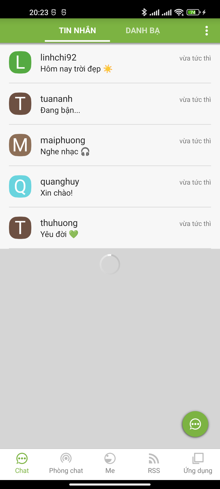
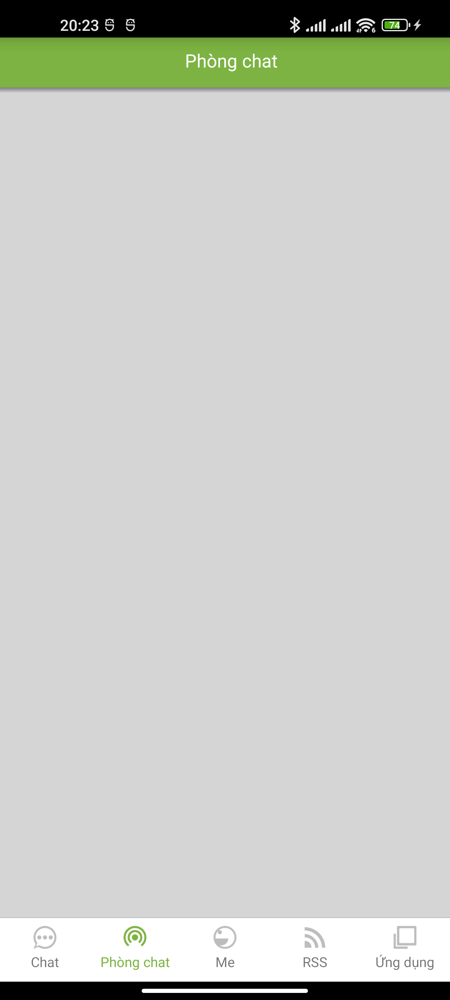
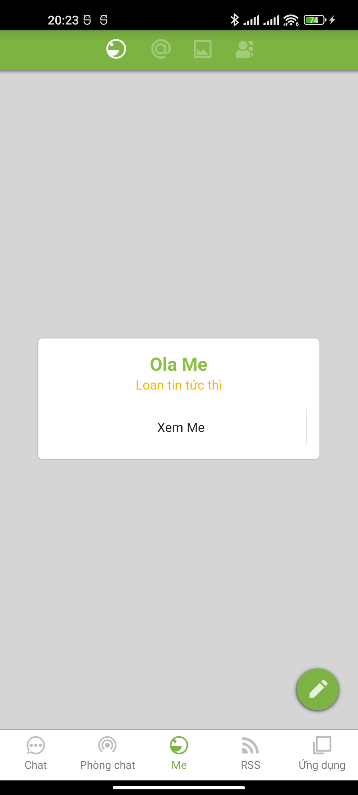
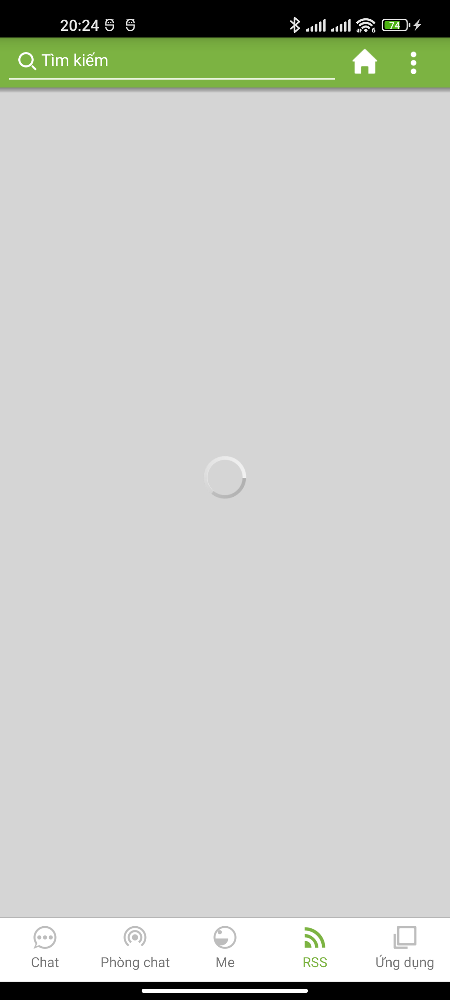

# Màn hình Trang chủ (Bottom Tab)

- **Activity:** `chat.ola.vn.activity.OlaBottomTabActivity`
- **Layout:** `apktool_out/res/layout/tab_content_view_layout.xml` (khung) + `tab_bottom_item.xml` (1 item bottom bar)
- **Chức năng:** màn chính sau khi đăng nhập — chứa **thanh tab dưới (bottom bar) 5 mục**, mỗi mục mở 1 fragment nội dung khác nhau.

## Ảnh chụp (thiết bị thật + fake server)

| Chat (TIN NHẮN) | Phòng chat | Me | RSS | Ứng dụng |
|---|---|---|---|---|
|  |  |  |  |  |

> Một số tab (Phòng chat, RSS) trống vì **fake server chưa cấp dữ liệu** cho chúng — bố cục/màu vẫn đúng.

---

## 1. Bottom bar — 5 tab

Bottom bar dựng động trong code (`OlaBottomTabActivity`, dòng 117–121), mỗi tab inflate từ `tab_bottom_item.xml`:

| # | index nội bộ | Icon (chưa chọn) | Icon (đang chọn) | Text hiển thị | String resource (EN) | Fragment nội dung |
|---|--------------|------------------|------------------|---------------|----------------------|-------------------|
| 1 | 0 |  |  | **Chat** | `general_tab_chat` = "Chat" | `e` — danh sách hội thoại |
| 2 | 14 |  |  | **Phòng chat** | `general_tab_publicroom` = "Chat room" | `l` — phòng chat công khai |
| 3 | 1 |  |  | **Me** | `general_tab_me` = "Me" | `me.c` — bảng tin cá nhân |
| 4 | 2 |  |  | **RSS** | `general_tab_rss` = "RSS" | `j` — tin tức RSS |
| 5 | 4 |  |  | **Ứng dụng** | `general_tab_app` = "Applications" | `d` — danh sách tiện ích |

> Tên hiển thị tiếng Việt: **Chat · Phòng chat · Me · RSS · Ứng dụng** (string gốc EN: Chat / Chat room / Me / RSS / Applications).

### Cấu tạo 1 item (`tab_bottom_item.xml`)
```
LinearLayout vertical (nền trắng #FFFFFF, style tab.button.item)
├─ View                1px  #a0a0a0           ← đường kẻ trên cùng của bar
├─ FrameLayout (center, marginTop 4dp)
│   ├─ ImageView imgTabIcon   cao 24dp, padding ngang 8dp, scaleType=centerInside
│   └─ TextView txtTabNotify  ← badge số chưa đọc (góc phải-trên), ẩn mặc định
└─ TextView tabTitleTextView  caption 12sp, canh giữa, margin T/B 2dp, 1 dòng
```

### Màu chữ + icon theo trạng thái (code: `OlaBottomTabActivity` §a(boolean))

| Trạng thái | Icon | Màu chữ |
|------------|------|---------|
| **Đang chọn** | bản `_selected` (xanh) | `#7CB342` (`colorOlaPrimary`) → biến `f.H` |
| Chưa chọn | bản thường (xám) | `#8A000000` = `rgba(0,0,0,.54)` (`colorTextBlackSecondaryOrIcon`) → biến `f.z` |

### Badge số chưa đọc (`txtTabNotify`, drawable `bg_uread_notify`)
- Hình tròn/bo, **nền `#FF4081`** (`colorOlaAccent` — hồng), **viền 2dp trắng**.
- Chữ **trắng, đậm, 12sp**, canh giữa. Ẩn (`gone`) khi không có thông báo; hiện số khi có tin chưa đọc (vd góc phải-trên icon **Chat**).

## 2. CSS tương đương — Bottom bar

```css
/* ===== Thanh tab dưới ===== */
.ola-tabbar {
  position: fixed; left: 0; right: 0; bottom: 0;
  display: flex;
  background: #FFFFFF;
  border-top: 1px solid #a0a0a0;     /* View 1px trên cùng mỗi item */
  font-family: Roboto, "Helvetica Neue", Arial, sans-serif;
}
.ola-tabbar__item {
  flex: 1;
  display: flex; flex-direction: column; align-items: center;
  padding: 4px 0 2px;                /* marginTop 4dp icon, margin 2dp title */
  cursor: pointer;
  position: relative;
}
.ola-tabbar__icon {
  height: 24px;                      /* metric.24dp */
  padding: 0 8px;
  object-fit: contain;
}
.ola-tabbar__title {
  margin-top: 2px;
  font-size: 12px;                   /* text.size.caption */
  line-height: 1;
  color: rgba(0,0,0,.54);            /* chưa chọn */
  white-space: nowrap;
}
/* Tab đang chọn */
.ola-tabbar__item.is-active .ola-tabbar__title { color: #7CB342; } /* colorOlaPrimary */
/* (icon đổi sang bản _selected khi active) */

/* Badge số chưa đọc */
.ola-tabbar__badge {
  position: absolute;
  top: 0; right: 50%;
  transform: translateX(150%);
  min-width: 16px; height: 16px;
  padding: 0 4px;
  border-radius: 12px;
  background: #FF4081;               /* colorOlaAccent */
  border: 2px solid #FFFFFF;
  color: #FFFFFF; font-size: 12px; font-weight: bold;
  line-height: 16px; text-align: center;
}
```

```html
<nav class="ola-tabbar">
  <div class="ola-tabbar__item is-active">
    
    <span class="ola-tabbar__title">Chat</span>
    <span class="ola-tabbar__badge">3</span>
  </div>
  <div class="ola-tabbar__item">
    
    <span class="ola-tabbar__title">Phòng chat</span>
  </div>
  <div class="ola-tabbar__item">
    
    <span class="ola-tabbar__title">Me</span>
  </div>
  <div class="ola-tabbar__item">
    
    <span class="ola-tabbar__title">RSS</span>
  </div>
  <div class="ola-tabbar__item">
    
    <span class="ola-tabbar__title">Ứng dụng</span>
  </div>
</nav>
```

## 3. Action bar trên (chung) & nội dung từng tab

Action bar trên cùng: **nền xanh `#7CB342`, cao 48dp, chữ trắng**, có bóng mảnh phía dưới. Nội dung action bar đổi theo tab:

| Tab | Action bar | Nội dung chính |
|-----|-----------|----------------|
| **Chat** | 2 tab con **"TIN NHẮN \| DANH BẠ"** (tab đang chọn gạch chân trắng) + menu ⋮ | Danh sách hội thoại (avatar tròn chữ cái + nick + tin cuối + thời gian "vừa tức thì") · **FAB xanh** (✎) góc phải-dưới để soạn tin |
| **Phòng chat** | Tiêu đề "Phòng chat" (giữa) | Danh sách phòng chat công khai — xem [tài liệu màn Phòng chat](../phong-chat/README.md) |
| **Me** | 4 icon con: 🙂 bảng tin · @ nhắc đến · 🖼 ảnh · 👥 quan tâm | Bảng tin "Ola Me" (newsfeed) · **FAB xanh** (✎) đăng bài — xem [tài liệu màn Me](../me/README.md) |
| **RSS** | Ô **tìm kiếm "Tìm kiếm"** (🔍) + nút 🏠 + menu ⋮ | Danh sách tin RSS — xem [tài liệu màn RSS](../rss/README.md) |
| **Ứng dụng** | Tiêu đề "Ứng dụng" | List tiện ích: Thông báo · Kho Game · Cá nhân · Kho VIP · KEN · Đăng Q.Cáo · Hình Ảnh · Ola Mall · Lân cận · Cài đặt |

> Tiêu đề action bar dùng style `defaultStyle.text.subhead` (16sp, chữ trắng). Tab con "TIN NHẮN/DANH BẠ" của tab Chat: xem chi tiết list hội thoại + danh bạ + khung chat ở [tài liệu màn Chat](../chat/README.md).

## 4. Strings

| Resource | EN | VI (hiển thị) |
|----------|----|----|
| `general_tab_chat` | Chat | Chat |
| `general_tab_publicroom` | Chat room | Phòng chat |
| `general_tab_me` | Me | Me |
| `general_tab_rss` | RSS | RSS |
| `general_tab_app` | Applications | Ứng dụng |
| `general_tab_notify` | Notifications | Thông báo |

## 5. Tóm tắt token UI

| Thành phần | Giá trị |
|------------|---------|
| Nền bottom bar | `#FFFFFF` |
| Kẻ trên bottom bar | `#a0a0a0`, 1px |
| Icon tab | cao 24dp, padding ngang 8dp |
| Chữ tab | 12sp (caption) |
| Chữ tab — chọn | `#7CB342` |
| Chữ tab — không chọn | `rgba(0,0,0,.54)` |
| Badge chưa đọc | nền `#FF4081`, viền 2dp trắng, chữ trắng đậm 12sp |
| Action bar | nền `#7CB342`, cao 48dp, chữ trắng 16sp |
