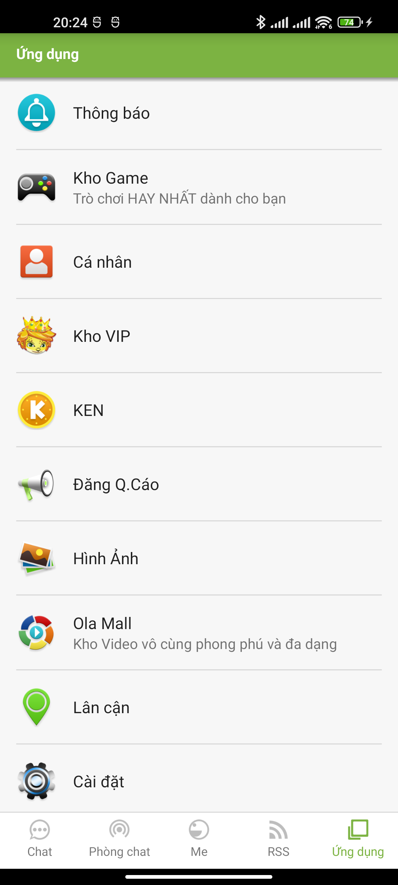
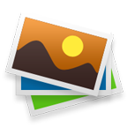
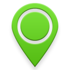

# Màn hình Ứng dụng (Applications)

Tab thứ **5** của bottom bar ([trang chủ](../trang-chu/README.md)) — danh sách dọc các **tiện ích / cửa hàng** của Ola. Mỗi dòng = 1 shortcut (icon + tên), bấm vào mở màn tương ứng.

> **Nguồn:** fragment `m/d.java` (xử lý click), danh sách dựng ở `r/a/c.java` (icon + tiêu đề), item layout `res/layout/home_icon_item.xml`, theme/màu từ `res/values/`.

## Ảnh chụp (thiết bị thật + fake server)



## 1. Bố cục

```
┌──────────────────────────────────────┐
│ Ứng dụng                              │  ← action bar (title general_tab_app)
├──────────────────────────────────────┤
│ [icon]  Tên tiện ích          [badge] │  ← mỗi dòng = home_icon_item (cao ≥72dp)
│ ─────────────────────────────────────│     divider 1px
│ [icon]  Tên tiện ích                  │
│ …                                     │
└──────────────────────────────────────┘
```

## 2. Danh sách tiện ích (đúng thứ tự trong `r/a/c.java`)

| # | Icon | Tên (VI hiển thị) | String EN (`general_tab_*`) | Badge | Mở tới |
|---|------|-------------------|------------------------------|-------|--------|
| 1 |  | Thông báo | `notify` = Notifications | số chưa đọc | Trung tâm thông báo |
| 2 |  | Kho Game | `game_store` = Game Store | "Free" (xanh) | Cửa hàng game |
| 3 |  | Cá nhân | `personal` = Profile | — | Hồ sơ bản thân (Me) |
| 4 |  | Kho VIP | `vipstore` = VIP icon collection | — | Cửa hàng icon VIP |
| 5 |  | KEN | `kenstore` = KEN | — | Cửa hàng KEN (tiền ảo) |
| 6 |  | Đăng Q.Cáo | `post_adme` = Create Ad | "New" (xanh) | Web `adme.ola.vn` |
| 7 |  | Hình Ảnh | `mediastore` = Photos | — | Kho ảnh |
| 8 |  | Ola Mall | `ola_mall` = Ola Mall | *subtitle* | Mall (clip) — phụ đề "Diverse video clips collected by editors" |
| 9 |  | Lân cận | `nearby_places` = Nearby places | — | Địa điểm gần (cần **GPS**) |
| 10 |  | Cài đặt | `setting` = Settings | — | Cài đặt app — xem [tài liệu màn Cài đặt](../cai-dat/README.md) |

> Item 2 (`o.e`) và 6 (`o.a`) là entry đặc biệt có **badge nhãn** (`general_tab_game_store`→"Free", `post_adme`→"New"). Item 8 (Ola Mall) hiện **subtitle** thay vì badge. Item 9 (Lân cận) khi bấm sẽ xin quyền **vị trí**; nếu GPS tắt → dialog xác nhận bật GPS (xem [modal-dialog](../modal-dialog/README.md)).

## 3. Style 1 dòng (`home_icon_item.xml`)

| Thành phần | id | Màu chữ / nền | Cỡ chữ | Kích thước | Ghi chú |
|------------|----|----|--------|-----------|---------|
| Dòng | (LinearLayout) | nền `#CCFFFFFF` (trắng mờ 80%) | — | cao tối thiểu **72dp**, padding **16dp** | bấm cả dòng |
| Icon | `notificationIconImageView` | — | — | **40×40dp**, `centerInside` | `OlaCachedImageView`; có `ProgressBar` 16dp khi tải |
| Tiêu đề | `notificationTitleTextView` | chữ đậm (subhead) | **16sp** | 1 dòng, margin trái 16dp | `defaultStyle.text.subhead` |
| Phụ đề | `notificationSubtitleTextView` | **#8A000000** (đen 54%) | 14sp | 1 dòng, ẩn mặc định | dùng cho Ola Mall |
| Badge nhãn | `notificationCaptionTextView` | chữ trắng, nền **#9CCC65** (xanh) | — | cao 36dp, ẩn mặc định | `defaultStyle.button.green` (vd "Free"/"New") |
| Badge số | `notificationNumberTextView` | (kiểu unread) | — | ẩn mặc định | số thông báo chưa đọc |
| Divider | `bottomDividerView` | **#1F000000** (đen 12%) | — | cao **1dp**, margin ngang 16dp | kẻ giữa các dòng |

## 4. CSS tương đương (dựng lại trên web)

```css
.ola-app-list { background: #d5d5d5; }
.ola-app-item {
  display: flex; align-items: center; gap: 16px;
  min-height: 72px; padding: 16px;
  background: rgba(255,255,255,.8);
  border-bottom: 1px solid rgba(0,0,0,.12);
}
.ola-app-item__icon { width: 40px; height: 40px; object-fit: contain; }
.ola-app-item__body { flex: 1; min-width: 0; }
.ola-app-item__title    { font-size: 16px; font-weight: 700; color: rgba(0,0,0,.87);
  white-space: nowrap; overflow: hidden; text-overflow: ellipsis; }
.ola-app-item__subtitle { font-size: 14px; color: rgba(0,0,0,.54); }
.ola-app-item__badge {
  padding: 4px 8px; border-radius: 2px; font-size: 14px;
  color: #fff; background: #9ccc65;          /* "Free" / "New" */
}
.ola-app-item__count { /* số chưa đọc */ color: #fff; background: #f44; border-radius: 999px; padding: 0 6px; }
```

## 5. Strings (đa ngôn ngữ)

| Resource | EN (`values/strings.xml`) | VI (hiển thị thực tế) |
|----------|--------------------------|----------------------|
| `general_tab_app` | Applications | Ứng dụng |
| `general_tab_notify` | Notifications | Thông báo |
| `general_tab_game_store` | Game Store | Kho Game |
| `general_tab_personal` | Profile | Cá nhân |
| `general_tab_vipstore` | VIP icon collection | Kho VIP |
| `general_tab_kenstore` | KEN | KEN |
| `general_tab_post_adme` | Create Ad | Đăng Q.Cáo |
| `general_tab_mediastore` | Photos | Hình Ảnh |
| `general_tab_ola_mall` | Ola Mall | Ola Mall |
| `message_mall_introduction` | Diverse video clips collected by editors | Tuyển tập clip đa dạng do BTV chọn |
| `general_tab_nearby_places` | Nearby places | Lân cận |
| `general_tab_setting` | Settings | Cài đặt |
| `string_free` | Free | Miễn phí |
| `string_new` | New | Mới |
